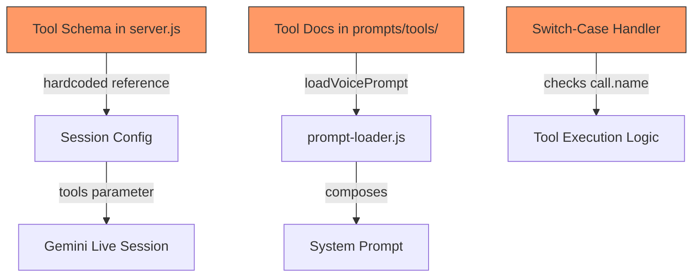
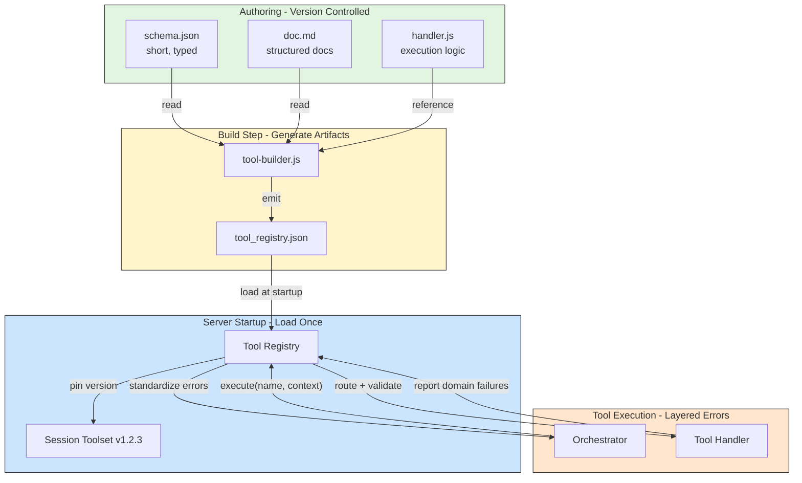
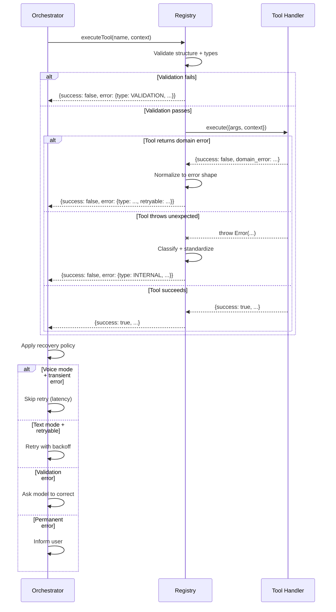

# Tool Registry Architecture Improvement Plan

## Plan Status: Production-Ready

**All critical corrections applied. The plan now:**

- ✅ Fixes implementation bugs (SDK conversion, state mutation, mode detection)
- ✅ Adds missing production features (idempotency keys, confirmation flow, on-demand docs)
- ✅ Includes complete reference implementation (`kb_search`) that locks in ALL patterns
- ✅ Clarifies source of truth (schema.json = contract, docs = guidance, core.md = policy)
- ✅ Configures Ajv properly (formats, useDefaults, strict validation)
- ✅ Ready for execution - can build 10-15 tools following `kb_search` pattern

---

## Critical Corrections & Refinements

### Implementation Bugs Fixed

**1. generateSDKSchema - Nested Objects/Arrays Bug**

- **Problem**: Current implementation drops nested properties, items, enum, formats
- **Solution**: Recursive conversion from JSON Schema → Gemini schema
- **Why it matters**: Retrieval tool `filters` won't work properly without nested structure

**2. applyIntent - State Mutation Bug**

- **Problem**: Passing values not references, assignments don't update outer variables
- **Solution**: Use `StateController` pattern with explicit mutation methods
- **Why it matters**: Intents won't actually change session state

**3. Mode Detection - Logic Error**

- **Problem**: `currentMode = geminiSession ? 'voice' : 'text'` incorrect
- **Solution**: Store `session.mode` explicitly at session creation
- **Why it matters**: Policy enforcement relies on accurate mode detection

**4. ToolResponse Envelope - Inconsistency**

- **Problem**: Plan uses both `success` and `ok` in different places
- **Solution**: Standardize on `ok` everywhere, enforce in registry
- **Why it matters**: Orchestrator must reliably parse responses

### Missing Production Features

**5. Idempotency Keys**

- **Problem**: No protection against reconnect/resend, duplicate calls
- **Solution**: Track `executionId` per tool call, dedupe at orchestrator level
- **Why it matters**: Critical for reliability, especially calendar/image generation

**6. Confirmation Flow Contract**

- **Problem**: `confirmed: false` placeholder with no specification
- **Solution**: Return `CONFIRMATION_REQUIRED` error with `confirmation_request` payload
- **Why it matters**: "Plan then commit" pattern needs clear UX contract

**7. On-Demand Docs Mechanism**

- **Problem**: Mentions `reg_describe(tool)` but no actual implementation
- **Solution**: Orchestrator pre-injects `doc.md` before tool execution (Option A - simpler for 10-15 tools)
- **Why it matters**: Agent needs way to get full docs for complex tools

**8. Ajv Configuration**

- **Problem**: Missing formats support, no default/coercion policy
- **Solution**: `new Ajv({ allErrors: true, useDefaults: true, coerceTypes: false, formats: require('ajv-formats') })`
- **Why it matters**: Email/date-time validation, consistent default behavior

### Refinements

**9. Retrieval Tool Enhancements**

- Add `namespace` field (studio vs personal vs public KB)
- Add `return_fields` to reduce payload
- Orchestrator clamps `top_k` in voice mode (max 3) regardless of model request

**10. Image Generation Classification**

- **Current**: `requiresConfirmation: true` (like calendar)
- **Better**: Policy-driven confirmation (e.g., only if sensitive topics or user didn't ask)
- **Why**: "Expensive" not "dangerous" - different risk profile

## Production-Grade Improvements Applied

Based on detailed feedback, the following improvements have been incorporated to avoid "looks clean on paper, becomes messy in production" traps:

### 1. Real JSON Schema Validation ✅

- **Problem**: Custom schema format with incomplete runtime validation
- **Solution**: Use actual JSON Schema (draft 2020-12) with Ajv validator
- **Benefits**: Validates all constraints (min/max/length/enum), nested types, consistent error paths

### 2. Two-Tier Documentation ✅

- **Problem**: Full docs injected into system prompt (scales poorly, increases latency)
- **Solution**: `doc_summary.md` (2-4 lines, always included) + `doc.md` (full detail, on-demand)
- **Benefits**: Tight prompts for voice, detailed docs available when needed

### 3. Intent-Based State Management ✅

- **Problem**: `setState()` allows tools to mutate arbitrary session state (footgun)
- **Solution**: Tools return intents, orchestrator applies them safely
- **Benefits**: Tools can't "invent" state updates, safer sequencing, cleaner for agents

### 4. Strict Tool Naming ✅

- **Problem**: Inconsistent mapping between directory names and tool IDs
- **Solution**: Enforce canonical `toolId`, derive everything from it, build validates match
- **Benefits**: No subtle bugs from name mismatches

### 5. Content-Based Versioning ✅

- **Problem**: Timestamp versions can collide, don't track which commit
- **Solution**: SHA256 hash of tools+schemas+docs, plus git commit tracking
- **Benefits**: Deterministic, meaningful versions, audit trail

### 6. Standardized Response Envelope ✅

- **Problem**: Mixed response formats across tools
- **Solution**: Uniform `ToolResponse` with `ok`, `data/error`, `meta` (includes versions + duration)
- **Benefits**: Orchestrator always knows where to look, automatic version tracking

### 7. Strict Parameter Validation ✅

- **Problem**: Extra parameters silently ignored (model hallucinations go undetected)
- **Solution**: `additionalProperties: false` in JSON Schema, reject unknown params
- **Benefits**: Fail fast on malformed calls

### 8. Cross-Platform Import Safety ✅

- **Problem**: Dynamic imports can behave oddly on Windows/ESM
- **Solution**: Use `pathToFileURL` for handler paths
- **Benefits**: Reliable across platforms

### 9. Clear Source of Truth Separation ✅

- **Schema (`schema.json`)**: Source of truth for API contract (parameters, types, constraints)
- **Docs (`doc_summary.md` + `doc.md`)**: Source of truth for usage guidance (when to use, examples, footguns)
- **Policy (`core.md`)**: Source of truth for global policies (escalation, behavior, tone)
- **Benefits**: No accidental mixing of contract details into docs, clear ownership

### 10. Build-Time Linting ✅

- **Problem**: Schema/doc drift detected only at runtime
- **Solution**: Build fails if missing required sections, name mismatches, invalid schemas
- **Benefits**: Catch issues before deployment

### 11. Capabilities Pattern ✅

- **Problem**: Tools access raw `ws`, `geminiSession` (tight coupling)
- **Solution**: Context provides `messaging`, `voice`, `audio`, `audit` capabilities
- **Benefits**: Testable, composable, abstracts implementation details

## 1. Current Implementation Analysis

### Problems Identified

**Multiple Sources of Truth:**

- Tool schemas hardcoded in [`voice-server/server.js`](voice-server/server.js) (lines 30-185)
- Tool documentation in separate markdown files (`prompts/tools/*.md`)
- Tool handlers in switch-case (lines 476-598)
- Tool registration hardcoded in session config (line 876)

**Adding a New Tool Requires 4 Manual Steps:**

1. Create JavaScript schema object with `Type.OBJECT`, `Type.STRING`, etc.
2. Add to `tools: [{ functionDeclarations: [...] }]` array
3. Add handler case in `handleGeminiMessage` switch statement
4. Create markdown documentation file

**Fragility Issues:**

- Schema definitions use SDK-specific types (`Type.OBJECT`, `Type.NUMBER`) scattered throughout code
- No validation that schema matches documentation
- Tool execution logic tightly coupled to message handler
- System prompt must be manually updated when tools change

### Current Flow Diagram



## 2. Proposed Solution: Build-Time Tool Registry

### Core Principles

**Design Decisions (Based on Requirements):**

1. **Markdown as source of truth** - Tools authored in `.md` files (version controlled, PR reviewed, diff-friendly)
2. **Build-time generation** - Registry JSON generated as build artifact from markdown + schema
3. **Startup-only loading** - All tools registered at server startup (no lazy loading, no hot reload in production)
4. **Versioned toolsets** - Pin registry version at session start, log with every tool execution
5. **Layered error handling** - Registry standardizes/classifies, orchestrator recovers, tools report domain failures
6. **Hybrid state access** - Tools receive state via context but don't manage it directly

### New Architecture



### File Structure

```
voice-server/
├── tools/                           # NEW: Tool definitions directory
│   ├── ignore-user/
│   │   ├── schema.json             # Short schema (SDK params)
│   │   ├── doc.md                  # Structured documentation
│   │   └── handler.js              # Execution logic
│   ├── end-voice-session/
│   │   ├── schema.json
│   │   ├── doc.md
│   │   └── handler.js
│   ├── registry.js                 # Runtime registry loader
│   ├── tool-builder.js             # Build script (generates tool_registry.json)
│   ├── error-types.js              # Error classification constants
│   └── README.md                   # Guide for adding new tools
├── tool_registry.json              # GENERATED: Build artifact (gitignored)
├── server.js                       # UPDATED: Uses registry, orchestrates errors
├── config.js                       # UPDATED: Injects registry version
└── prompt-loader.js                # UPDATED: Loads docs from registry
```

## 3. Tool Categorization Strategy

### Three Tool Categories

As the agent's job shifts to **"get more context, then act"**, the tool registry evolves from a few action tools to a mix of retrieval, action, and utility tools.

#### 1. Retrieval Tools (Safe to Call Often)

**Purpose**: Context expansion - agent's "eyes"

**Characteristics:**

- Read-only operations
- Idempotent (safe to retry)
- Fast (voice: <800ms, text: <2s)
- Structured outputs (prevent hallucination)
- No confirmation needed

**Examples:**

- `kb_search` - Search knowledge base with filters
- `kb_get` - Fetch specific record by ID
- `linkedin_lookup` - Get LinkedIn URL from KB (stored reference, not web scraping)

**Design principle**: Don't create tool sprawl. Use 1-2 general retrieval tools with strong structure, not 10 specialized ones.

#### 2. Action Tools (Call Sparingly)

**Purpose**: Side effects - agent's "hands"

**Characteristics:**

- Explicit side effects
- Usually require high confidence
- Often need confirmation (scheduling, sending)
- Slower (acceptable: 2-5s)
- May require planning stage

**Examples:**

- `calendar_propose_event` → `calendar_create_event` (two-stage)
- `image_draft_prompt` → `image_generate` (two-stage)
- `ignore_user` (immediate action, moderation)
- `end_voice_session` (immediate action, session control)

**Design principle**: Separate "plan" from "commit" for risky actions (calendar, images).

#### 3. Utility Tools (Deterministic Helpers)

**Purpose**: Transform, summarize, extract - when deterministic behavior needed

**Characteristics:**

- No external side effects
- Fast processing
- Consistent outputs
- Can be done by model, but tool ensures predictability

**Examples:**

- `extract_contacts` - Parse text for structured contact info
- `rank_results` - Deterministic ranking algorithm
- `format_datetime` - Consistent date formatting

### Retrieval-First Agent Loop

**Stable pattern (voice + text):**

```
1. Missing context? → kb_search (max 1-2 calls in voice)
2. Found relevant items? → kb_get for top 1-2 (use IDs)
3. Answer using structured fields + cite sources
4. Need action? → Propose (calendar_propose, image_draft)
5. Commit action → Only when allowed/confirmed
```

This loop stays **stable in the prompt** while KB grows and tools are added.

### Voice-Specific Retrieval Budget

**Voice mode constraints:**

- Max 1-2 retrieval calls per turn (latency budget)
- Smaller `top_k` (3 vs 10 for text)
- Prefer `kb_get` if IDs known (faster than search)
- Sequential searches forbidden (too slow)

**Text mode flexibility:**

- Allow deeper retrieval (3-5 calls)
- Larger `top_k`
- Can do multi-stage context building

### Citation-Like Outputs (Auditable)

**Every retrieval tool returns evidence objects:**

```json
{
  "items": [
    {
      "id": "person:andrei_clodius",
      "type": "person",
      "title": "Andrei Clodius",
      "snippet": "Founder of FRAM...",
      "score": 0.94,
      "source_type": "crm",
      "last_updated": "2026-01-10",
      "url": "https://linkedin.com/in/andrei",
      "metadata": { "role": "founder", "company": "FRAM" }
    }
  ]
}
```

**Benefits:**

- Agent says: "Based on person:andrei_clodius record..."
- Log exactly what it used
- Prevents hallucinated links (only returns KB data)
- Auditable trail

## 4. Tool Definition Standard

### Three-File Pattern (Per Tool)

Each tool consists of three files in its own directory:

#### 1. Schema File (`schema.json`)

**Purpose**: Source of truth for contract using **real JSON Schema (draft 2020-12)** with orchestration metadata

```json
{
  "toolId": "ignore_user",
  "version": "1.0.0",
  "description": "Block user for specified duration. Side effects: ends voice session, blocks all messages.",
  
  "category": "action",
  "sideEffects": "writes",
  "idempotent": false,
  "requiresConfirmation": false,
  "allowedModes": ["text", "voice"],
  "latencyBudgetMs": 1000,
  
  "parameters": {
    "type": "object",
    "additionalProperties": false,
    "required": ["duration_seconds", "farewell_message"],
    "properties": {
      "duration_seconds": {
        "type": "number",
        "description": "Block duration in seconds",
        "minimum": 30,
        "maximum": 86400
      },
      "farewell_message": {
        "type": "string",
        "description": "Final message before blocking (spoken in voice mode)",
        "maxLength": 200
      }
    }
  }
}
```

**Orchestration metadata** (enables policy enforcement without prompt changes):

- **`category`**: `"retrieval"` | `"action"` | `"utility"` - Tool classification
- **`sideEffects`**: `"none"` | `"read_only"` | `"writes"` - Side effect tracking
- **`idempotent`**: Safe to retry or not
- **`requiresConfirmation`**: Actions like calendar events need confirmation
- **`allowedModes`**: `["text"]`, `["voice"]`, or `["text", "voice"]` - Mode restrictions
- **`latencyBudgetMs`**: Voice requires fast tools (<1s), text more flexible

---

### Example: Retrieval Tool (`kb_search`)

```json
{
  "toolId": "kb_search",
  "version": "1.0.0",
  "description": "Search knowledge base with filters. Returns structured results with citations.",
  
  "category": "retrieval",
  "sideEffects": "read_only",
  "idempotent": true,
  "requiresConfirmation": false,
  "allowedModes": ["text", "voice"],
  "latencyBudgetMs": 800,
  
  "parameters": {
    "type": "object",
    "additionalProperties": false,
    "required": ["query"],
    "properties": {
      "query": {
        "type": "string",
        "description": "Search query",
        "maxLength": 200
      },
      "filters": {
        "type": "object",
        "properties": {
          "type": {
            "type": "string",
            "enum": ["project", "person", "process", "link", "doc"]
          },
          "tags": {
            "type": "array",
            "items": { "type": "string" }
          }
        }
      },
      "top_k": {
        "type": "number",
        "description": "Number of results (voice: max 3, text: max 10)",
        "minimum": 1,
        "maximum": 10,
        "default": 5
      },
      "include_snippets": {
        "type": "boolean",
        "description": "Include text snippets",
        "default": true
      }
    }
  }
}
```

---

### Example: Action Tool with Planning Stage (`calendar_propose_event`)

```json
{
  "toolId": "calendar_propose_event",
  "version": "1.0.0",
  "description": "Check availability and propose event times (read-only planning stage).",
  
  "category": "action",
  "sideEffects": "read_only",
  "idempotent": true,
  "requiresConfirmation": false,
  "allowedModes": ["text"],
  "latencyBudgetMs": 2000,
  
  "parameters": {
    "type": "object",
    "additionalProperties": false,
    "required": ["attendees", "duration_minutes"],
    "properties": {
      "attendees": {
        "type": "array",
        "items": { "type": "string", "format": "email" }
      },
      "duration_minutes": {
        "type": "number",
        "minimum": 15,
        "maximum": 480
      },
      "preferred_times": {
        "type": "array",
        "items": { "type": "string", "format": "date-time" }
      }
    }
  }
}
```
```json
{
  "toolId": "calendar_create_event",
  "version": "1.0.0",
  "description": "Create calendar event with Zoom link (commits the action).",
  
  "category": "action",
  "sideEffects": "writes",
  "idempotent": false,
  "requiresConfirmation": true,
  "allowedModes": ["text"],
  "latencyBudgetMs": 3000,
  
  "parameters": {
    "type": "object",
    "additionalProperties": false,
    "required": ["event_draft_id"],
    "properties": {
      "event_draft_id": {
        "type": "string",
        "description": "ID from calendar_propose_event response"
      }
    }
  }
}
```

#### 2. Documentation Files

**Purpose**: Two-tier documentation for performance

**`doc_summary.md`** - Always injected into system prompt (2-4 lines max):

```markdown
Block user who is rude/abusive for specified duration (30s-24h). Ends voice session after farewell is spoken. Follow escalation: warn first (unless extreme), then escalate based on severity. User blocked until timeout expires.
```

**`doc.md`** - Full documentation (loaded on demand via `reg_describe(tool)` or pre-call injection):

```markdown
# Timeout Tool (ignore_user)

## Summary
Block users who are rude, disrespectful, or abusive. User cannot send messages for the specified duration.

## Preconditions
- User has committed offense worthy of timeout
- You have followed escalation policy (see core.md) unless extreme abuse

## Postconditions
- Voice session ends after farewell is spoken
- User blocked for duration_seconds
- Client UI shows timeout message and countdown
- Audit log entry created with reason

## Invariants
- Farewell message WILL be spoken in voice mode before block takes effect
- Duration between 30-86400 seconds (enforced by schema)
- Tool is NOT idempotent (repeated calls extend timeout)

## Failure Modes
- **Session already ended**: Returns SESSION_INACTIVE error, no side effects
- **Invalid duration**: Registry validates and rejects before execution (VALIDATION error)
- **WebSocket closed**: Returns TRANSIENT error, logs issue, no timeout applied

## Examples

### Example 1: Second Offense
User: "You're being really annoying"
Your response: [Verbal warning per core.md policy]
User: "Seriously, shut up"
Your action:
\`\`\`json
{
  "duration_seconds": 60,
  "farewell_message": "I don't tolerate disrespect. This conversation is over."
}
\`\`\`

### Example 2: Extreme Abuse
User: [Vile insult/threat]
Your action:
\`\`\`json
{
  "duration_seconds": 86400,
  "farewell_message": "That behavior is completely unacceptable. You're blocked for 24 hours."
}
\`\`\`

## Common Mistakes (Do Not)
❌ Use this tool based on past conversation history (only current session)
❌ Threaten to use it (either warn or act)
❌ Use out of annoyance (only when respect is broken)
❌ Forget expired timeouts are "paid for" (reset escalation after timeout)
❌ Call without following escalation policy (documented in core.md)
```

**Note**: Escalation policy lives in `core.md` (global policy), not per-tool docs. Tool doc references it.

#### 3. Handler File (`handler.js`)

**Purpose**: Execution logic with semantic validation, returns intents (not setState)

```javascript
import { ToolError, ErrorType } from '../error-types.js';

/**
 * Block user for specified duration
 * @param {object} args - Validated parameters from schema
 * @param {object} context - Execution context with capabilities
 * @returns {ToolResponse} - Standardized response with intents
 */
export async function execute({ args, context }) {
  const { duration_seconds, farewell_message } = args;
  
  // Semantic validation (schema already validated types/structure)
  if (!context.session.isActive) {
    // Expected domain failure - return as result, not exception
    return {
      ok: false,
      error: {
        type: ErrorType.SESSION_INACTIVE,
        message: 'Cannot timeout user - session already ended',
        retryable: false
      }
    };
  }
  
  // Calculate timeout
  const timeoutUntil = Date.now() + (duration_seconds * 1000);
  
  // Send timeout command to client (side effect)
  try {
    await context.messaging.send({
      type: 'timeout',
      durationSeconds: duration_seconds,
      timeoutUntil,
      farewellMessage: farewell_message
    });
  } catch (error) {
    // Unexpected failure (WebSocket error, etc)
    throw new ToolError(ErrorType.TRANSIENT, 'Failed to send timeout command', {
      retryable: true,
      partialSideEffects: false // Timeout not applied
    });
  }
  
  // Log for audit trail with context
  context.audit.log('user_timeout', {
    duration: duration_seconds,
    timeoutUntil,
    reason: 'tool_invocation'
  });
  
  // Return success WITH INTENTS (orchestrator applies state changes)
  return {
    ok: true,
    data: {
      timeoutUntil,
      duration: duration_seconds
    },
    intents: [
      // Voice session should end after farewell is spoken
      { type: 'END_VOICE_SESSION', after: 'farewell_spoken' },
      // No further responses should be generated
      { type: 'SUPPRESS_AUDIO', value: true }
    ]
  };
}
```

**Key improvements:**

- Returns **intents** instead of mutating state via `setState`
- Domain failures return error results (not exceptions)
- Uses **capabilities** (`context.messaging`, `context.audit`) instead of raw `ws`
- Explicit side effects tracking for orchestrator

### Build-Time Tool Builder

**`voice-server/tools/tool-builder.js`**

Generates `tool_registry.json` with **build-time linting** and **content-based versioning**:

```javascript
import { readdirSync, readFileSync, writeFileSync } from 'fs';
import { join, dirname } from 'path';
import { fileURLToPath, pathToFileURL } from 'url';
import { createHash } from 'crypto';
import { execSync } from 'child_process';
import Ajv from 'ajv';

const __dirname = dirname(fileURLToPath(import.meta.url));
const TOOLS_DIR = __dirname;
const OUTPUT_FILE = join(__dirname, '../tool_registry.json');

// JSON Schema validator
const ajv = new Ajv({ allErrors: true, strict: true });

// Type mapping for SDK (Gemini uses string representations)
const TYPE_MAP = {
  'string': 'STRING',
  'number': 'NUMBER',
  'integer': 'NUMBER',
  'boolean': 'BOOLEAN',
  'object': 'OBJECT',
  'array': 'ARRAY'
};

// Required sections in doc.md
const REQUIRED_DOC_SECTIONS = [
  '## Summary',
  '## Preconditions',
  '## Postconditions',
  '## Invariants',
  '## Failure Modes',
  '## Examples',
  '## Common Mistakes'
];

function buildRegistry() {
  const tools = [];
  const errors = [];
  
  // Only process directories (ignore .js files in tools/)
  const toolDirs = readdirSync(TOOLS_DIR, { withFileTypes: true })
    .filter(dirent => dirent.isDirectory() && !dirent.name.startsWith('.'))
    .map(dirent => dirent.name);
  
  console.log(`Found ${toolDirs.length} tool directories`);
  
  for (const toolDirName of toolDirs) {
    try {
      const tool = buildTool(toolDirName);
      tools.push(tool);
      console.log(`✓ Built tool: ${tool.toolId}`);
    } catch (error) {
      errors.push({ tool: toolDirName, error: error.message });
      console.error(`✗ Failed to build ${toolDirName}: ${error.message}`);
    }
  }
  
  // Fail build if any tools failed
  if (errors.length > 0) {
    console.error(`\n❌ Build failed with ${errors.length} error(s):`);
    errors.forEach(e => console.error(`  - ${e.tool}: ${e.error}`));
    process.exit(1);
  }
  
  // Generate registry with deterministic version
  const registryVersion = generateRegistryVersion(tools);
  const gitCommit = getGitCommit();
  
  const registry = {
    version: registryVersion,
    gitCommit: gitCommit,
    buildTimestamp: new Date().toISOString(),
    tools: tools
  };
  
  writeFileSync(OUTPUT_FILE, JSON.stringify(registry, null, 2));
  console.log(`\n✓ Built tool registry successfully`);
  console.log(`  Version: ${registry.version}`);
  console.log(`  Git commit: ${gitCommit || 'N/A'}`);
  console.log(`  Tools: ${tools.map(t => t.toolId).join(', ')}`);
}

function buildTool(toolDirName) {
  const toolPath = join(TOOLS_DIR, toolDirName);
  
  // Read and validate schema.json
  const schemaPath = join(toolPath, 'schema.json');
  if (!existsSync(schemaPath)) {
    throw new Error('Missing schema.json');
  }
  const schema = JSON.parse(readFileSync(schemaPath, 'utf-8'));
  
  // Lint schema structure
  lintSchema(schema, toolDirName);
  
  // Validate parameters are valid JSON Schema
  try {
    ajv.compile(schema.parameters);
  } catch (error) {
    throw new Error(`Invalid JSON Schema in parameters: ${error.message}`);
  }
  
  // Read and validate doc_summary.md
  const summaryPath = join(toolPath, 'doc_summary.md');
  if (!existsSync(summaryPath)) {
    throw new Error('Missing doc_summary.md');
  }
  const summary = readFileSync(summaryPath, 'utf-8').trim();
  if (summary.length > 250) {
    throw new Error(`doc_summary.md too long (${summary.length} chars, max 250)`);
  }
  
  // Read and validate doc.md
  const docPath = join(toolPath, 'doc.md');
  if (!existsSync(docPath)) {
    throw new Error('Missing doc.md');
  }
  const documentation = readFileSync(docPath, 'utf-8');
  lintDocumentation(documentation);
  
  // Verify handler.js exists and exports execute
  const handlerPath = join(toolPath, 'handler.js');
  if (!existsSync(handlerPath)) {
    throw new Error('Missing handler.js');
  }
  
  // Verify toolId matches directory name (canonical ID)
  const expectedToolId = toolDirName.replace(/-/g, '_');
  if (schema.toolId !== expectedToolId) {
    throw new Error(`toolId "${schema.toolId}" doesn't match directory "${toolDirName}" (expected "${expectedToolId}")`);
  }
  
  // Generate SDK-compatible schema from JSON Schema
  const sdkSchema = generateSDKSchema(schema);
  
  // Use pathToFileURL for cross-platform safety
  const handlerUrl = pathToFileURL(handlerPath).href;
  
  return {
    toolId: schema.toolId,
    version: schema.version,
    category: schema.category,
    sideEffects: schema.sideEffects,
    idempotent: schema.idempotent,
    requiresConfirmation: schema.requiresConfirmation,
    allowedModes: schema.allowedModes,
    latencyBudgetMs: schema.latencyBudgetMs,
    schema: sdkSchema,
    jsonSchema: schema.parameters, // Keep for runtime validation
    summary: summary,
    documentation: documentation,
    handlerPath: handlerUrl
  };
}

function lintSchema(schema, toolDirName) {
  // Required fields
  const required = [
    'toolId', 'version', 'description', 
    'category', 'sideEffects', 'idempotent', 
    'requiresConfirmation', 'allowedModes', 'latencyBudgetMs',
    'parameters'
  ];
  
  for (const field of required) {
    if (schema[field] === undefined) {
      throw new Error(`Missing required field: ${field}`);
    }
  }
  
  // Validate category
  const validCategories = ['retrieval', 'action', 'utility'];
  if (!validCategories.includes(schema.category)) {
    throw new Error(`Invalid category: ${schema.category} (must be one of: ${validCategories.join(', ')})`);
  }
  
  // Validate sideEffects
  const validSideEffects = ['none', 'read_only', 'writes'];
  if (!validSideEffects.includes(schema.sideEffects)) {
    throw new Error(`Invalid sideEffects: ${schema.sideEffects} (must be one of: ${validSideEffects.join(', ')})`);
  }
  
  // Validate allowedModes
  if (!Array.isArray(schema.allowedModes) || schema.allowedModes.length === 0) {
    throw new Error('allowedModes must be non-empty array');
  }
  
  const validModes = ['text', 'voice'];
  for (const mode of schema.allowedModes) {
    if (!validModes.includes(mode)) {
      throw new Error(`Invalid mode in allowedModes: ${mode} (must be one of: ${validModes.join(', ')})`);
    }
  }
  
  // Validate latencyBudgetMs
  if (typeof schema.latencyBudgetMs !== 'number' || schema.latencyBudgetMs <= 0) {
    throw new Error('latencyBudgetMs must be positive number');
  }
  
  // Validate parameters is JSON Schema object
  if (schema.parameters.type !== 'object') {
    throw new Error('parameters.type must be "object"');
  }
  
  if (schema.parameters.additionalProperties !== false) {
    throw new Error('parameters.additionalProperties must be false (reject hallucinated params)');
  }
  
  // Category-specific validation
  if (schema.category === 'retrieval') {
    if (schema.sideEffects === 'writes') {
      throw new Error('Retrieval tools cannot have sideEffects: "writes"');
    }
    if (!schema.idempotent) {
      throw new Error('Retrieval tools must be idempotent');
    }
  }
  
  if (schema.category === 'action' && schema.sideEffects === 'writes') {
    // Actions with side effects should specify if confirmation needed
    // (This is a warning, not error - some actions like ignore_user don't need confirmation)
    if (!schema.requiresConfirmation) {
      console.warn(`⚠️  Action tool ${schema.toolId} has writes but doesn't require confirmation - verify this is intentional`);
    }
  }
}

function lintDocumentation(doc) {
  for (const section of REQUIRED_DOC_SECTIONS) {
    if (!doc.includes(section)) {
      throw new Error(`Missing required section: ${section}`);
    }
  }
}

function generateSDKSchema(schema) {
  const properties = {};
  
  for (const [key, param] of Object.entries(schema.parameters.properties)) {
    properties[key] = {
      type: TYPE_MAP[param.type] || 'STRING',
      description: param.description
    };
  }
  
  return {
    name: schema.toolId,
    description: schema.description,
    parameters: {
      type: 'OBJECT',
      properties,
      required: schema.parameters.required || []
    }
  };
}

function generateRegistryVersion(tools) {
  // Content-based version: hash of all tool IDs + schemas + doc hashes
  const content = tools
    .map(t => `${t.toolId}:${t.version}:${hashString(t.schema)}:${hashString(t.summary)}`)
    .join('|');
  
  const hash = hashString(content);
  return `1.0.${hash.substring(0, 8)}`;
}

function hashString(str) {
  return createHash('sha256').update(JSON.stringify(str)).digest('hex');
}

function getGitCommit() {
  try {
    return execSync('git rev-parse --short HEAD', { encoding: 'utf-8' }).trim();
  } catch {
    return null;
  }
}

function existsSync(path) {
  try {
    readFileSync(path);
    return true;
  } catch {
    return false;
  }
}

buildRegistry();
```

**Key improvements:**

- **Build-time linting** - Fails if schema/docs missing required sections
- **JSON Schema validation** with Ajv
- **Content-based versioning** - Hash of tools + schemas (deterministic)
- **Git commit tracking** - Records which commit built the registry
- **Strict validation** - `additionalProperties: false` enforced
- **Cross-platform imports** - Uses `pathToFileURL` for handler paths
- **Canonical toolId** - Enforces directory name = toolId (with dash → underscore conversion)

### Runtime Registry Loader

**`voice-server/tools/registry.js`**

Loads pre-built registry, validates with Ajv, provides standardized execution envelope:

```javascript
import { readFileSync } from 'fs';
import { join, dirname } from 'path';
import { fileURLToPath } from 'url';
import { Type } from '@google/genai';
import Ajv from 'ajv';
import { ToolError, ErrorType } from './error-types.js';

const __dirname = dirname(fileURLToPath(import.meta.url));
const REGISTRY_FILE = join(__dirname, '../tool_registry.json');

// JSON Schema validator
const ajv = new Ajv({ allErrors: true });

// Type mapping from string to SDK enum
const TYPE_ENUM = {
  'STRING': Type.STRING,
  'NUMBER': Type.NUMBER,
  'BOOLEAN': Type.BOOLEAN,
  'OBJECT': Type.OBJECT,
  'ARRAY': Type.ARRAY
};

/**
 * Tool Registry - loads and executes tools with validation and error handling
 */
class ToolRegistry {
  constructor() {
    this.tools = new Map();
    this.handlers = new Map();
    this.validators = new Map(); // Ajv validators per tool
    this.version = null;
    this.gitCommit = null;
  }

  /**
   * Load registry at startup - validates all tools and handlers
   */
  async load() {
    const registryData = JSON.parse(readFileSync(REGISTRY_FILE, 'utf-8'));
    this.version = registryData.version;
    this.gitCommit = registryData.gitCommit;
    
    for (const tool of registryData.tools) {
      // Convert schema types from strings to SDK enums
      const sdkSchema = this.convertToSDKTypes(tool.schema);
      
      // Compile JSON Schema validator (strict validation with Ajv)
      const validator = ajv.compile(tool.jsonSchema);
      
      // Load handler dynamically using file:// URL from builder
      const handlerModule = await import(tool.handlerPath);
      
      // Verify handler exports execute function
      if (typeof handlerModule.execute !== 'function') {
        throw new Error(`Handler for ${tool.toolId} doesn't export execute function`);
      }
      
      this.tools.set(tool.toolId, {
        toolId: tool.toolId,
        version: tool.version,
        category: tool.category,
        sideEffects: tool.sideEffects,
        idempotent: tool.idempotent,
        requiresConfirmation: tool.requiresConfirmation,
        allowedModes: tool.allowedModes,
        latencyBudgetMs: tool.latencyBudgetMs,
        schema: sdkSchema,
        summary: tool.summary,
        documentation: tool.documentation
      });
      
      this.handlers.set(tool.toolId, handlerModule.execute);
      this.validators.set(tool.toolId, validator);
    }
    
    console.log(`✓ Loaded tool registry v${this.version} (commit: ${this.gitCommit || 'N/A'}) with ${this.tools.size} tools`);
    console.log(`  Tools: ${Array.from(this.tools.keys()).join(', ')}`);
  }
  
  convertToSDKTypes(schema) {
    const converted = { ...schema };
    if (converted.parameters) {
      converted.parameters = {
        type: TYPE_ENUM[schema.parameters.type],
        properties: {},
        required: schema.parameters.required
      };
      
      for (const [key, prop] of Object.entries(schema.parameters.properties)) {
        converted.parameters.properties[key] = {
          type: TYPE_ENUM[prop.type],
          description: prop.description
        };
      }
    }
    return converted;
  }

  /**
   * Get SDK-compatible schemas for session config
   */
  getSDKSchemas() {
    return Array.from(this.tools.values()).map(tool => tool.schema);
  }

  /**
   * Get summaries (injected into system prompt)
   */
  getSummaries() {
    return Array.from(this.tools.values())
      .map(tool => `**${tool.toolId}** (${tool.category}): ${tool.summary}`)
      .join('\n\n');
  }

  /**
   * Get full documentation for a specific tool (on-demand)
   */
  getDocumentation(toolId) {
    const tool = this.tools.get(toolId);
    return tool ? tool.documentation : null;
  }
  
  /**
   * Get tool metadata for orchestrator policy enforcement
   */
  getToolMetadata(toolId) {
    const tool = this.tools.get(toolId);
    if (!tool) return null;
    
    return {
      toolId: tool.toolId,
      version: tool.version,
      category: tool.category,
      sideEffects: tool.sideEffects,
      idempotent: tool.idempotent,
      requiresConfirmation: tool.requiresConfirmation,
      allowedModes: tool.allowedModes,
      latencyBudgetMs: tool.latencyBudgetMs
    };
  }
  
  /**
   * Get tools by category (useful for analytics and debugging)
   */
  getToolsByCategory(category) {
    return Array.from(this.tools.values())
      .filter(tool => tool.category === category)
      .map(tool => tool.toolId);
  }

  /**
   * Execute a tool with layered error handling
   * Returns standardized ToolResponse envelope
   */
  async executeTool(toolId, executionContext) {
    const startTime = Date.now();
    
    // Check if tool exists
    if (!this.handlers.has(toolId)) {
      return this.createResponse(toolId, false, {
        type: ErrorType.NOT_FOUND,
        message: `Unknown tool: ${toolId}`,
        retryable: false
      }, startTime);
    }
    
    const handler = this.handlers.get(toolId);
    const tool = this.tools.get(toolId);
    const validator = this.validators.get(toolId);
    
    // Validate parameters with Ajv (strict JSON Schema validation)
    const valid = validator(executionContext.args);
    if (!valid) {
      const errors = validator.errors.map(e => 
        `${e.instancePath || 'root'} ${e.message}`
      ).join(', ');
      
      return this.createResponse(toolId, false, {
        type: ErrorType.VALIDATION,
        message: `Invalid parameters: ${errors}`,
        retryable: false,
        details: validator.errors
      }, startTime);
    }
    
    // Build context with capabilities (not raw ws/geminiSession)
    const context = this.buildContext(executionContext, tool);
    
    // Execute tool with error handling
    try {
      const result = await handler({ args: executionContext.args, context });
      
      // Tool returned result (ok: true/false)
      if (result.ok === false) {
        // Domain failure (expected, not exception)
        return this.createResponse(toolId, false, result.error, startTime);
      }
      
      // Success
      return this.createResponse(toolId, true, result.data, startTime, result.intents);
      
    } catch (error) {
      // Unexpected exception - classify and normalize
      return this.createResponse(toolId, false, 
        this.normalizeError(error, toolId), 
        startTime
      );
    }
  }
  
  /**
   * Build context with capabilities (abstracts raw ws/session)
   */
  buildContext(executionContext, tool) {
    const { clientId, ws, geminiSession, session } = executionContext;
    
    return {
      clientId,
      tool: {
        id: tool.toolId,
        version: tool.version,
        idempotent: tool.idempotent
      },
      session: {
        isActive: session.isActive,
        toolsVersion: session.toolsVersion,
        // Read-only state access
        state: { ...session.state }
      },
      // Capabilities (not raw ws)
      messaging: {
        send: async (message) => {
          if (ws.readyState !== 1) { // WebSocket.OPEN = 1
            throw new ToolError(ErrorType.TRANSIENT, 'WebSocket not open', { retryable: true });
          }
          ws.send(JSON.stringify(message));
        }
      },
      voice: {
        isActive: () => geminiSession !== null,
        endSession: () => {
          // Returns intent, doesn't execute
          return { type: 'END_VOICE_SESSION', after: 'current_turn' };
        }
      },
      audio: {
        suppress: (value) => ({ type: 'SUPPRESS_AUDIO', value })
      },
      audit: {
        log: (event, data) => {
          console.log(`[${clientId}] AUDIT: ${event}`, JSON.stringify(data));
        }
      }
    };
  }
  
  /**
   * Create standardized response envelope
   */
  createResponse(toolId, ok, dataOrError, startTime, intents = []) {
    const tool = this.tools.get(toolId);
    const duration = Date.now() - startTime;
    
    const meta = {
      tool: toolId,
      toolVersion: tool?.version,
      registryVersion: this.version,
      duration
    };
    
    if (ok) {
      return {
        ok: true,
        data: dataOrError,
        intents,
        meta
      };
    } else {
      return {
        ok: false,
        error: dataOrError,
        meta
      };
    }
  }
  
  /**
   * Normalize unexpected errors
   */
  normalizeError(error, toolId) {
    // Handle known ToolError instances (thrown by handlers)
    if (error instanceof ToolError) {
      return {
        type: error.type,
        message: error.message,
        retryable: error.retryable || false,
        idempotencyRequired: error.idempotencyRequired || false,
        partialSideEffects: error.partialSideEffects || false
      };
    }
    
    // Handle unexpected errors
    console.error(`[ToolRegistry] Unexpected error in ${toolId}:`, error);
    return {
      type: ErrorType.INTERNAL,
      message: `Internal error executing ${toolId}`,
      retryable: false,
      partialSideEffects: true // Assume side effects may have occurred
    };
  }

  getVersion() {
    return this.version;
  }
  
  getGitCommit() {
    return this.gitCommit;
  }
}

export const toolRegistry = new ToolRegistry();
```

**Key improvements:**

- **Ajv validation** - Real JSON Schema validation with detailed error paths
- **Standardized envelope** - All responses use `ToolResponse` format with metadata
- **Capabilities pattern** - Tools use `context.messaging`, `context.voice`, `context.audit` instead of raw `ws`
- **Version tracking** - Every response includes tool version + registry version + duration
- **Intent-based state** - Tools return intents, orchestrator applies them
- **Strict validation** - Rejects unknown parameters (additionalProperties: false)

### Error Type Definitions

**`voice-server/tools/error-types.js`**

```javascript
/**
 * Error classification for tool execution
 * Used by registry to standardize errors and by orchestrator to make recovery decisions
 */
export const ErrorType = {
  VALIDATION: 'VALIDATION',           // Invalid parameters (schema violation)
  NOT_FOUND: 'NOT_FOUND',            // Tool doesn't exist
  SESSION_INACTIVE: 'SESSION_INACTIVE', // Session state error (domain failure)
  TRANSIENT: 'TRANSIENT',            // Temporary failure (network, etc) - may retry
  PERMANENT: 'PERMANENT',            // Permanent failure - don't retry
  RATE_LIMIT: 'RATE_LIMIT',          // Rate limit exceeded
  AUTH: 'AUTH',                      // Authentication error
  CONFLICT: 'CONFLICT',              // Resource conflict (domain failure)
  INTERNAL: 'INTERNAL'               // Unexpected internal error
};

/**
 * Custom error class for tool handlers
 * Thrown when tools encounter expected failure modes
 * Registry catches and normalizes into standard error shape
 */
export class ToolError extends Error {
  constructor(type, message, options = {}) {
    super(message);
    this.name = 'ToolError';
    this.type = type;
    this.retryable = options.retryable || false;
    this.idempotencyRequired = options.idempotencyRequired || false;
    this.partialSideEffects = options.partialSideEffects || false;
  }
}

/**
 * Intent types for tools to request state changes
 * Orchestrator applies these after tool execution
 */
export const IntentType = {
  END_VOICE_SESSION: 'END_VOICE_SESSION',
  SUPPRESS_AUDIO: 'SUPPRESS_AUDIO',
  SUPPRESS_TRANSCRIPT: 'SUPPRESS_TRANSCRIPT',
  SET_PENDING_MESSAGE: 'SET_PENDING_MESSAGE'
};
```

## 4. Integration Changes

### Update `voice-server/server.js`

**Key Changes:**

1. Load registry at startup (before accepting connections)
2. Pin registry version to each session
3. Use orchestrator pattern for tool execution with recovery logic
4. Pass session state via context (hybrid approach)

**Before (lines 30-185):** Hardcoded tool definitions

**After:**

```javascript
import { toolRegistry } from './tools/registry.js';
import { ErrorType } from './tools/error-types.js';

// Load tool registry at server startup
await toolRegistry.load();
console.log(`✓ Tool registry loaded: v${toolRegistry.getVersion()}`);

// In session connection handler (line 264+):
wss.on('connection', async (ws, req) => {
  const clientId = `${Date.now()}-${Math.random().toString(36).slice(2, 8)}`;
  
  // Pin tool registry version to this session
  const sessionToolsVersion = toolRegistry.getVersion();
  console.log(`[${clientId}] Session started with tools v${sessionToolsVersion}`);
  
  // ... existing session setup ...
});

// In session config (line 876):
const config = {
  responseModalities: [Modality.AUDIO],
  systemInstruction: FRAM_SYSTEM_PROMPT,
  speechConfig: { /* ... */ },
  inputAudioTranscription: {},
  outputAudioTranscription: {},
  // Use registry to get tool schemas
  tools: [{ functionDeclarations: toolRegistry.getSDKSchemas() }]
};

// In handleGeminiMessage (replace lines 476-598):
// ORCHESTRATOR PATTERN: Handle tool execution with policy enforcement
if (message.toolCall?.functionCalls) {
  // Track retrieval calls for budget enforcement (voice mode)
  let retrievalCallsThisTurn = 0;
  const MAX_RETRIEVAL_CALLS_VOICE = 2;
  
  for (const call of message.toolCall.functionCalls) {
    // Validate tool call structure
    if (!call.name) {
      console.error(`[${clientId}] Invalid tool call: missing name`);
      continue;
    }
    
    // Get tool metadata for policy enforcement
    const toolMetadata = toolRegistry.getToolMetadata(call.name);
    if (!toolMetadata) {
      console.error(`[${clientId}] Unknown tool: ${call.name}`);
      geminiSession.sendToolResponse({
        functionResponses: [{
          name: call.name,
          response: { error: `Unknown tool: ${call.name}` }
        }]
      });
      continue;
    }
    
    // POLICY: Check if tool allowed in current mode (voice vs text)
    const currentMode = geminiSession ? 'voice' : 'text';
    if (!toolMetadata.allowedModes.includes(currentMode)) {
      console.warn(`[${clientId}] Tool ${call.name} not allowed in ${currentMode} mode`);
      geminiSession.sendToolResponse({
        functionResponses: [{
          name: call.name,
          response: { 
            error: `Tool ${call.name} is not available in ${currentMode} mode`,
            suggestion: currentMode === 'voice' ? 'Switch to text mode to use this tool' : null
          }
        }]
      });
      continue;
    }
    
    // POLICY: Enforce retrieval budget in voice mode
    if (currentMode === 'voice' && toolMetadata.category === 'retrieval') {
      retrievalCallsThisTurn++;
      if (retrievalCallsThisTurn > MAX_RETRIEVAL_CALLS_VOICE) {
        console.warn(`[${clientId}] Retrieval budget exceeded in voice mode (${retrievalCallsThisTurn}/${MAX_RETRIEVAL_CALLS_VOICE})`);
        geminiSession.sendToolResponse({
          functionResponses: [{
            name: call.name,
            response: { 
              error: 'Retrieval budget exceeded for this turn',
              suggestion: 'Use specific IDs with kb_get instead of searching'
            }
          }]
        });
        continue;
      }
    }
    
    // POLICY: Check confirmation requirement for actions
    if (toolMetadata.requiresConfirmation && !context.confirmed) {
      // For now, block unconfirmed actions
      // Later: implement confirmation flow
      console.warn(`[${clientId}] Tool ${call.name} requires confirmation`);
      geminiSession.sendToolResponse({
        functionResponses: [{
          name: call.name,
          response: { 
            error: 'This action requires user confirmation',
            suggestion: 'Ask user to confirm before creating calendar events'
          }
        }]
      });
      continue;
    }
    
    // Build execution context with capabilities
    const executionContext = {
      clientId,
      ws,
      geminiSession,
      args: call.args || {},
      mode: currentMode,
      session: {
        isActive: sessionReady && geminiSession !== null,
        toolsVersion: sessionToolsVersion,
        // Provide read-only state access
        state: {
          isModelGenerating,
          pendingEndVoiceSession,
          audioChunkCounter
        }
      },
      confirmed: false // TODO: implement confirmation flow
    };
    
    // Execute tool through registry (returns normalized result with intents)
    const startTime = Date.now();
    const result = await toolRegistry.executeTool(call.name, executionContext);
    const duration = Date.now() - startTime;
    
    // Log execution with metadata
    console.log(`[${clientId}] Tool executed: ${call.name} (${toolMetadata.category}) - ok: ${result.ok}, duration: ${duration}ms, tools v${sessionToolsVersion}`);
    
    // POLICY: Warn if latency budget exceeded
    if (duration > toolMetadata.latencyBudgetMs) {
      console.warn(`[${clientId}] Tool ${call.name} exceeded latency budget: ${duration}ms > ${toolMetadata.latencyBudgetMs}ms`);
    }
    
    // Apply intents (if tool succeeded)
    if (result.ok && result.intents) {
      for (const intent of result.intents) {
        applyIntent(intent, { 
          pendingEndVoiceSession, 
          shouldSuppressAudio, 
          shouldSuppressTranscript 
        });
      }
    }
    
    // Orchestrate recovery based on error type and mode
    if (!result.ok) {
      const error = result.error;
      console.error(`[${clientId}] Tool error: ${error.type} - ${error.message}`);
      
      // Apply recovery policy based on error type and mode
      if (error.type === ErrorType.VALIDATION) {
        // Send error back to model for correction
        geminiSession.sendToolResponse({
          functionResponses: [{
            name: call.name,
            response: { 
              error: error.message,
              suggestion: 'Please check the parameters and try again'
            }
          }]
        });
      } else if (error.type === ErrorType.TRANSIENT && error.retryable) {
        // Voice mode: skip retry (latency budget too tight)
        // Text mode: could retry once
        if (currentMode === 'text' && toolMetadata.idempotent) {
          // TODO: implement single retry with backoff
          console.log(`[${clientId}] Could retry ${call.name} in text mode, but skipping for now`);
        }
        
        geminiSession.sendToolResponse({
          functionResponses: [{
            name: call.name,
            response: { 
              error: 'Temporary failure, please try again',
              retryable: currentMode === 'text'
            }
          }]
        });
      } else {
        // Permanent error: inform model
        geminiSession.sendToolResponse({
          functionResponses: [{
            name: call.name,
            response: { 
              error: error.message,
              retryable: false
            }
          }]
        });
      }
    } else {
      // Success: send result to model
      geminiSession.sendToolResponse({
        functionResponses: [{
          name: call.name,
          response: {
            ok: true,
            ...result.data
          }
        }]
      });
    }
  }
}

// Helper: Apply intents to session state
function applyIntent(intent, state) {
  switch (intent.type) {
    case 'END_VOICE_SESSION':
      state.pendingEndVoiceSession = { after: intent.after };
      break;
    case 'SUPPRESS_AUDIO':
      state.shouldSuppressAudio = intent.value;
      break;
    case 'SUPPRESS_TRANSCRIPT':
      state.shouldSuppressTranscript = intent.value;
      break;
    default:
      console.warn(`Unknown intent type: ${intent.type}`);
  }
}
```

### Update `voice-server/config.js`

**Before:** Loads prompt directly

**After:** Inject registry version and use registry for prompt composition

```javascript
import { loadVoicePrompt } from './prompt-loader.js';

// Load voice mode system prompt from markdown files + tool registry
export const FRAM_SYSTEM_PROMPT = loadVoicePrompt();
```

### Update `voice-server/prompt-loader.js`

**Before:** Manually loads specific markdown files

**After:** Use registry for tool documentation

```javascript
import { readFileSync } from 'fs';
import { join, dirname } from 'path';
import { fileURLToPath } from 'url';
import { toolRegistry } from './tools/registry.js';

const __filename = fileURLToPath(import.meta.url);
const __dirname = dirname(__filename);
const PROMPTS_DIR = join(__dirname, '..', 'prompts');

function readPromptFile(filename) {
  const content = readFileSync(join(PROMPTS_DIR, filename), 'utf-8');
  return content.replace(/^# .*$/m, '').trim();
}

export function loadVoicePrompt() {
  const core = readPromptFile('core.md');
  const voiceBehavior = readPromptFile('voice-behavior.md');
  
  // Inject tool SUMMARIES only (not full docs - those are on-demand)
  const toolSummaries = toolRegistry.getSummaries();
  const toolsVersion = toolRegistry.getVersion();
  
  // Stable agent loop pattern (doesn't change as tools are added)
  const agentLoop = `
## Agent Loop (Retrieval-First)

When you need more context to answer:
1. **Search for context**: Use kb_search with specific filters (max 2 calls in voice mode)
2. **Get detailed records**: Use kb_get with IDs from search results
3. **Answer with citations**: Reference source IDs (e.g., "Based on person:andrei_clodius record...")
4. **Propose actions**: Use planning tools first (calendar_propose, image_draft)
5. **Commit actions**: Only when confirmed or policy allows

In voice mode:
- Keep retrieval tight (1-2 calls max, top_k: 3)
- Use kb_get with known IDs (faster than search)
- No sequential searches (latency budget)
`;
  
  return `${core}\n\n${voiceBehavior}\n\n# Available Tools (v${toolsVersion})\n\n${toolSummaries}\n\n${agentLoop}`;
}

export function loadTextPrompt() {
  const core = readPromptFile('core.md');
  
  // Text mode: can include more detail, but still use summaries by default
  const toolSummaries = toolRegistry.getSummaries();
  const toolsVersion = toolRegistry.getVersion();
  
  const agentLoop = `
## Agent Loop (Retrieval-First)

When you need more context to answer:
1. **Search for context**: Use kb_search with specific filters (max 5 calls)
2. **Get detailed records**: Use kb_get with IDs from search results
3. **Answer with citations**: Reference source IDs and include URLs when available
4. **Propose actions**: Use planning tools first (calendar_propose, image_draft)
5. **Commit actions**: Only when confirmed by user

Text mode advantages:
- Deeper retrieval allowed (3-5 calls, top_k: 10)
- Can show more results
- Multi-stage context building OK
`;
  
  return `${core}\n\n# Available Tools (v${toolsVersion})\n\n${toolSummaries}\n\n${agentLoop}`;
}

/**
 * Get full documentation for a specific tool (on-demand)
 * Called when agent needs detailed usage info
 */
export function getToolDocumentation(toolId) {
  return toolRegistry.getDocumentation(toolId);
}
```

### Add Build Script and Dependencies to `package.json`

```json
{
  "scripts": {
    "build:tools": "node voice-server/tools/tool-builder.js",
    "prebuild": "npm run build:tools",
    "prestart": "npm run build:tools",
    "start": "node voice-server/server.js",
    "dev": "npm run build:tools && node voice-server/server.js"
  },
  "dependencies": {
    "ajv": "^8.12.0",
    "ajv-formats": "^3.0.1"
  }
}
```

**Install dependencies:**

```bash
npm install ajv ajv-formats
```

### Update `.gitignore`

```
# Tool registry build artifact
tool_registry.json
```

## 5. Benefits of New Architecture

### For Developers

**Adding a new tool requires ONE directory with 3 files:**

```
voice-server/tools/send-image/
├── schema.json       # Short, typed schema
├── doc.md            # Structured documentation  
└── handler.js        # Execution logic
```

**Example - `schema.json`:**

```json
{
  "name": "send_image",
  "version": "1.0.0",
  "description": "Send image to user chat. Side effects: displays image in UI.",
  "parameters": {
    "image_url": {
      "type": "string",
      "description": "URL of the image to send",
      "required": true
    },
    "caption": {
      "type": "string", 
      "description": "Optional caption",
      "required": false
    }
  }
}
```

**Example - `doc.md`:**

```markdown
# Send Image Tool

## Summary
Send images to the user's chat interface.

## Preconditions
- Image URL is accessible
- User chat interface is active

## Postconditions
- Image displayed in chat
- Caption shown if provided

## Examples
[Show 2-3 good examples]

## Common Mistakes
[List footguns to avoid]
```

**Example - `handler.js`:**

```javascript
export async function execute({ args, context }) {
  context.ws.send(JSON.stringify({
    type: 'image',
    url: args.image_url,
    caption: args.caption
  }));
  return { success: true };
}
```

**After adding files:**

1. Run `npm run build:tools` (generates `tool_registry.json`)
2. Restart server
3. Tool is automatically available

**No changes needed to:**

- `server.js`
- `config.js`
- `prompt-loader.js`
- System prompt files

### Stability Improvements

**"Flight Control Software" Approach:**

- Tools loaded once at startup (no runtime surprises)
- Version pinned per session (no mid-call changes)
- All tool calls logged with version (full audit trail)
- Build-time validation catches errors before deployment

**Layered Error Handling:**

- Registry standardizes + classifies errors
- Orchestrator applies recovery policy (context-aware)
- Tools report domain failures cleanly (no exceptions for expected cases)
- Clear error types guide recovery decisions

**Type Safety:**

- Schema validation at build time AND runtime
- Registry validates structure/types before execution
- Tools validate semantics
- Never rely solely on SDK validation

**Maintainability:**

- Markdown source of truth (PRs, diffs, history, ownership)
- Build artifact is regenerated (no manual sync)
- Clear separation: authoring (MD) vs runtime (JSON)
- Structured docs prevent 100+ line walls of text

### Comparison Table

| Task | Current | Proposed |

|------|---------|----------|

| Add new tool | 4 edits in 3 files | 3 new files in 1 directory |

| Update tool schema | 2 locations (JS + docs) | 1 file (schema.json) |

| Update tool docs | 1 markdown file | 1 file (doc.md) |

| Update tool logic | Switch case in server.js | 1 file (handler.js) |

| Remove tool | 4 deletions in 3 files | Delete 1 directory |

| Debug tool issues | Search across 3 files | Check 3 files in 1 directory |

| Test tool handler | Mock server + session | Import handler + test |

| Audit tool usage | Scattered logs | Version-tagged logs |

| Version tools | Manual tracking | Automatic (build timestamp) |

## 6. Migration Strategy

### Phase 1: Create Infrastructure (No Breaking Changes)

**Files to create:**

1. `voice-server/tools/error-types.js` - Error classification
2. `voice-server/tools/tool-builder.js` - Build script
3. `voice-server/tools/registry.js` - Runtime loader
4. `voice-server/tools/README.md` - Developer guide

**Actions:**

- Test build script independently
- Validate error types work
- Keep existing code running

### Phase 2: Migrate ignore_user Tool

**Create directory structure:**

```
voice-server/tools/ignore-user/
├── schema.json
├── doc.md
└── handler.js
```

**Actions:**

1. Copy existing schema from `server.js` lines 30-67 → `schema.json`
2. Copy docs from `prompts/tools/ignore_user.md` → `doc.md` (restructure to format)
3. Extract handler logic from `server.js` lines 493-527 → `handler.js`
4. Run `node voice-server/tools/tool-builder.js`
5. Verify `tool_registry.json` is generated correctly
6. Test in isolation (don't integrate yet)

### Phase 3: Migrate end_voice_session Tool

**Create directory structure:**

```
voice-server/tools/end-voice-session/
├── schema.json
├── doc.md
└── handler.js
```

**Actions:**

1. Copy schema from `server.js` lines 70-185 → `schema.json`
2. Copy docs from `prompts/tools/end_voice_session.md` → `doc.md` (restructure)
3. Extract handler logic from `server.js` lines 529-574 → `handler.js`
4. Rebuild registry
5. Verify both tools in registry

### Phase 4: Update Server Integration (Breaking Change - Test Thoroughly)

**Files to modify:**

1. `voice-server/server.js`:

            - Add `await toolRegistry.load()` at startup
            - Replace hardcoded schemas (lines 30-185) with registry import
            - Replace tool handler switch case (lines 476-598) with orchestrator pattern
            - Add session state context builder

2. `voice-server/prompt-loader.js`:

            - Import registry
            - Replace manual tool doc loading with `toolRegistry.getDocumentation()`

3. `voice-server/config.js`:

            - No changes needed (already imports from prompt-loader)

4. `package.json`:

            - Add `build:tools` script
            - Add `prebuild` and `prestart` hooks

**Testing checklist:**

- [ ] Server starts without errors
- [ ] Registry version logged at startup
- [ ] Tool schemas available in session config
- [ ] Tool documentation injected into system prompt
- [ ] `ignore_user` tool executes correctly
- [ ] `end_voice_session` tool executes correctly
- [ ] Error handling works (test invalid params, unknown tools)
- [ ] Session state context accessible to tools
- [ ] Logs include tool version info

### Phase 5: Cleanup & Documentation

**Files to remove:**

- `prompts/tools/ignore_user.md` (content moved to `tools/ignore-user/doc.md`)
- `prompts/tools/end_voice_session.md` (content moved to `tools/end-voice-session/doc.md`)

**Files to update:**

- `.gitignore` - Add `tool_registry.json`
- `README.md` - Document new tool system
- Deployment docs - Add build step

**Validation:**

- [ ] No references to old markdown files
- [ ] Build artifact gitignored
- [ ] Documentation complete
- [ ] All tests passing

## 7. Key Architectural Decisions Summary

### Decision Matrix

| Aspect | Decision | Rationale |

|--------|----------|-----------|

| **Source of Truth** | Markdown files (`.md`) | PR reviews, diffs, history, ownership |

| **Build Artifact** | `tool_registry.json` | Stable runtime format, consistent |

| **Discovery Timing** | Startup only | Predictable, no runtime surprises |

| **Session Toolset** | Pin version at start | No mid-call changes (flight control) |

| **Hot Reload** | Dev only (optional) | Avoid "changed during call" bugs |

| **Schema Layer** | Short (1 line + params) | SDK needs concise descriptions |

| **Documentation Layer** | Structured (7 sections) | Avoid 100+ line walls of text |

| **State Management** | Hybrid via context | Tools get state, don't manage it |

| **Validation** | Registry + Tools | Registry: types, Tools: semantics |

| **Error Handling** | Layered (3 levels) | Registry: standardize, Orchestrator: recover, Tools: report |

| **Error Recovery** | Context-aware | Voice: fast/minimal, Text: can retry |

### Error Handling Flow



## 8. Complete Tool Ecosystem Example

### Minimal Production Toolset

**Moderation & Session (2 tools):**

- `ignore_user` - Block abusive users (action, writes)
- `end_voice_session` - Graceful session termination (utility, none)

**Retrieval (2 tools):**

- `kb_search` - Search knowledge base with filters (retrieval, read_only)
- `kb_get` - Fetch specific record by ID (retrieval, read_only)

**Actions with Planning (4 tools):**

- `calendar_propose_event` - Check availability (action, read_only)
- `calendar_create_event` - Create event with Zoom (action, writes, requires_confirmation)
- `image_draft_prompt` - Generate prompt variants (action, read_only)
- `image_generate` - Generate image (action, writes)

**Utility (1 tool):**

- `extract_contacts` - Parse text for structured contacts (utility, none)

### Tool Selection Matrix

| Tool | Category | Side Effects | Voice | Text | Latency (ms) | Confirmation |

|------|----------|--------------|-------|------|--------------|--------------|

| ignore_user | action | writes | ✓ | ✓ | 1000 | ✗ |

| end_voice_session | utility | none | ✓ | ✗ | 500 | ✗ |

| kb_search | retrieval | read_only | ✓ | ✓ | 800 | ✗ |

| kb_get | retrieval | read_only | ✓ | ✓ | 500 | ✗ |

| calendar_propose | action | read_only | ✗ | ✓ | 2000 | ✗ |

| calendar_create | action | writes | ✗ | ✓ | 3000 | ✓ |

| image_draft | action | read_only | ✗ | ✓ | 1500 | ✗ |

| image_generate | action | writes | ✗ | ✓ | 5000 | ✗ |

| extract_contacts | utility | none | ✗ | ✓ | 200 | ✗ |

### Orchestrator Policy Enforcement

**Voice Mode Constraints:**

```javascript
// Enforced by orchestrator, not prompt
if (mode === 'voice') {
  - Max 2 retrieval calls per turn
  - No tools with allowedModes excluding 'voice'
  - Warn if latencyBudgetMs exceeded
  - Smaller top_k for retrieval (3 vs 10)
}
```

**Confirmation Flow:**

```javascript
if (tool.requiresConfirmation && !context.confirmed) {
  return { error: 'This action requires user confirmation' };
}
```

**Retrieval Budget:**

```javascript
// Count retrieval calls
if (tool.category === 'retrieval') {
  retrievalCallsThisTurn++;
  if (retrievalCallsThisTurn > MAX_RETRIEVAL_CALLS_VOICE) {
    return { error: 'Retrieval budget exceeded' };
  }
}
```

### Agent Prompt Stays Stable

**Core prompt includes:**

- Global policies (escalation, tone, behavior)
- Tool summaries (category + 1-2 lines each)
- Stable agent loop pattern

**Does NOT include:**

- Full tool documentation (loaded on-demand)
- Tool metadata (enforced by orchestrator)
- Specific retrieval schemas (handled by tool)

**Example prompt snippet:**

```markdown
## Available Tools

**kb_search** (retrieval): Search knowledge base with filters. Returns structured results with citations.

**kb_get** (retrieval): Fetch specific record by ID. Use when you have exact IDs from previous searches.

**calendar_propose_event** (action): Check availability and propose event times. Read-only planning stage.

**calendar_create_event** (action): Create calendar event with Zoom link. Commits the action (requires confirmation).

...

## Agent Loop

1. If missing context → call kb_search (max 1-2 in voice)
2. If found relevant items → call kb_get for top 1-2
3. Answer using structured fields + cite sources
4. Only if needed → propose action (calendar, image)
5. Commit action only when allowed/confirmed
```

## 9. Reference Implementation: `kb_search`

### Why This Tool First

`kb_search` establishes the pattern for ALL future tools:

- Complex nested JSON Schema (filters object)
- Recursive SDK schema conversion
- Evidence-based outputs with citations
- Voice vs text mode differences (top_k clamping)
- Orchestrator policy enforcement

**Once this works, all other tools follow the same pattern.**

### Complete Implementation

#### `tools/kb-search/schema.json`

```json
{
  "toolId": "kb_search",
  "version": "1.0.0",
  "description": "Search knowledge base. Returns structured results with source citations.",
  
  "category": "retrieval",
  "sideEffects": "read_only",
  "idempotent": true,
  "requiresConfirmation": false,
  "allowedModes": ["text", "voice"],
  "latencyBudgetMs": 800,
  
  "parameters": {
    "type": "object",
    "additionalProperties": false,
    "required": ["query"],
    "properties": {
      "query": {
        "type": "string",
        "description": "Search query text",
        "minLength": 1,
        "maxLength": 200
      },
      "namespace": {
        "type": "string",
        "description": "KB namespace to search",
        "enum": ["studio", "personal", "public"],
        "default": "studio"
      },
      "filters": {
        "type": "object",
        "description": "Filter search results",
        "additionalProperties": false,
        "properties": {
          "type": {
            "type": "string",
            "description": "Record type filter",
            "enum": ["project", "person", "process", "link", "doc"]
          },
          "tags": {
            "type": "array",
            "description": "Tag filters (AND logic)",
            "items": {
              "type": "string",
              "minLength": 1
            },
            "maxItems": 5
          },
          "date_range": {
            "type": "object",
            "description": "Filter by last_updated date",
            "properties": {
              "start": {
                "type": "string",
                "format": "date-time"
              },
              "end": {
                "type": "string",
                "format": "date-time"
              }
            }
          }
        }
      },
      "top_k": {
        "type": "integer",
        "description": "Number of results to return",
        "minimum": 1,
        "maximum": 10,
        "default": 5
      },
      "return_fields": {
        "type": "array",
        "description": "Fields to include in response (default: all)",
        "items": {
          "type": "string",
          "enum": ["snippet", "full_text", "metadata", "sources", "url"]
        },
        "uniqueItems": true
      },
      "include_snippets": {
        "type": "boolean",
        "description": "Include text snippets in results",
        "default": true
      }
    }
  }
}
```

#### `tools/kb-search/doc_summary.md`

```markdown
Search knowledge base with vector + metadata filters. Returns structured results with citations (id, type, score, source). Use for finding context about projects, people, processes, links. Voice: max 3 results, prefer kb_get if you have IDs.
```

#### `tools/kb-search/doc.md`

````markdown
# KB Search Tool

## Summary
Search knowledge base using vector search with optional metadata filters. Returns structured evidence objects with source citations to prevent hallucination.

## Preconditions
- Query is specific enough to find relevant results
- Filters match KB schema (if used)
- namespace is accessible to current user

## Postconditions
- Returns 0-N results ranked by relevance score
- Each result includes source metadata for citation
- Results are deduplicated by record ID

## Invariants
- Results always include: id, type, title, score, source_type, last_updated
- Optional fields (snippet, url, metadata) included based on return_fields
- Score range: 0.0-1.0 (higher = more relevant)
- Results sorted by score descending

## Failure Modes
- **Empty results**: Returns empty array (not error)
- **Invalid namespace**: Returns VALIDATION error
- **Timeout**: Returns TRANSIENT error if search exceeds latency budget
- **Invalid filters**: Returns VALIDATION error with specific field path

## Voice vs Text Mode Differences

### Voice Mode
- Orchestrator clamps top_k to max 3 (regardless of request)
- Smaller return_fields (snippet only, no full_text)
- Prefer this over multiple searches

### Text Mode
- top_k up to 10
- Can request full_text in return_fields
- Multi-stage searches OK (3-5 calls)

## Examples

### Example 1: Find Person by Role
```json
{
  "query": "founder of FRAM",
  "filters": {
    "type": "person"
  },
  "top_k": 3
}
````

Response:

```json
{
  "ok": true,
  "data": {
    "results": [
      {
        "id": "person:andrei_clodius",
        "type": "person",
        "title": "Andrei Clodius",
        "snippet": "Founder and CEO of FRAM, specializing in AI-powered automation...",
        "score": 0.94,
        "source_type": "crm",
        "last_updated": "2026-01-10T15:30:00Z",
        "url": "https://linkedin.com/in/andrei",
        "metadata": {
          "role": "founder",
          "company": "FRAM"
        }
      }
    ],
    "query_time_ms": 245
  }
}
```

### Example 2: Find Projects with Tags

```json
{
  "query": "automation project",
  "filters": {
    "type": "project",
    "tags": ["automation", "active"]
  },
  "top_k": 5,
  "return_fields": ["snippet", "metadata"]
}
```

### Example 3: LinkedIn Links for Person

```json
{
  "query": "LinkedIn profile",
  "filters": {
    "type": "link"
  },
  "namespace": "personal",
  "top_k": 10,
  "return_fields": ["url", "metadata"]
}
```

## Common Mistakes (Do Not)

❌ Use multiple sequential searches in voice mode (latency budget)

❌ Request full_text in voice mode (too much data)

❌ Forget to cite sources in your response (always say "Based on {id}...")

❌ Hallucinate links not in results (only return URLs from response)

❌ Use when you already have record IDs (use kb_get instead - faster)

````

#### `tools/kb-search/handler.js`

```javascript
import { ToolError, ErrorType } from '../error-types.js';

/**
 * Search knowledge base with vector + metadata filters
 * Returns evidence objects with citations
 */
export async function execute({ args, context }) {
  const { query, namespace, filters, top_k, return_fields, include_snippets } = args;
  
  // Apply orchestrator clamping for voice mode
  const effectiveTopK = context.mode === 'voice' 
    ? Math.min(top_k, 3) 
    : top_k;
  
  if (effectiveTopK !== top_k && context.mode === 'voice') {
    context.audit.log('top_k_clamped', { requested: top_k, clamped: effectiveTopK });
  }
  
  // Semantic validation (Ajv already validated types/structure)
  if (!context.session.isActive) {
    return {
      ok: false,
      error: {
        type: ErrorType.SESSION_INACTIVE,
        message: 'Cannot search - session ended',
        retryable: false
      }
    };
  }
  
  try {
    // Call KB service (mock for now)
    const startTime = Date.now();
    const results = await context.kb.search({
      query,
      namespace,
      filters,
      topK: effectiveTopK,
      returnFields: return_fields || ['snippet', 'metadata', 'url'],
      includeSnippets: include_snippets
    });
    
    const queryTimeMs = Date.now() - startTime;
    
    // Return evidence objects with citations
    return {
      ok: true,
      data: {
        results: results.map(r => ({
          id: r.id,
          type: r.type,
          title: r.title,
          snippet: r.snippet || null,
          score: r.score,
          source_type: r.sourceType,
          last_updated: r.lastUpdated,
          url: r.url || null,
          metadata: r.metadata || {}
        })),
        query_time_ms: queryTimeMs,
        clamped: effectiveTopK !== top_k
      }
    };
    
  } catch (error) {
    // KB service errors
    if (error.code === 'TIMEOUT') {
      throw new ToolError(ErrorType.TRANSIENT, 'Search timeout', {
        retryable: true,
        partialSideEffects: false
      });
    }
    
    if (error.code === 'INVALID_NAMESPACE') {
      throw new ToolError(ErrorType.VALIDATION, `Invalid namespace: ${namespace}`, {
        retryable: false
      });
    }
    
    // Unexpected errors
    throw error; // Registry will catch and normalize
  }
}
````

### Recursive SDK Schema Conversion

**`voice-server/tools/tool-builder.js`** - Updated `generateSDKSchema`:

```javascript
function generateSDKSchema(schema) {
  return {
    name: schema.toolId,
    description: schema.description,
    parameters: convertJSONSchemaToSDK(schema.parameters)
  };
}

/**
 * Recursively convert JSON Schema to Gemini SDK format
 */
function convertJSONSchemaToSDK(jsonSchema) {
  const sdkSchema = {
    type: TYPE_MAP[jsonSchema.type] || 'STRING'
  };
  
  // Handle object properties (nested)
  if (jsonSchema.type === 'object' && jsonSchema.properties) {
    sdkSchema.properties = {};
    for (const [key, prop] of Object.entries(jsonSchema.properties)) {
      sdkSchema.properties[key] = convertJSONSchemaToSDK(prop);
    }
    
    if (jsonSchema.required) {
      sdkSchema.required = jsonSchema.required;
    }
  }
  
  // Handle arrays (items)
  if (jsonSchema.type === 'array' && jsonSchema.items) {
    sdkSchema.items = convertJSONSchemaToSDK(jsonSchema.items);
  }
  
  // Handle enums
  if (jsonSchema.enum) {
    sdkSchema.enum = jsonSchema.enum;
  }
  
  // Always include description
  if (jsonSchema.description) {
    sdkSchema.description = jsonSchema.description;
  }
  
  return sdkSchema;
}
```

### State Controller Pattern

**`voice-server/session-state.js`** - Replaces buggy applyIntent:

```javascript
/**
 * State controller with explicit mutation and FSM validation
 */
export function createStateController(initialState) {
  const state = { ...initialState };
  
  return {
    get: (key) => state[key],
    
    apply: (intent) => {
      // Validate state transitions
      switch (intent.type) {
        case 'END_VOICE_SESSION':
          if (!state.isActive) {
            console.warn('Cannot end inactive session');
            return false;
          }
          state.pendingEndVoiceSession = { after: intent.after };
          return true;
          
        case 'SUPPRESS_AUDIO':
          state.shouldSuppressAudio = intent.value;
          return true;
          
        case 'SUPPRESS_TRANSCRIPT':
          state.shouldSuppressTranscript = intent.value;
          return true;
          
        default:
          console.warn(`Unknown intent type: ${intent.type}`);
          return false;
      }
    },
    
    // For read-only access
    snapshot: () => ({ ...state })
  };
}
```

### Idempotency Keys

**`voice-server/server.js`** - Add dedupe tracking:

```javascript
// Session state (add to existing session variables)
let executedToolCalls = new Map(); // executionId -> result (keep last 100)
const MAX_EXECUTION_HISTORY = 100;

// In orchestrator tool call loop:
for (const call of message.toolCall.functionCalls) {
  // Generate execution ID (use model's if available)
  const executionId = call.id || `${clientId}-${Date.now()}-${Math.random().toString(36).slice(2, 8)}`;
  
  // Check for duplicate (idempotency)
  if (executedToolCalls.has(executionId)) {
    console.log(`[${clientId}] Duplicate tool call detected: ${executionId}, returning cached result`);
    const cachedResult = executedToolCalls.get(executionId);
    
    geminiSession.sendToolResponse({
      functionResponses: [{
        name: call.name,
        response: cachedResult
      }]
    });
    continue;
  }
  
  // ... execute tool ...
  const result = await toolRegistry.executeTool(call.name, executionContext);
  
  // Cache result for idempotency
  executedToolCalls.set(executionId, result.ok ? result.data : { error: result.error });
  
  // Limit cache size
  if (executedToolCalls.size > MAX_EXECUTION_HISTORY) {
    const firstKey = executedToolCalls.keys().next().value;
    executedToolCalls.delete(firstKey);
  }
  
  // ... send response ...
}
```

### Ajv Configuration

**`voice-server/tools/registry.js`** - Updated Ajv setup:

```javascript
import Ajv from 'ajv';
import addFormats from 'ajv-formats';

// Configure Ajv with formats and strict defaults
const ajv = new Ajv({ 
  allErrors: true,           // Report all errors, not just first
  useDefaults: true,         // Apply default values from schema
  coerceTypes: false,        // Stay strict - don't auto-coerce "3" to 3
  removeAdditional: false,   // Don't silently drop unknown params (fail instead)
  strict: true               // Strict schema validation
});

// Add format validators (email, date-time, etc.)
addFormats(ajv);
```

### Confirmation Flow Contract

**Error type for unconfirmed actions:**

```javascript
if (toolMetadata.requiresConfirmation && !executionContext.confirmed) {
  geminiSession.sendToolResponse({
    functionResponses: [{
      name: call.name,
      response: { 
        ok: false,
        error: {
          type: 'CONFIRMATION_REQUIRED',
          message: 'This action requires user confirmation',
          confirmation_request: {
            tool: call.name,
            args: call.args,
            preview: `Create calendar event with ${call.args.attendees?.length || 0} attendees`,
            confirmation_token: generateConfirmationToken(call)
          }
        }
      }
    }]
  });
  continue;
}
```

## 10. Future Enhancements

### Tool Metadata Extensions

```json
{
  "name": "ignore_user",
  "version": "1.0.0",
  "categories": ["moderation", "session_control"],
  "permissions": {
    "requiresAuth": false,
    "rateLimit": {"calls": 1, "window": 60000}
  },
  "availableIn": ["voice", "text"],
  "idempotent": false,
  "sideEffects": ["ends_session", "blocks_user"]
}
```

### Tool Analytics

Track usage per tool, errors, execution time:

```javascript
toolRegistry.getMetrics() 
// {
//   ignore_user: { calls: 12, errors: 1, avgDuration: 15 },
//   end_voice_session: { calls: 45, errors: 2, avgDuration: 8 }
// }
```

### Conditional Tool Availability

Enable/disable tools based on context:

```javascript
// In schema.json
"availability": {
  "condition": "context.user.isAuthenticated && context.mode === 'voice'"
}
```

### Tool Composition

Allow tools to call other tools:

```javascript
// In handler.js
const result = await context.callTool('helper_tool', { param: value });
```