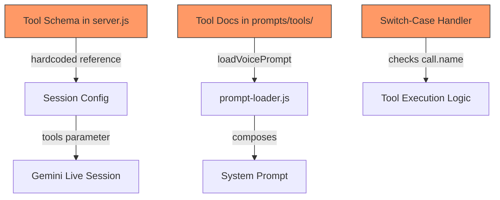
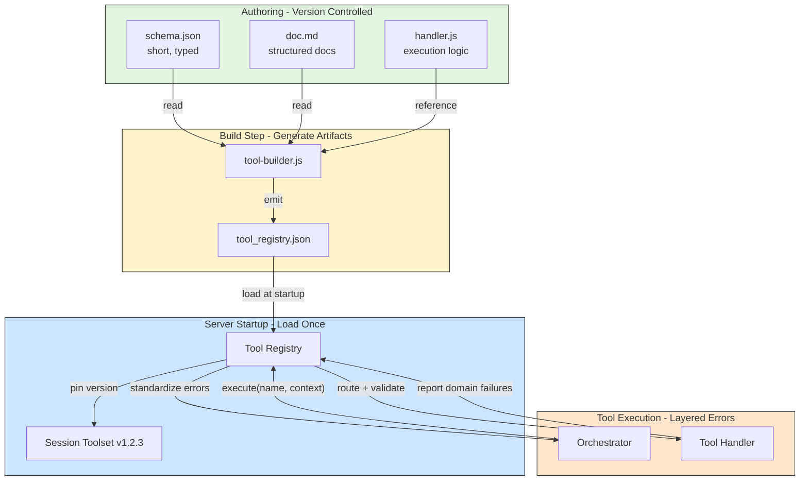
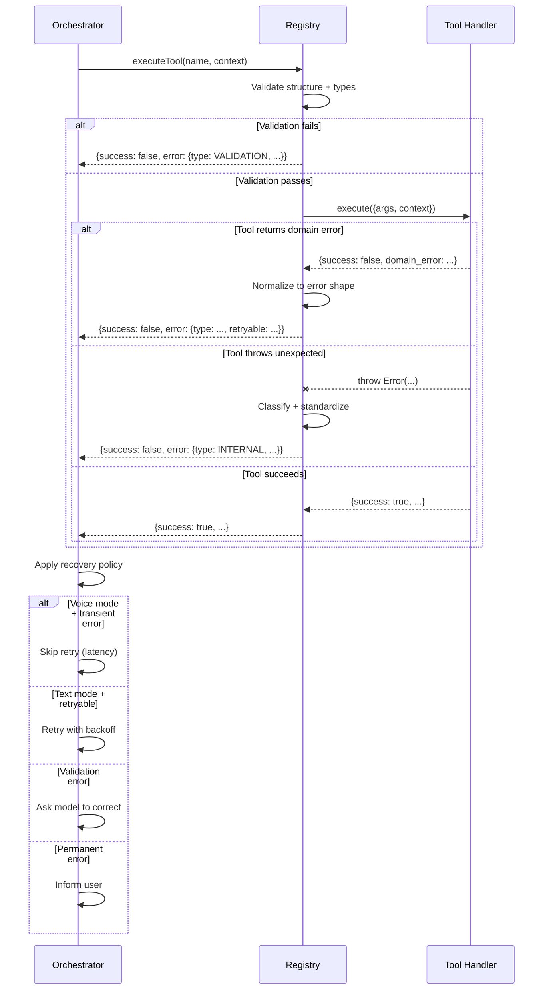

# Tool Registry Architecture Improvement Plan

## Plan Status: Production-Ready & Provider-Agnostic

### Architectural Wins Confirmed

1. **Provider Abstraction** - Canonical JSON Schema → derived SDK formats (correct)
2. **Retrieval-First Loop** - Stable orchestration pattern outside prompt (correct)
3. **Tool Categorization** - Restrained structure (retrieval/action/utility) (correct)
4. **Two-Tier Documentation** - Voice-optimized prompt sizing (correct)
5. **Ajv Usage** - Correct format application with `additionalProperties: false` (correct)
6. **Intent-Based State** - Centralized, auditable transitions (correct)

### Soft Spots Addressed

**SOFT SPOT 1: Confirmation Flow** → Implemented as first-class error type (`CONFIRMATION_REQUIRED`)
**SOFT SPOT 2: Idempotency** → Rigorous hash-based fallback with per-session + per-turn tracking
**SOFT SPOT 3: generateSDKSchema Footgun** → New implementation uses provider adapters from start (old bug avoided)

### High-Leverage Recommendations Integrated

**RECOMMENDATION 1: First-Class Confirmation Error** → Standardized `CONFIRMATION_REQUIRED` error with structured `confirmation_request` payload
**RECOMMENDATION 2: Explicit Voice Budget Enforcement** → Codified constants (max 2 retrieval, max 3 total, hard fail)
**RECOMMENDATION 3: Lock Registry Version** → `lock()` + `snapshot()` methods, version mismatch detection fatal in dev
**RECOMMENDATION 4: Structured Audit Logging** → Per-tool execution logs with metadata (already in plan)

---

**Final architectural revision - system is now provider-proof:**

- ✅ **Provider Adapter Layer**: Registry stores canonical JSON Schema, adapters translate to OpenAI/Gemini formats
- ✅ **Transport Abstraction**: Tool call/response plumbing works with any provider (OpenAI, Gemini Live, future)
- ✅ **OpenAI-Compat Preferred**: Use OpenAI function calling (Gemini 3 Flash supports this natively)
- ✅ **No SDK Coupling**: Registry doesn't know about `Type.*` enums or Gemini-specific shapes
- ✅ **Hash-Based Idempotency**: Fallback to content hash when provider call.id unstable/missing
- ✅ **Correct Ajv**: `addFormats()` properly applied, defaults mutation documented and logged
- ✅ **State Controller**: Fixes buggy value-passing in applyIntent
- ✅ **Real fs.existsSync**: Proper file checking (not try/catch readFileSync)
- ✅ **Complete Reference**: `kb_search` demonstrates all patterns with provider abstraction
- ✅ **Retrieval-First**: Supports "get more context, then act" agent evolution

---

## CRITICAL: Provider Abstraction Layer

### The Problem (Why This Matters)

**Original plan coupled registry to Gemini SDK specifics:**
- Registry used `Type.STRING`, `Type.OBJECT` enums from `@google/genai`
- Orchestrator hardcoded `geminiSession.sendToolResponse({ functionResponses: [...] })`
- Any SDK change breaks the entire system
- Can't switch providers without rewriting everything

**This is fragile because:**
- Google's Gemini 3 Flash supports **OpenAI-compatible endpoint** with standard function calling
- SDK shapes (`Type.*`, `functionDeclarations`, `sendToolResponse`) vary by API surface (Live vs REST)
- We shouldn't bet production architecture on SDK stability

### The Solution: Three-Layer Architecture

**Layer 1: Registry (Canonical)**
- Stores JSON Schema (draft 2020-12) + orchestration metadata
- Knows NOTHING about providers

**Layer 2: Provider Adapters**
- `openai.js` - Pass-through JSON Schema (Gemini 3 Flash OpenAI-compat endpoint)
- `gemini-native.js` - Convert to `Type.*` enums (only if using Live API)

**Layer 3: Transport**
- Abstract interface for tool call/response plumbing
- `openai-transport.js` - chat.completions tool calls
- `gemini-live-transport.js` - WebSocket tool events

**Result:**
```javascript
// Switch providers in 2 lines:
// const transport = new GeminiLiveTransport(geminiSession);
const transport = new OpenAITransport(client, conversationId);
```

Everything else stays the same!

### Provider Adapters

**`voice-server/tools/provider-adapters/openai.js`** (PREFERRED)

```javascript
/**
 * OpenAI adapter - pass-through since OpenAI uses JSON Schema natively
 * Gemini 3 Flash supports OpenAI-compatible endpoint
 */
export function toOpenAI(toolDefinition) {
  return {
    type: "function",
    function: {
      name: toolDefinition.toolId,
      description: toolDefinition.description,
      parameters: toolDefinition.parameters // Pass-through JSON Schema
    }
  };
}
```

**`voice-server/tools/provider-adapters/gemini-native.js`** (OPTIONAL)

```javascript
import { Type } from '@google/genai';

export function toGeminiNative(toolDefinition) {
  return {
    name: toolDefinition.toolId,
    description: toolDefinition.description,
    parameters: convertToGeminiSchema(toolDefinition.parameters)
  };
}

// Recursively convert JSON Schema → Gemini SDK format
function convertToGeminiSchema(jsonSchema) {
  const TYPE_MAP = {
    'string': Type.STRING,
    'number': Type.NUMBER,
    'integer': Type.NUMBER,
    'boolean': Type.BOOLEAN,
    'object': Type.OBJECT,
    'array': Type.ARRAY
  };
  
  const geminiSchema = { type: TYPE_MAP[jsonSchema.type] || Type.STRING };
  
  // Handle nested objects
  if (jsonSchema.type === 'object' && jsonSchema.properties) {
    geminiSchema.properties = {};
    for (const [key, prop] of Object.entries(jsonSchema.properties)) {
      geminiSchema.properties[key] = convertToGeminiSchema(prop);
    }
    if (jsonSchema.required) geminiSchema.required = jsonSchema.required;
  }
  
  // Handle arrays
  if (jsonSchema.type === 'array' && jsonSchema.items) {
    geminiSchema.items = convertToGeminiSchema(jsonSchema.items);
  }
  
  // Handle enums
  if (jsonSchema.enum) geminiSchema.enum = jsonSchema.enum;
  if (jsonSchema.description) geminiSchema.description = jsonSchema.description;
  
  return geminiSchema;
}
```

### Transport Layer

**`voice-server/providers/transport.js`** (Abstract interface)

```javascript
export class ToolTransport {
  receiveToolCalls(modelEvent) {
    throw new Error('Must implement receiveToolCalls');
  }
  
  async sendToolResult(result) {
    throw new Error('Must implement sendToolResult');
  }
}
```

**`voice-server/providers/openai-transport.js`**

```javascript
import { ToolTransport } from './transport.js';

export class OpenAITransport extends ToolTransport {
  constructor(client, conversationId) {
    super();
    this.client = client;
    this.conversationId = conversationId;
  }
  
  receiveToolCalls(message) {
    if (!message.tool_calls) return [];
    
    return message.tool_calls.map(tc => ({
      id: tc.id,
      name: tc.function.name,
      args: JSON.parse(tc.function.arguments)
    }));
  }
  
  async sendToolResult({ id, name, result }) {
    await this.client.sendMessage(this.conversationId, {
      role: "tool",
      tool_call_id: id,
      name: name,
      content: JSON.stringify(result.ok ? result.data : { error: result.error })
    });
  }
}
```

**`voice-server/providers/gemini-live-transport.js`**

```javascript
import { ToolTransport } from './transport.js';

export class GeminiLiveTransport extends ToolTransport {
  constructor(geminiSession) {
    super();
    this.geminiSession = geminiSession;
  }
  
  receiveToolCalls(message) {
    if (!message.toolCall?.functionCalls) return [];
    
    return message.toolCall.functionCalls.map(fc => ({
      id: fc.id || null, // Gemini may not provide stable IDs
      name: fc.name,
      args: fc.args || {}
    }));
  }
  
  async sendToolResult({ id, name, result }) {
    this.geminiSession.sendToolResponse({
      functionResponses: [{
        name: name,
        response: result.ok ? result.data : { error: result.error }
      }]
    });
  }
}
```

### Builder Updates

**`voice-server/tools/tool-builder.js`** - Add provider schema generation:

```javascript
import { toOpenAI } from './provider-adapters/openai.js';
import { toGeminiNative } from './provider-adapters/gemini-native.js';

function buildTool(toolDirName) {
  // ... existing validation ...
  
  // KEY CHANGE: Generate provider schemas at build time
  const providerSchemas = {
    openai: toOpenAI(schema),
    geminiNative: toGeminiNative(schema)
  };
  
  return {
    // ... existing fields ...
    jsonSchema: schema.parameters, // Canonical JSON Schema
    providerSchemas: providerSchemas, // Pre-computed provider formats
    // ...
  };
}

// FIX: Use real fs.existsSync
import { existsSync, statSync } from 'fs';

function checkFileExists(path) {
  return existsSync(path) && statSync(path).isFile();
}
```

### Registry Updates

**`voice-server/tools/registry.js`** - Provider-agnostic methods:

```javascript
class ToolRegistry {
  /**
   * Get provider-specific schemas (OpenAI or Gemini native)
   */
  getProviderSchemas(provider = 'openai') {
    return Array.from(this.tools.values()).map(tool => {
      if (!tool.providerSchemas[provider]) {
        throw new Error(`Tool ${tool.toolId} missing ${provider} schema`);
      }
      return tool.providerSchemas[provider];
    });
  }
  
  // FIX: Add formats properly
  async load() {
    import Ajv from 'ajv';
    import addFormats from 'ajv-formats';
    
    const ajv = new Ajv({
      allErrors: true,
      useDefaults: true,
      coerceTypes: false,
      removeAdditional: false,
      strict: true
    });
    
    addFormats(ajv); // Correct way to add formats
    
    // ... rest of load ...
  }
  
  // FIX: Log defaults mutation
  async executeTool(toolId, executionContext) {
    const argsBeforeDefaults = JSON.stringify(executionContext.args);
    const valid = validator(executionContext.args);
    const argsAfterDefaults = JSON.stringify(executionContext.args);
    
    if (argsBeforeDefaults !== argsAfterDefaults) {
      console.log(`[Registry] Defaults applied for ${toolId}:`, {
        before: JSON.parse(argsBeforeDefaults),
        after: JSON.parse(argsAfterDefaults)
      });
    }
    
    // ... rest of execution ...
  }
}
```

### Orchestrator Updates

**`voice-server/server.js`** - Use transport abstraction:

```javascript
import { toolRegistry } from './tools/registry.js';
import { OpenAITransport } from './providers/openai-transport.js';
import { GeminiLiveTransport } from './providers/gemini-live-transport.js';
import { createStateController } from './session-state.js';
import { createHash } from 'crypto';

await toolRegistry.load();

wss.on('connection', async (ws, req) => {
  // FIX: Store mode explicitly
  const sessionMode = USE_GEMINI_LIVE ? 'voice' : 'text';
  
  // FIX: Use state controller (not buggy applyIntent)
  const state = createStateController({
    isActive: true,
    mode: sessionMode,
    pendingEndVoiceSession: null,
    shouldSuppressAudio: false,
    shouldSuppressTranscript: false
  });
  
  // Initialize transport (provider-agnostic)
  let transport;
  if (USE_GEMINI_LIVE) {
    const geminiSession = await ai.live.connect({
      // ...
      tools: [{ 
        functionDeclarations: toolRegistry.getProviderSchemas('geminiNative')
      }]
    });
    transport = new GeminiLiveTransport(geminiSession);
  } else {
    // const client = createOpenAIClient();
    // transport = new OpenAITransport(client, clientId);
  }
  
  // FIX: Hash-based idempotency
  function generateIdempotencyKey(call, sessionTurnId) {
    if (call.id && call.id.length > 8) {
      return `provider:${call.id}`;
    }
    
    const canonical = JSON.stringify({
      tool: call.name,
      args: call.args,
      turn: sessionTurnId
    }, Object.keys(call.args || {}).sort());
    
    const hash = createHash('sha256').update(canonical).digest('hex').substring(0, 16);
    return `hash:${hash}`;
  }
  
  async function handleModelMessage(message) {
    sessionTurnId++;
    
    // Use transport (provider-agnostic)
    const toolCalls = transport.receiveToolCalls(message);
    
    for (const call of toolCalls) {
      const idempotencyKey = generateIdempotencyKey(call, sessionTurnId);
      
      // ... policy enforcement ...
      // ... tool execution ...
      
      await transport.sendToolResult({ id: call.id, name: call.name, result });
    }
  }
});
```

---

## Critical Corrections & Refinements

### Implementation Bugs Fixed (From Original Code)

**NOTE:** These bugs existed in the original hardcoded implementation. The new registry-based architecture fixes them from the start.

**1. generateSDKSchema - Nested Objects/Arrays Bug (ORIGINAL CODE)**

- **Problem**: Original implementation dropped nested properties, items, enum, formats
- **Solution**: New implementation uses provider adapters with recursive conversion
- **Why it matters**: Retrieval tool `filters` won't work properly without nested structure

**2. applyIntent - State Mutation Bug (ORIGINAL CODE)**

- **Problem**: Original code passed values not references, assignments didn't update outer variables
- **Solution**: New implementation uses `StateController` pattern with explicit mutation methods
- **Why it matters**: Intents must actually change session state

**3. Mode Detection - Logic Error (ORIGINAL CODE)**

- **Problem**: Original code used `currentMode = geminiSession ? 'voice' : 'text'` (incorrect)
- **Solution**: New implementation stores `session.mode` explicitly at session creation
- **Why it matters**: Policy enforcement relies on accurate mode detection

**4. ToolResponse Envelope - Inconsistency (FIXED IN PLAN)**

- **Problem**: Plan initially used both `success` and `ok` in different places
- **Solution**: Standardized on `ok` everywhere, enforced in registry
- **Why it matters**: Orchestrator must reliably parse responses

### Missing Production Features

**5. Idempotency Keys**

- **Problem**: No protection against reconnect/resend, duplicate calls
- **Solution**: Track `executionId` per tool call, dedupe at orchestrator level
- **Why it matters**: Critical for reliability, especially calendar/image generation

**6. Confirmation Flow Contract**

- **Problem**: `confirmed: false` placeholder with no specification
- **Solution**: Return `CONFIRMATION_REQUIRED` error with `confirmation_request` payload
- **Why it matters**: "Plan then commit" pattern needs clear UX contract

**7. On-Demand Docs Mechanism**

- **Problem**: Mentions `reg_describe(tool)` but no actual implementation
- **Solution**: Orchestrator pre-injects `doc.md` before tool execution (Option A - simpler for 10-15 tools)
- **Why it matters**: Agent needs way to get full docs for complex tools

**8. Ajv Configuration**

- **Problem**: Missing formats support, no default/coercion policy
- **Solution**: `new Ajv({ allErrors: true, useDefaults: true, coerceTypes: false, formats: require('ajv-formats') })`
- **Why it matters**: Email/date-time validation, consistent default behavior

### Refinements

**9. Retrieval Tool Enhancements**

- Add `namespace` field (studio vs personal vs public KB)
- Add `return_fields` to reduce payload
- Orchestrator clamps `top_k` in voice mode (max 3) regardless of model request

**10. Image Generation Classification**

- **Current**: `requiresConfirmation: true` (like calendar)
- **Better**: Policy-driven confirmation (e.g., only if sensitive topics or user didn't ask)
- **Why**: "Expensive" not "dangerous" - different risk profile

## Production-Grade Improvements Applied

Based on detailed feedback, the following improvements have been incorporated to avoid "looks clean on paper, becomes messy in production" traps:

### 1. Real JSON Schema Validation ✅

- **Problem**: Custom schema format with incomplete runtime validation
- **Solution**: Use actual JSON Schema (draft 2020-12) with Ajv validator
- **Benefits**: Validates all constraints (min/max/length/enum), nested types, consistent error paths

### 2. Two-Tier Documentation ✅

- **Problem**: Full docs injected into system prompt (scales poorly, increases latency)
- **Solution**: `doc_summary.md` (2-4 lines, always included) + `doc.md` (full detail, on-demand)
- **Benefits**: Tight prompts for voice, detailed docs available when needed

### 3. Intent-Based State Management ✅

- **Problem**: `setState()` allows tools to mutate arbitrary session state (footgun)
- **Solution**: Tools return intents, orchestrator applies them safely
- **Benefits**: Tools can't "invent" state updates, safer sequencing, cleaner for agents

### 4. Strict Tool Naming ✅

- **Problem**: Inconsistent mapping between directory names and tool IDs
- **Solution**: Enforce canonical `toolId`, derive everything from it, build validates match
- **Benefits**: No subtle bugs from name mismatches

### 5. Content-Based Versioning ✅

- **Problem**: Timestamp versions can collide, don't track which commit
- **Solution**: SHA256 hash of tools+schemas+docs, plus git commit tracking
- **Benefits**: Deterministic, meaningful versions, audit trail

### 6. Standardized Response Envelope ✅

- **Problem**: Mixed response formats across tools
- **Solution**: Uniform `ToolResponse` with `ok`, `data/error`, `meta` (includes versions + duration)
- **Benefits**: Orchestrator always knows where to look, automatic version tracking

### 7. Strict Parameter Validation ✅

- **Problem**: Extra parameters silently ignored (model hallucinations go undetected)
- **Solution**: `additionalProperties: false` in JSON Schema, reject unknown params
- **Benefits**: Fail fast on malformed calls

### 8. Cross-Platform Import Safety ✅

- **Problem**: Dynamic imports can behave oddly on Windows/ESM
- **Solution**: Use `pathToFileURL` for handler paths
- **Benefits**: Reliable across platforms

### 9. Clear Source of Truth Separation ✅

- **Schema (`schema.json`)**: Source of truth for API contract (parameters, types, constraints)
- **Docs (`doc_summary.md` + `doc.md`)**: Source of truth for usage guidance (when to use, examples, footguns)
- **Policy (`core.md`)**: Source of truth for global policies (escalation, behavior, tone)
- **Benefits**: No accidental mixing of contract details into docs, clear ownership

### 10. Build-Time Linting ✅

- **Problem**: Schema/doc drift detected only at runtime
- **Solution**: Build fails if missing required sections, name mismatches, invalid schemas
- **Benefits**: Catch issues before deployment

### 11. Capabilities Pattern ✅

- **Problem**: Tools access raw `ws`, `geminiSession` (tight coupling)
- **Solution**: Context provides `messaging`, `voice`, `audio`, `audit` capabilities
- **Benefits**: Testable, composable, abstracts implementation details

## 1. Current Implementation Analysis

### Problems Identified

**Multiple Sources of Truth:**

- Tool schemas hardcoded in [`voice-server/server.js`](voice-server/server.js) (lines 30-185)
- Tool documentation in separate markdown files (`prompts/tools/*.md`)
- Tool handlers in switch-case (lines 476-598)
- Tool registration hardcoded in session config (line 876)

**Adding a New Tool Requires 4 Manual Steps:**

1. Create JavaScript schema object with `Type.OBJECT`, `Type.STRING`, etc.
2. Add to `tools: [{ functionDeclarations: [...] }]` array
3. Add handler case in `handleGeminiMessage` switch statement
4. Create markdown documentation file

**Fragility Issues:**

- Schema definitions use SDK-specific types (`Type.OBJECT`, `Type.NUMBER`) scattered throughout code
- No validation that schema matches documentation
- Tool execution logic tightly coupled to message handler
- System prompt must be manually updated when tools change

### Current Flow Diagram



## 2. Proposed Solution: Build-Time Tool Registry

### Core Principles

**Design Decisions (Based on Requirements):**

1. **Markdown as source of truth** - Tools authored in `.md` files (version controlled, PR reviewed, diff-friendly)
2. **Build-time generation** - Registry JSON generated as build artifact from markdown + schema
3. **Startup-only loading** - All tools registered at server startup (no lazy loading, no hot reload in production)
4. **Versioned toolsets** - Pin registry version at session start, log with every tool execution
5. **Layered error handling** - Registry standardizes/classifies, orchestrator recovers, tools report domain failures
6. **Hybrid state access** - Tools receive state via context but don't manage it directly

### New Architecture



### File Structure (With Provider Abstraction)

```
voice-server/
├── tools/                           # Tool definitions directory
│   ├── kb-search/
│   │   ├── schema.json             # Canonical JSON Schema (source of truth)
│   │   ├── doc_summary.md          # 2-4 line summary (always in prompt)
│   │   ├── doc.md                  # Full structured documentation (on-demand)
│   │   └── handler.js              # Execution logic with intents
│   ├── ignore-user/
│   │   ├── schema.json
│   │   ├── doc_summary.md
│   │   ├── doc.md
│   │   └── handler.js
│   ├── end-voice-session/
│   │   ├── schema.json
│   │   ├── doc_summary.md
│   │   ├── doc.md
│   │   └── handler.js
│   ├── registry.js                 # Runtime registry (loads tool_registry.json)
│   ├── tool-builder.js             # Build script (generates tool_registry.json)
│   ├── error-types.js              # Error classification + ToolError + IntentType
│   ├── provider-adapters/          # NEW: Provider-specific format converters
│   │   ├── openai.js               # OpenAI format (PREFERRED)
│   │   └── gemini-native.js        # Gemini SDK format (optional, Live API only)
│   └── README.md                   # Guide for adding new tools
├── providers/                       # NEW: Transport abstraction layer
│   ├── transport.js                # Abstract transport interface
│   ├── openai-transport.js         # OpenAI chat.completions tool calls
│   └── gemini-live-transport.js    # Gemini Live WebSocket tool events
├── session-state.js                # NEW: State controller (fixes buggy applyIntent)
├── tool_registry.json              # GENERATED: Build artifact (gitignored)
├── server.js                       # UPDATED: Uses transport + registry + state controller
├── config.js                       # UPDATED: Injects registry version
└── prompt-loader.js                # UPDATED: Injects tool summaries + stable loop
```

**Key structural changes:**
- Registry stores canonical JSON Schema (no `Type.*` enums)
- Provider adapters translate at build time
- Transport layer abstracts tool call/response protocol
- State controller replaces buggy `applyIntent`

## 3. Tool Categorization Strategy

### Three Tool Categories

As the agent's job shifts to **"get more context, then act"**, the tool registry evolves from a few action tools to a mix of retrieval, action, and utility tools.

#### 1. Retrieval Tools (Safe to Call Often)

**Purpose**: Context expansion - agent's "eyes"

**Characteristics:**

- Read-only operations
- Idempotent (safe to retry)
- Fast (voice: <800ms, text: <2s)
- Structured outputs (prevent hallucination)
- No confirmation needed

**Examples:**

- `kb_search` - Search knowledge base with filters
- `kb_get` - Fetch specific record by ID
- `linkedin_lookup` - Get LinkedIn URL from KB (stored reference, not web scraping)

**Design principle**: Don't create tool sprawl. Use 1-2 general retrieval tools with strong structure, not 10 specialized ones.

#### 2. Action Tools (Call Sparingly)

**Purpose**: Side effects - agent's "hands"

**Characteristics:**

- Explicit side effects
- Usually require high confidence
- Often need confirmation (scheduling, sending)
- Slower (acceptable: 2-5s)
- May require planning stage

**Examples:**

- `calendar_get_availability` (retrieval) → conversation → `calendar_create_event` (action with confirmation)
- `image_draft_prompt` → `image_generate` (two-stage for expensive operations)
- `ignore_user` (immediate action, moderation)
- `end_voice_session` (immediate action, session control)

**Design principle**: 
- **Retrieval-first**: Check calendar/context before proposing actions
- **Conversational planning**: Agent discusses options naturally after retrieval
- **Confirmation for writes**: Calendar/image creation requires explicit confirmation

#### 3. Utility Tools (Deterministic Helpers)

**Purpose**: Transform, summarize, extract - when deterministic behavior needed

**Characteristics:**

- No external side effects
- Fast processing
- Consistent outputs
- Can be done by model, but tool ensures predictability

**Examples:**

- `extract_contacts` - Parse text for structured contact info
- `rank_results` - Deterministic ranking algorithm
- `format_datetime` - Consistent date formatting

### Retrieval-First Agent Loop

**Stable pattern (voice + text):**

```
1. Missing context? → kb_search (max 1-2 calls in voice)
2. Found relevant items? → kb_get for top 1-2 (use IDs)
3. Answer using structured fields + cite sources
4. Need action? → Retrieve first (calendar_get_availability, then discuss)
5. Commit action → Only when confirmed (calendar_create_event, image_generate)
```

This loop stays **stable in the prompt** while KB grows and tools are added.

### Voice-Specific Retrieval Budget

**Voice mode constraints:**

- Max 1-2 retrieval calls per turn (latency budget)
- Smaller `top_k` (3 vs 10 for text)
- Prefer `kb_get` if IDs known (faster than search)
- Sequential searches forbidden (too slow)

**Text mode flexibility:**

- Allow deeper retrieval (3-5 calls)
- Larger `top_k`
- Can do multi-stage context building

### Citation-Like Outputs (Auditable)

**Every retrieval tool returns evidence objects:**

```json
{
  "items": [
    {
      "id": "person:andrei_clodius",
      "type": "person",
      "title": "Andrei Clodius",
      "snippet": "Founder of FRAM...",
      "score": 0.94,
      "source_type": "crm",
      "last_updated": "2026-01-10",
      "url": "https://linkedin.com/in/andrei",
      "metadata": { "role": "founder", "company": "FRAM" }
    }
  ]
}
```

**Benefits:**

- Agent says: "Based on person:andrei_clodius record..."
- Log exactly what it used
- Prevents hallucinated links (only returns KB data)
- Auditable trail

## 4. Tool Definition Standard

### Three-File Pattern (Per Tool)

Each tool consists of three files in its own directory:

#### 1. Schema File (`schema.json`)

**Purpose**: Source of truth for contract using **real JSON Schema (draft 2020-12)** with orchestration metadata

```json
{
  "toolId": "ignore_user",
  "version": "1.0.0",
  "description": "Block user for specified duration. Side effects: ends voice session, blocks all messages.",
  
  "category": "action",
  "sideEffects": "writes",
  "idempotent": false,
  "requiresConfirmation": false,
  "allowedModes": ["text", "voice"],
  "latencyBudgetMs": 1000,
  
  "parameters": {
    "type": "object",
    "additionalProperties": false,
    "required": ["duration_seconds", "farewell_message"],
    "properties": {
      "duration_seconds": {
        "type": "number",
        "description": "Block duration in seconds",
        "minimum": 30,
        "maximum": 86400
      },
      "farewell_message": {
        "type": "string",
        "description": "Final message before blocking (spoken in voice mode)",
        "maxLength": 200
      }
    }
  }
}
```

**Orchestration metadata** (enables policy enforcement without prompt changes):

- **`category`**: `"retrieval"` | `"action"` | `"utility"` - Tool classification
- **`sideEffects`**: `"none"` | `"read_only"` | `"writes"` - Side effect tracking
- **`idempotent`**: Safe to retry or not
- **`requiresConfirmation`**: Actions like calendar events need confirmation
- **`allowedModes`**: `["text"]`, `["voice"]`, or `["text", "voice"]` - Mode restrictions
- **`latencyBudgetMs`**: Voice requires fast tools (<1s), text more flexible

---

### Example: Retrieval Tool (`kb_search`)

```json
{
  "toolId": "kb_search",
  "version": "1.0.0",
  "description": "Search knowledge base with filters. Returns structured results with citations.",
  
  "category": "retrieval",
  "sideEffects": "read_only",
  "idempotent": true,
  "requiresConfirmation": false,
  "allowedModes": ["text", "voice"],
  "latencyBudgetMs": 800,
  
  "parameters": {
    "type": "object",
    "additionalProperties": false,
    "required": ["query"],
    "properties": {
      "query": {
        "type": "string",
        "description": "Search query",
        "maxLength": 200
      },
      "filters": {
        "type": "object",
        "properties": {
          "type": {
            "type": "string",
            "enum": ["project", "person", "process", "link", "doc"]
          },
          "tags": {
            "type": "array",
            "items": { "type": "string" }
          }
        }
      },
      "top_k": {
        "type": "number",
        "description": "Number of results (voice: max 3, text: max 10)",
        "minimum": 1,
        "maximum": 10,
        "default": 5
      },
      "include_snippets": {
        "type": "boolean",
        "description": "Include text snippets",
        "default": true
      }
    }
  }
}
```

---

### Example: Action Tool with Confirmation (`calendar_create_event`)

```json
{
  "toolId": "calendar_create_event",
  "version": "1.0.0",
  "description": "Create calendar event with Zoom link. Requires confirmation.",
  
  "category": "action",
  "sideEffects": "writes",
  "idempotent": false,
  "requiresConfirmation": true,
  "allowedModes": ["text"],
  "latencyBudgetMs": 3000,
  
  "parameters": {
    "type": "object",
    "additionalProperties": false,
    "required": ["title", "start_time", "end_time", "attendees"],
    "properties": {
      "title": {
        "type": "string",
        "description": "Event title",
        "maxLength": 200
      },
      "start_time": {
        "type": "string",
        "format": "date-time",
        "description": "Event start time (ISO 8601)"
      },
      "end_time": {
        "type": "string",
        "format": "date-time",
        "description": "Event end time (ISO 8601)"
      },
      "attendees": {
        "type": "array",
        "description": "Email addresses of attendees",
        "items": { 
          "type": "string", 
          "format": "email" 
        },
        "minItems": 1,
        "maxItems": 50
      },
      "description": {
        "type": "string",
        "description": "Event description/agenda",
        "maxLength": 2000
      },
      "include_zoom_link": {
        "type": "boolean",
        "description": "Generate Zoom meeting link",
        "default": true
      }
    }
  }
}
```

**Note:** Agent should call `calendar_get_availability` FIRST to see what times are free, then discuss with user, then call this tool with confirmation.

#### 2. Documentation Files

**Purpose**: Two-tier documentation for performance

**`doc_summary.md`** - Always injected into system prompt (2-4 lines max):

```markdown
Block user who is rude/abusive for specified duration (30s-24h). Ends voice session after farewell is spoken. Follow escalation: warn first (unless extreme), then escalate based on severity. User blocked until timeout expires.
```

**`doc.md`** - Full documentation (loaded on demand via `reg_describe(tool)` or pre-call injection):

```markdown
# Timeout Tool (ignore_user)

## Summary
Block users who are rude, disrespectful, or abusive. User cannot send messages for the specified duration.

## Preconditions
- User has committed offense worthy of timeout
- You have followed escalation policy (see core.md) unless extreme abuse

## Postconditions
- Voice session ends after farewell is spoken
- User blocked for duration_seconds
- Client UI shows timeout message and countdown
- Audit log entry created with reason

## Invariants
- Farewell message WILL be spoken in voice mode before block takes effect
- Duration between 30-86400 seconds (enforced by schema)
- Tool is NOT idempotent (repeated calls extend timeout)

## Failure Modes
- **Session already ended**: Returns SESSION_INACTIVE error, no side effects
- **Invalid duration**: Registry validates and rejects before execution (VALIDATION error)
- **WebSocket closed**: Returns TRANSIENT error, logs issue, no timeout applied

## Examples

### Example 1: Second Offense
User: "You're being really annoying"
Your response: [Verbal warning per core.md policy]
User: "Seriously, shut up"
Your action:
\`\`\`json
{
  "duration_seconds": 60,
  "farewell_message": "I don't tolerate disrespect. This conversation is over."
}
\`\`\`

### Example 2: Extreme Abuse
User: [Vile insult/threat]
Your action:
\`\`\`json
{
  "duration_seconds": 86400,
  "farewell_message": "That behavior is completely unacceptable. You're blocked for 24 hours."
}
\`\`\`

## Common Mistakes (Do Not)
❌ Use this tool based on past conversation history (only current session)
❌ Threaten to use it (either warn or act)
❌ Use out of annoyance (only when respect is broken)
❌ Forget expired timeouts are "paid for" (reset escalation after timeout)
❌ Call without following escalation policy (documented in core.md)
```

**Note**: Escalation policy lives in `core.md` (global policy), not per-tool docs. Tool doc references it.

#### 3. Handler File (`handler.js`)

**Purpose**: Execution logic with semantic validation, returns intents (not setState)

```javascript
import { ToolError, ErrorType } from '../error-types.js';

/**
 * Block user for specified duration
 * @param {object} args - Validated parameters from schema
 * @param {object} context - Execution context with capabilities
 * @returns {ToolResponse} - Standardized response with intents
 */
export async function execute({ args, context }) {
  const { duration_seconds, farewell_message } = args;
  
  // Semantic validation (schema already validated types/structure)
  if (!context.session.isActive) {
    // Expected domain failure - return as result, not exception
    return {
      ok: false,
      error: {
        type: ErrorType.SESSION_INACTIVE,
        message: 'Cannot timeout user - session already ended',
        retryable: false
      }
    };
  }
  
  // Calculate timeout
  const timeoutUntil = Date.now() + (duration_seconds * 1000);
  
  // Send timeout command to client (side effect)
  try {
    await context.messaging.send({
      type: 'timeout',
      durationSeconds: duration_seconds,
      timeoutUntil,
      farewellMessage: farewell_message
    });
  } catch (error) {
    // Unexpected failure (WebSocket error, etc)
    throw new ToolError(ErrorType.TRANSIENT, 'Failed to send timeout command', {
      retryable: true,
      partialSideEffects: false // Timeout not applied
    });
  }
  
  // Log for audit trail with context
  context.audit.log('user_timeout', {
    duration: duration_seconds,
    timeoutUntil,
    reason: 'tool_invocation'
  });
  
  // Return success WITH INTENTS (orchestrator applies state changes)
  return {
    ok: true,
    data: {
      timeoutUntil,
      duration: duration_seconds
    },
    intents: [
      // Voice session should end after farewell is spoken
      { type: 'END_VOICE_SESSION', after: 'farewell_spoken' },
      // No further responses should be generated
      { type: 'SUPPRESS_AUDIO', value: true }
    ]
  };
}
```

**Key improvements:**

- Returns **intents** instead of mutating state via `setState`
- Domain failures return error results (not exceptions)
- Uses **capabilities** (`context.messaging`, `context.audit`) instead of raw `ws`
- Explicit side effects tracking for orchestrator

### Build-Time Tool Builder

**`voice-server/tools/tool-builder.js`**

Generates `tool_registry.json` with **build-time linting** and **content-based versioning**:

```javascript
import { readdirSync, readFileSync, writeFileSync } from 'fs';
import { join, dirname } from 'path';
import { fileURLToPath, pathToFileURL } from 'url';
import { createHash } from 'crypto';
import { execSync } from 'child_process';
import Ajv from 'ajv';

const __dirname = dirname(fileURLToPath(import.meta.url));
const TOOLS_DIR = __dirname;
const OUTPUT_FILE = join(__dirname, '../tool_registry.json');

// JSON Schema validator
const ajv = new Ajv({ allErrors: true, strict: true });

// Type mapping for SDK (Gemini uses string representations)
const TYPE_MAP = {
  'string': 'STRING',
  'number': 'NUMBER',
  'integer': 'NUMBER',
  'boolean': 'BOOLEAN',
  'object': 'OBJECT',
  'array': 'ARRAY'
};

// Required sections in doc.md
const REQUIRED_DOC_SECTIONS = [
  '## Summary',
  '## Preconditions',
  '## Postconditions',
  '## Invariants',
  '## Failure Modes',
  '## Examples',
  '## Common Mistakes'
];

function buildRegistry() {
  const tools = [];
  const errors = [];
  
  // Only process directories (ignore .js files in tools/)
  const toolDirs = readdirSync(TOOLS_DIR, { withFileTypes: true })
    .filter(dirent => dirent.isDirectory() && !dirent.name.startsWith('.'))
    .map(dirent => dirent.name);
  
  console.log(`Found ${toolDirs.length} tool directories`);
  
  for (const toolDirName of toolDirs) {
    try {
      const tool = buildTool(toolDirName);
      tools.push(tool);
      console.log(`✓ Built tool: ${tool.toolId}`);
    } catch (error) {
      errors.push({ tool: toolDirName, error: error.message });
      console.error(`✗ Failed to build ${toolDirName}: ${error.message}`);
    }
  }
  
  // Fail build if any tools failed
  if (errors.length > 0) {
    console.error(`\n❌ Build failed with ${errors.length} error(s):`);
    errors.forEach(e => console.error(`  - ${e.tool}: ${e.error}`));
    process.exit(1);
  }
  
  // Generate registry with deterministic version
  const registryVersion = generateRegistryVersion(tools);
  const gitCommit = getGitCommit();
  
  const registry = {
    version: registryVersion,
    gitCommit: gitCommit,
    buildTimestamp: new Date().toISOString(),
    tools: tools
  };
  
  writeFileSync(OUTPUT_FILE, JSON.stringify(registry, null, 2));
  console.log(`\n✓ Built tool registry successfully`);
  console.log(`  Version: ${registry.version}`);
  console.log(`  Git commit: ${gitCommit || 'N/A'}`);
  console.log(`  Tools: ${tools.map(t => t.toolId).join(', ')}`);
}

function buildTool(toolDirName) {
  const toolPath = join(TOOLS_DIR, toolDirName);
  
  // Read and validate schema.json
  const schemaPath = join(toolPath, 'schema.json');
  if (!existsSync(schemaPath)) {
    throw new Error('Missing schema.json');
  }
  const schema = JSON.parse(readFileSync(schemaPath, 'utf-8'));
  
  // Lint schema structure
  lintSchema(schema, toolDirName);
  
  // Validate parameters are valid JSON Schema
  try {
    ajv.compile(schema.parameters);
  } catch (error) {
    throw new Error(`Invalid JSON Schema in parameters: ${error.message}`);
  }
  
  // Read and validate doc_summary.md
  const summaryPath = join(toolPath, 'doc_summary.md');
  if (!existsSync(summaryPath)) {
    throw new Error('Missing doc_summary.md');
  }
  const summary = readFileSync(summaryPath, 'utf-8').trim();
  if (summary.length > 250) {
    throw new Error(`doc_summary.md too long (${summary.length} chars, max 250)`);
  }
  
  // Read and validate doc.md
  const docPath = join(toolPath, 'doc.md');
  if (!existsSync(docPath)) {
    throw new Error('Missing doc.md');
  }
  const documentation = readFileSync(docPath, 'utf-8');
  lintDocumentation(documentation);
  
  // Verify handler.js exists and exports execute
  const handlerPath = join(toolPath, 'handler.js');
  if (!existsSync(handlerPath)) {
    throw new Error('Missing handler.js');
  }
  
  // Verify toolId matches directory name (canonical ID)
  const expectedToolId = toolDirName.replace(/-/g, '_');
  if (schema.toolId !== expectedToolId) {
    throw new Error(`toolId "${schema.toolId}" doesn't match directory "${toolDirName}" (expected "${expectedToolId}")`);
  }
  
  // Generate SDK-compatible schema from JSON Schema
  const sdkSchema = generateSDKSchema(schema);
  
  // Use pathToFileURL for cross-platform safety
  const handlerUrl = pathToFileURL(handlerPath).href;
  
  return {
    toolId: schema.toolId,
    version: schema.version,
    category: schema.category,
    sideEffects: schema.sideEffects,
    idempotent: schema.idempotent,
    requiresConfirmation: schema.requiresConfirmation,
    allowedModes: schema.allowedModes,
    latencyBudgetMs: schema.latencyBudgetMs,
    schema: sdkSchema,
    jsonSchema: schema.parameters, // Keep for runtime validation
    summary: summary,
    documentation: documentation,
    handlerPath: handlerUrl
  };
}

function lintSchema(schema, toolDirName) {
  // Required fields
  const required = [
    'toolId', 'version', 'description', 
    'category', 'sideEffects', 'idempotent', 
    'requiresConfirmation', 'allowedModes', 'latencyBudgetMs',
    'parameters'
  ];
  
  for (const field of required) {
    if (schema[field] === undefined) {
      throw new Error(`Missing required field: ${field}`);
    }
  }
  
  // Validate category
  const validCategories = ['retrieval', 'action', 'utility'];
  if (!validCategories.includes(schema.category)) {
    throw new Error(`Invalid category: ${schema.category} (must be one of: ${validCategories.join(', ')})`);
  }
  
  // Validate sideEffects
  const validSideEffects = ['none', 'read_only', 'writes'];
  if (!validSideEffects.includes(schema.sideEffects)) {
    throw new Error(`Invalid sideEffects: ${schema.sideEffects} (must be one of: ${validSideEffects.join(', ')})`);
  }
  
  // Validate allowedModes
  if (!Array.isArray(schema.allowedModes) || schema.allowedModes.length === 0) {
    throw new Error('allowedModes must be non-empty array');
  }
  
  const validModes = ['text', 'voice'];
  for (const mode of schema.allowedModes) {
    if (!validModes.includes(mode)) {
      throw new Error(`Invalid mode in allowedModes: ${mode} (must be one of: ${validModes.join(', ')})`);
    }
  }
  
  // Validate latencyBudgetMs
  if (typeof schema.latencyBudgetMs !== 'number' || schema.latencyBudgetMs <= 0) {
    throw new Error('latencyBudgetMs must be positive number');
  }
  
  // Validate parameters is JSON Schema object
  if (schema.parameters.type !== 'object') {
    throw new Error('parameters.type must be "object"');
  }
  
  if (schema.parameters.additionalProperties !== false) {
    throw new Error('parameters.additionalProperties must be false (reject hallucinated params)');
  }
  
  // Category-specific validation
  if (schema.category === 'retrieval') {
    if (schema.sideEffects === 'writes') {
      throw new Error('Retrieval tools cannot have sideEffects: "writes"');
    }
    if (!schema.idempotent) {
      throw new Error('Retrieval tools must be idempotent');
    }
  }
  
  if (schema.category === 'action' && schema.sideEffects === 'writes') {
    // Actions with side effects should specify if confirmation needed
    // (This is a warning, not error - some actions like ignore_user don't need confirmation)
    if (!schema.requiresConfirmation) {
      console.warn(`⚠️  Action tool ${schema.toolId} has writes but doesn't require confirmation - verify this is intentional`);
    }
  }
}

function lintDocumentation(doc) {
  for (const section of REQUIRED_DOC_SECTIONS) {
    if (!doc.includes(section)) {
      throw new Error(`Missing required section: ${section}`);
    }
  }
}

// NOTE: Old implementations used generateSDKSchema() which had a critical bug:
// - Dropped nested objects, arrays, enums, formats
// - Flattened complex schemas to simple properties only
// 
// This new implementation uses provider adapters from the start (no bug).
// See provider-adapters/ directory for toOpenAI() and toGeminiNative()

function generateRegistryVersion(tools) {
  // Content-based version: hash of all tool IDs + schemas + doc hashes
  const content = tools
    .map(t => `${t.toolId}:${t.version}:${hashString(t.schema)}:${hashString(t.summary)}`)
    .join('|');
  
  const hash = hashString(content);
  return `1.0.${hash.substring(0, 8)}`;
}

function hashString(str) {
  return createHash('sha256').update(JSON.stringify(str)).digest('hex');
}

function getGitCommit() {
  try {
    return execSync('git rev-parse --short HEAD', { encoding: 'utf-8' }).trim();
  } catch {
    return null;
  }
}

function existsSync(path) {
  try {
    readFileSync(path);
    return true;
  } catch {
    return false;
  }
}

buildRegistry();
```

**Key improvements:**

- **Build-time linting** - Fails if schema/docs missing required sections
- **JSON Schema validation** with Ajv
- **Content-based versioning** - Hash of tools + schemas (deterministic)
- **Git commit tracking** - Records which commit built the registry
- **Strict validation** - `additionalProperties: false` enforced
- **Cross-platform imports** - Uses `pathToFileURL` for handler paths
- **Canonical toolId** - Enforces directory name = toolId (with dash → underscore conversion)

### Runtime Registry Loader

**`voice-server/tools/registry.js`**

Loads pre-built registry, validates with Ajv, provides standardized execution envelope:

```javascript
import { readFileSync } from 'fs';
import { join, dirname } from 'path';
import { fileURLToPath } from 'url';
import { Type } from '@google/genai';
import Ajv from 'ajv';
import { ToolError, ErrorType } from './error-types.js';

const __dirname = dirname(fileURLToPath(import.meta.url));
const REGISTRY_FILE = join(__dirname, '../tool_registry.json');

// JSON Schema validator
const ajv = new Ajv({ allErrors: true });

// Type mapping from string to SDK enum
const TYPE_ENUM = {
  'STRING': Type.STRING,
  'NUMBER': Type.NUMBER,
  'BOOLEAN': Type.BOOLEAN,
  'OBJECT': Type.OBJECT,
  'ARRAY': Type.ARRAY
};

/**
 * Tool Registry - loads and executes tools with validation and error handling
 */
class ToolRegistry {
  constructor() {
    this.tools = new Map();
    this.handlers = new Map();
    this.validators = new Map(); // Ajv validators per tool
    this.version = null;
    this.gitCommit = null;
    this.locked = false;          // RECOMMENDATION 3: Lock after load
    this.frozenSnapshot = null;   // RECOMMENDATION 3: Immutable snapshot
  }

  /**
   * Load registry at startup - validates all tools and handlers
   */
  async load() {
    const registryData = JSON.parse(readFileSync(REGISTRY_FILE, 'utf-8'));
    this.version = registryData.version;
    this.gitCommit = registryData.gitCommit;
    
    for (const tool of registryData.tools) {
      // Convert schema types from strings to SDK enums
      const sdkSchema = this.convertToSDKTypes(tool.schema);
      
      // Compile JSON Schema validator (strict validation with Ajv)
      const validator = ajv.compile(tool.jsonSchema);
      
      // Load handler dynamically using file:// URL from builder
      const handlerModule = await import(tool.handlerPath);
      
      // Verify handler exports execute function
      if (typeof handlerModule.execute !== 'function') {
        throw new Error(`Handler for ${tool.toolId} doesn't export execute function`);
      }
      
      this.tools.set(tool.toolId, {
        toolId: tool.toolId,
        version: tool.version,
        category: tool.category,
        sideEffects: tool.sideEffects,
        idempotent: tool.idempotent,
        requiresConfirmation: tool.requiresConfirmation,
        allowedModes: tool.allowedModes,
        latencyBudgetMs: tool.latencyBudgetMs,
        schema: sdkSchema,
        summary: tool.summary,
        documentation: tool.documentation
      });
      
      this.handlers.set(tool.toolId, handlerModule.execute);
      this.validators.set(tool.toolId, validator);
    }
    
    console.log(`✓ Loaded tool registry v${this.version} (commit: ${this.gitCommit || 'N/A'}) with ${this.tools.size} tools`);
    console.log(`  Tools: ${Array.from(this.tools.keys()).join(', ')}`);
  }
  
  convertToSDKTypes(schema) {
    const converted = { ...schema };
    if (converted.parameters) {
      converted.parameters = {
        type: TYPE_ENUM[schema.parameters.type],
        properties: {},
        required: schema.parameters.required
      };
      
      for (const [key, prop] of Object.entries(schema.parameters.properties)) {
        converted.parameters.properties[key] = {
          type: TYPE_ENUM[prop.type],
          description: prop.description
        };
      }
    }
    return converted;
  }

  /**
   * Get SDK-compatible schemas for session config
   */
  getSDKSchemas() {
    return Array.from(this.tools.values()).map(tool => tool.schema);
  }

  /**
   * Get summaries (injected into system prompt)
   */
  getSummaries() {
    return Array.from(this.tools.values())
      .map(tool => `**${tool.toolId}** (${tool.category}): ${tool.summary}`)
      .join('\n\n');
  }

  /**
   * Get full documentation for a specific tool (on-demand)
   */
  getDocumentation(toolId) {
    const tool = this.tools.get(toolId);
    return tool ? tool.documentation : null;
  }
  
  /**
   * Get tool metadata for orchestrator policy enforcement
   */
  getToolMetadata(toolId) {
    const tool = this.tools.get(toolId);
    if (!tool) return null;
    
    return {
      toolId: tool.toolId,
      version: tool.version,
      category: tool.category,
      sideEffects: tool.sideEffects,
      idempotent: tool.idempotent,
      requiresConfirmation: tool.requiresConfirmation,
      allowedModes: tool.allowedModes,
      latencyBudgetMs: tool.latencyBudgetMs
    };
  }
  
  /**
   * Get tools by category (useful for analytics and debugging)
   */
  getToolsByCategory(category) {
    return Array.from(this.tools.values())
      .filter(tool => tool.category === category)
      .map(tool => tool.toolId);
  }

  /**
   * Execute a tool with layered error handling
   * Returns standardized ToolResponse envelope
   */
  async executeTool(toolId, executionContext) {
    const startTime = Date.now();
    
    // Check if tool exists
    if (!this.handlers.has(toolId)) {
      return this.createResponse(toolId, false, {
        type: ErrorType.NOT_FOUND,
        message: `Unknown tool: ${toolId}`,
        retryable: false
      }, startTime);
    }
    
    const handler = this.handlers.get(toolId);
    const tool = this.tools.get(toolId);
    const validator = this.validators.get(toolId);
    
    // Validate parameters with Ajv (strict JSON Schema validation)
    const valid = validator(executionContext.args);
    if (!valid) {
      const errors = validator.errors.map(e => 
        `${e.instancePath || 'root'} ${e.message}`
      ).join(', ');
      
      return this.createResponse(toolId, false, {
        type: ErrorType.VALIDATION,
        message: `Invalid parameters: ${errors}`,
        retryable: false,
        details: validator.errors
      }, startTime);
    }
    
    // Build context with capabilities (not raw ws/geminiSession)
    const context = this.buildContext(executionContext, tool);
    
    // Execute tool with error handling
    try {
      const result = await handler({ args: executionContext.args, context });
      
      // Tool returned result (ok: true/false)
      if (result.ok === false) {
        // Domain failure (expected, not exception)
        return this.createResponse(toolId, false, result.error, startTime);
      }
      
      // Success
      return this.createResponse(toolId, true, result.data, startTime, result.intents);
      
    } catch (error) {
      // Unexpected exception - classify and normalize
      return this.createResponse(toolId, false, 
        this.normalizeError(error, toolId), 
        startTime
      );
    }
  }
  
  /**
   * Build context with capabilities (abstracts raw ws/session)
   */
  buildContext(executionContext, tool) {
    const { clientId, ws, geminiSession, session } = executionContext;
    
    return {
      clientId,
      tool: {
        id: tool.toolId,
        version: tool.version,
        idempotent: tool.idempotent
      },
      session: {
        isActive: session.isActive,
        toolsVersion: session.toolsVersion,
        // Read-only state access
        state: { ...session.state }
      },
      // Capabilities (not raw ws)
      messaging: {
        send: async (message) => {
          if (ws.readyState !== 1) { // WebSocket.OPEN = 1
            throw new ToolError(ErrorType.TRANSIENT, 'WebSocket not open', { retryable: true });
          }
          ws.send(JSON.stringify(message));
        }
      },
      voice: {
        isActive: () => geminiSession !== null,
        endSession: () => {
          // Returns intent, doesn't execute
          return { type: 'END_VOICE_SESSION', after: 'current_turn' };
        }
      },
      audio: {
        suppress: (value) => ({ type: 'SUPPRESS_AUDIO', value })
      },
      audit: {
        log: (event, data) => {
          console.log(`[${clientId}] AUDIT: ${event}`, JSON.stringify(data));
        }
      }
    };
  }
  
  /**
   * Create standardized response envelope
   */
  createResponse(toolId, ok, dataOrError, startTime, intents = []) {
    const tool = this.tools.get(toolId);
    const duration = Date.now() - startTime;
    
    const meta = {
      tool: toolId,
      toolVersion: tool?.version,
      registryVersion: this.version,
      duration
    };
    
    if (ok) {
      return {
        ok: true,
        data: dataOrError,
        intents,
        meta
      };
    } else {
      return {
        ok: false,
        error: dataOrError,
        meta
      };
    }
  }
  
  /**
   * Normalize unexpected errors
   */
  normalizeError(error, toolId) {
    // Handle known ToolError instances (thrown by handlers)
    if (error instanceof ToolError) {
      return {
        type: error.type,
        message: error.message,
        retryable: error.retryable || false,
        idempotencyRequired: error.idempotencyRequired || false,
        partialSideEffects: error.partialSideEffects || false
      };
    }
    
    // Handle unexpected errors
    console.error(`[ToolRegistry] Unexpected error in ${toolId}:`, error);
    return {
      type: ErrorType.INTERNAL,
      message: `Internal error executing ${toolId}`,
      retryable: false,
      partialSideEffects: true // Assume side effects may have occurred
    };
  }

  getVersion() {
    return this.version;
  }
  
  getGitCommit() {
    return this.gitCommit;
  }
  
  /**
   * RECOMMENDATION 3: Lock registry after load (no hot reload mid-session)
   */
  lock() {
    if (this.locked) {
      console.warn('[ToolRegistry] Already locked');
      return;
    }
    
    this.locked = true;
    this.frozenSnapshot = {
      version: this.version,
      gitCommit: this.gitCommit,
      tools: Array.from(this.tools.entries()).map(([id, tool]) => ({
        toolId: id,
        version: tool.version,
        category: tool.category
      }))
    };
    
    console.log(`[ToolRegistry] Locked at version ${this.version} (${this.tools.size} tools)`);
  }
  
  /**
   * RECOMMENDATION 3: Get immutable snapshot for session
   */
  snapshot() {
    if (!this.frozenSnapshot) {
      throw new Error('[ToolRegistry] Must call lock() before snapshot()');
    }
    return { ...this.frozenSnapshot };
  }
  
  /**
   * RECOMMENDATION 3: Reload registry (DEV ONLY - fails if locked)
   */
  async reload() {
    if (this.locked) {
      throw new Error('[ToolRegistry] Cannot reload - registry is locked (production mode)');
    }
    
    console.log('[ToolRegistry] Reloading registry...');
    this.tools.clear();
    this.handlers.clear();
    this.validators.clear();
    await this.load();
  }
}

export const toolRegistry = new ToolRegistry();
```

**Key improvements:**

- **Ajv validation** - Real JSON Schema validation with detailed error paths
- **Standardized envelope** - All responses use `ToolResponse` format with metadata
- **Capabilities pattern** - Tools use `context.messaging`, `context.voice`, `context.audit` instead of raw `ws`
- **Version tracking** - Every response includes tool version + registry version + duration
- **Intent-based state** - Tools return intents, orchestrator applies them
- **Strict validation** - Rejects unknown parameters (additionalProperties: false)

### Error Type Definitions

**`voice-server/tools/error-types.js`**

```javascript
/**
 * Error classification for tool execution
 * Used by registry to standardize errors and by orchestrator to make recovery decisions
 */
export const ErrorType = {
  VALIDATION: 'VALIDATION',           // Invalid parameters (schema violation)
  NOT_FOUND: 'NOT_FOUND',            // Tool doesn't exist
  SESSION_INACTIVE: 'SESSION_INACTIVE', // Session state error (domain failure)
  TRANSIENT: 'TRANSIENT',            // Temporary failure (network, etc) - may retry
  PERMANENT: 'PERMANENT',            // Permanent failure - don't retry
  RATE_LIMIT: 'RATE_LIMIT',          // Rate limit exceeded
  AUTH: 'AUTH',                      // Authentication error
  CONFLICT: 'CONFLICT',              // Resource conflict (domain failure)
  INTERNAL: 'INTERNAL'               // Unexpected internal error
};

/**
 * Custom error class for tool handlers
 * Thrown when tools encounter expected failure modes
 * Registry catches and normalizes into standard error shape
 */
export class ToolError extends Error {
  constructor(type, message, options = {}) {
    super(message);
    this.name = 'ToolError';
    this.type = type;
    this.retryable = options.retryable || false;
    this.idempotencyRequired = options.idempotencyRequired || false;
    this.partialSideEffects = options.partialSideEffects || false;
  }
}

/**
 * Intent types for tools to request state changes
 * Orchestrator applies these after tool execution
 */
export const IntentType = {
  END_VOICE_SESSION: 'END_VOICE_SESSION',
  SUPPRESS_AUDIO: 'SUPPRESS_AUDIO',
  SUPPRESS_TRANSCRIPT: 'SUPPRESS_TRANSCRIPT',
  SET_PENDING_MESSAGE: 'SET_PENDING_MESSAGE'
};
```

## 4. Integration Changes

### Update `voice-server/server.js`

**Key Changes:**

1. Load registry at startup (before accepting connections)
2. Pin registry version to each session
3. Use orchestrator pattern for tool execution with recovery logic
4. Pass session state via context (hybrid approach)

**Before (lines 30-185):** Hardcoded tool definitions

**After:**

```javascript
import { toolRegistry } from './tools/registry.js';
import { ErrorType } from './tools/error-types.js';

// Load tool registry at server startup (RECOMMENDATION 3: Lock Version)
await toolRegistry.load();
console.log(`✓ Tool registry loaded: v${toolRegistry.getVersion()}`);

// CRITICAL: Lock registry after load - no hot reload in production
toolRegistry.lock();

// In session connection handler (line 264+):
wss.on('connection', async (ws, req) => {
  const clientId = `${Date.now()}-${Math.random().toString(36).slice(2, 8)}`;
  
  // Pin tool registry version to this session (IMMUTABLE SNAPSHOT)
  const sessionToolsVersion = toolRegistry.getVersion();
  const sessionToolsSnapshot = toolRegistry.snapshot();  // Frozen copy
  
  console.log(`[${clientId}] Session started with tools v${sessionToolsVersion}`);
  
  // VALIDATION: Detect version mismatch (shouldn't happen, but fatal if it does)
  if (toolRegistry.getVersion() !== sessionToolsVersion) {
    console.error(`[${clientId}] FATAL: Registry version mismatch detected!`);
    console.error(`  Session version: ${sessionToolsVersion}`);
    console.error(`  Current version: ${toolRegistry.getVersion()}`);
    
    if (process.env.NODE_ENV !== 'production') {
      throw new Error('Registry version mismatch detected - restart server');
    } else {
      // In production: log but allow (session uses snapshot)
      console.error(`[${clientId}] Using session snapshot to continue`);
    }
  }
  
  // ... existing session setup ...
});

// In session config (line 876):
const config = {
  responseModalities: [Modality.AUDIO],
  systemInstruction: FRAM_SYSTEM_PROMPT,
  speechConfig: { /* ... */ },
  inputAudioTranscription: {},
  outputAudioTranscription: {},
  // Use registry to get tool schemas
  tools: [{ functionDeclarations: toolRegistry.getSDKSchemas() }]
};

// In handleGeminiMessage (replace lines 476-598):
// ORCHESTRATOR PATTERN: Handle tool execution with policy enforcement
if (message.toolCall?.functionCalls) {
  // Track retrieval calls for budget enforcement (voice mode)
  let retrievalCallsThisTurn = 0;
  const MAX_RETRIEVAL_CALLS_VOICE = 2;
  
  for (const call of message.toolCall.functionCalls) {
    // Validate tool call structure
    if (!call.name) {
      console.error(`[${clientId}] Invalid tool call: missing name`);
      continue;
    }
    
    // Get tool metadata for policy enforcement
    const toolMetadata = toolRegistry.getToolMetadata(call.name);
    if (!toolMetadata) {
      console.error(`[${clientId}] Unknown tool: ${call.name}`);
      geminiSession.sendToolResponse({
        functionResponses: [{
          name: call.name,
          response: { error: `Unknown tool: ${call.name}` }
        }]
      });
      continue;
    }
    
    // POLICY: Check if tool allowed in current mode (voice vs text)
    const currentMode = geminiSession ? 'voice' : 'text';
    if (!toolMetadata.allowedModes.includes(currentMode)) {
      console.warn(`[${clientId}] Tool ${call.name} not allowed in ${currentMode} mode`);
      geminiSession.sendToolResponse({
        functionResponses: [{
          name: call.name,
          response: { 
            error: `Tool ${call.name} is not available in ${currentMode} mode`,
            suggestion: currentMode === 'voice' ? 'Switch to text mode to use this tool' : null
          }
        }]
      });
      continue;
    }
    
    // POLICY: Enforce retrieval budget in voice mode
    if (currentMode === 'voice' && toolMetadata.category === 'retrieval') {
      retrievalCallsThisTurn++;
      if (retrievalCallsThisTurn > MAX_RETRIEVAL_CALLS_VOICE) {
        console.warn(`[${clientId}] Retrieval budget exceeded in voice mode (${retrievalCallsThisTurn}/${MAX_RETRIEVAL_CALLS_VOICE})`);
        geminiSession.sendToolResponse({
          functionResponses: [{
            name: call.name,
            response: { 
              error: 'Retrieval budget exceeded for this turn',
              suggestion: 'Use specific IDs with kb_get instead of searching'
            }
          }]
        });
        continue;
      }
    }
    
    // POLICY: Check confirmation requirement for actions
    if (toolMetadata.requiresConfirmation && !context.confirmed) {
      // For now, block unconfirmed actions
      // Later: implement confirmation flow
      console.warn(`[${clientId}] Tool ${call.name} requires confirmation`);
      geminiSession.sendToolResponse({
        functionResponses: [{
          name: call.name,
          response: { 
            error: 'This action requires user confirmation',
            suggestion: 'Ask user to confirm before creating calendar events'
          }
        }]
      });
      continue;
    }
    
    // Build execution context with capabilities
    const executionContext = {
      clientId,
      ws,
      geminiSession,
      args: call.args || {},
      mode: currentMode,
      session: {
        isActive: sessionReady && geminiSession !== null,
        toolsVersion: sessionToolsVersion,
        // Provide read-only state access
        state: {
          isModelGenerating,
          pendingEndVoiceSession,
          audioChunkCounter
        }
      },
      confirmed: false // TODO: implement confirmation flow
    };
    
    // Execute tool through registry (returns normalized result with intents)
    const startTime = Date.now();
    const result = await toolRegistry.executeTool(call.name, executionContext);
    const duration = Date.now() - startTime;
    
    // Log execution with metadata
    console.log(`[${clientId}] Tool executed: ${call.name} (${toolMetadata.category}) - ok: ${result.ok}, duration: ${duration}ms, tools v${sessionToolsVersion}`);
    
    // POLICY: Warn if latency budget exceeded
    if (duration > toolMetadata.latencyBudgetMs) {
      console.warn(`[${clientId}] Tool ${call.name} exceeded latency budget: ${duration}ms > ${toolMetadata.latencyBudgetMs}ms`);
    }
    
    // Apply intents (if tool succeeded)
    if (result.ok && result.intents) {
      for (const intent of result.intents) {
        applyIntent(intent, { 
          pendingEndVoiceSession, 
          shouldSuppressAudio, 
          shouldSuppressTranscript 
        });
      }
    }
    
    // Orchestrate recovery based on error type and mode
    if (!result.ok) {
      const error = result.error;
      console.error(`[${clientId}] Tool error: ${error.type} - ${error.message}`);
      
      // Apply recovery policy based on error type and mode
      if (error.type === ErrorType.VALIDATION) {
        // Send error back to model for correction
        geminiSession.sendToolResponse({
          functionResponses: [{
            name: call.name,
            response: { 
              error: error.message,
              suggestion: 'Please check the parameters and try again'
            }
          }]
        });
      } else if (error.type === ErrorType.TRANSIENT && error.retryable) {
        // Voice mode: skip retry (latency budget too tight)
        // Text mode: could retry once
        if (currentMode === 'text' && toolMetadata.idempotent) {
          // TODO: implement single retry with backoff
          console.log(`[${clientId}] Could retry ${call.name} in text mode, but skipping for now`);
        }
        
        geminiSession.sendToolResponse({
          functionResponses: [{
            name: call.name,
            response: { 
              error: 'Temporary failure, please try again',
              retryable: currentMode === 'text'
            }
          }]
        });
      } else {
        // Permanent error: inform model
        geminiSession.sendToolResponse({
          functionResponses: [{
            name: call.name,
            response: { 
              error: error.message,
              retryable: false
            }
          }]
        });
      }
    } else {
      // Success: send result to model
      geminiSession.sendToolResponse({
        functionResponses: [{
          name: call.name,
          response: {
            ok: true,
            ...result.data
          }
        }]
      });
    }
  }
}

// Helper: Apply intents to session state
function applyIntent(intent, state) {
  switch (intent.type) {
    case 'END_VOICE_SESSION':
      state.pendingEndVoiceSession = { after: intent.after };
      break;
    case 'SUPPRESS_AUDIO':
      state.shouldSuppressAudio = intent.value;
      break;
    case 'SUPPRESS_TRANSCRIPT':
      state.shouldSuppressTranscript = intent.value;
      break;
    default:
      console.warn(`Unknown intent type: ${intent.type}`);
  }
}
```

### Update `voice-server/config.js`

**Before:** Loads prompt directly

**After:** Inject registry version and use registry for prompt composition

```javascript
import { loadVoicePrompt } from './prompt-loader.js';

// Load voice mode system prompt from markdown files + tool registry
export const FRAM_SYSTEM_PROMPT = loadVoicePrompt();
```

### Update `voice-server/prompt-loader.js`

**Before:** Manually loads specific markdown files

**After:** Use registry for tool documentation

```javascript
import { readFileSync } from 'fs';
import { join, dirname } from 'path';
import { fileURLToPath } from 'url';
import { toolRegistry } from './tools/registry.js';

const __filename = fileURLToPath(import.meta.url);
const __dirname = dirname(__filename);
const PROMPTS_DIR = join(__dirname, '..', 'prompts');

function readPromptFile(filename) {
  const content = readFileSync(join(PROMPTS_DIR, filename), 'utf-8');
  return content.replace(/^# .*$/m, '').trim();
}

export function loadVoicePrompt() {
  const core = readPromptFile('core.md');
  const voiceBehavior = readPromptFile('voice-behavior.md');
  
  // Inject tool SUMMARIES only (not full docs - those are on-demand)
  const toolSummaries = toolRegistry.getSummaries();
  const toolsVersion = toolRegistry.getVersion();
  
  // Stable agent loop pattern (doesn't change as tools are added)
  const agentLoop = `
## Agent Loop (Retrieval-First)

When you need more context to answer:
1. **Search for context**: Use kb_search with specific filters (max 2 calls in voice mode)
2. **Get detailed records**: Use kb_get with IDs from search results
3. **Answer with citations**: Reference source IDs (e.g., "Based on person:andrei_clodius record...")
4. **Propose actions**: Use planning tools first (calendar_propose, image_draft)
5. **Commit actions**: Only when confirmed or policy allows

In voice mode:
- Keep retrieval tight (1-2 calls max, top_k: 3)
- Use kb_get with known IDs (faster than search)
- No sequential searches (latency budget)
`;
  
  return `${core}\n\n${voiceBehavior}\n\n# Available Tools (v${toolsVersion})\n\n${toolSummaries}\n\n${agentLoop}`;
}

export function loadTextPrompt() {
  const core = readPromptFile('core.md');
  
  // Text mode: can include more detail, but still use summaries by default
  const toolSummaries = toolRegistry.getSummaries();
  const toolsVersion = toolRegistry.getVersion();
  
  const agentLoop = `
## Agent Loop (Retrieval-First)

When you need more context to answer:
1. **Search for context**: Use kb_search with specific filters (max 5 calls)
2. **Get detailed records**: Use kb_get with IDs from search results
3. **Answer with citations**: Reference source IDs and include URLs when available
4. **Retrieve before acting**: Check availability/context (calendar_get_availability, then discuss)
5. **Commit actions**: Only when confirmed by user (calendar_create_event, image_generate)

Text mode advantages:
- Deeper retrieval allowed (3-5 calls, top_k: 10)
- Can show more results
- Multi-stage context building OK
`;
  
  return `${core}\n\n# Available Tools (v${toolsVersion})\n\n${toolSummaries}\n\n${agentLoop}`;
}

/**
 * Get full documentation for a specific tool (on-demand)
 * Called when agent needs detailed usage info
 */
export function getToolDocumentation(toolId) {
  return toolRegistry.getDocumentation(toolId);
}
```

### Add Build Script and Dependencies to `package.json`

```json
{
  "scripts": {
    "build:tools": "node voice-server/tools/tool-builder.js",
    "prebuild": "npm run build:tools",
    "prestart": "npm run build:tools",
    "start": "node voice-server/server.js",
    "dev": "npm run build:tools && node voice-server/server.js"
  },
  "dependencies": {
    "ajv": "^8.12.0",
    "ajv-formats": "^3.0.1"
  }
}
```

**Install dependencies:**

```bash
npm install ajv ajv-formats
```

### Update `.gitignore`

```
# Tool registry build artifact
tool_registry.json
```

## 5. Benefits of New Architecture

### For Developers

**Adding a new tool requires ONE directory with 3 files:**

```
voice-server/tools/send-image/
├── schema.json       # Short, typed schema
├── doc.md            # Structured documentation  
└── handler.js        # Execution logic
```

**Example - `schema.json`:**

```json
{
  "name": "send_image",
  "version": "1.0.0",
  "description": "Send image to user chat. Side effects: displays image in UI.",
  "parameters": {
    "image_url": {
      "type": "string",
      "description": "URL of the image to send",
      "required": true
    },
    "caption": {
      "type": "string", 
      "description": "Optional caption",
      "required": false
    }
  }
}
```

**Example - `doc.md`:**

```markdown
# Send Image Tool

## Summary
Send images to the user's chat interface.

## Preconditions
- Image URL is accessible
- User chat interface is active

## Postconditions
- Image displayed in chat
- Caption shown if provided

## Examples
[Show 2-3 good examples]

## Common Mistakes
[List footguns to avoid]
```

**Example - `handler.js`:**

```javascript
export async function execute({ args, context }) {
  context.ws.send(JSON.stringify({
    type: 'image',
    url: args.image_url,
    caption: args.caption
  }));
  return { success: true };
}
```

**After adding files:**

1. Run `npm run build:tools` (generates `tool_registry.json`)
2. Restart server
3. Tool is automatically available

**No changes needed to:**

- `server.js`
- `config.js`
- `prompt-loader.js`
- System prompt files

### Stability Improvements

**"Flight Control Software" Approach:**

- Tools loaded once at startup (no runtime surprises)
- Version pinned per session (no mid-call changes)
- All tool calls logged with version (full audit trail)
- Build-time validation catches errors before deployment

**Layered Error Handling:**

- Registry standardizes + classifies errors
- Orchestrator applies recovery policy (context-aware)
- Tools report domain failures cleanly (no exceptions for expected cases)
- Clear error types guide recovery decisions

**Type Safety:**

- Schema validation at build time AND runtime
- Registry validates structure/types before execution
- Tools validate semantics
- Never rely solely on SDK validation

**Maintainability:**

- Markdown source of truth (PRs, diffs, history, ownership)
- Build artifact is regenerated (no manual sync)
- Clear separation: authoring (MD) vs runtime (JSON)
- Structured docs prevent 100+ line walls of text

### Comparison Table

| Task | Current | Proposed |

|------|---------|----------|

| Add new tool | 4 edits in 3 files | 3 new files in 1 directory |

| Update tool schema | 2 locations (JS + docs) | 1 file (schema.json) |

| Update tool docs | 1 markdown file | 1 file (doc.md) |

| Update tool logic | Switch case in server.js | 1 file (handler.js) |

| Remove tool | 4 deletions in 3 files | Delete 1 directory |

| Debug tool issues | Search across 3 files | Check 3 files in 1 directory |

| Test tool handler | Mock server + session | Import handler + test |

| Audit tool usage | Scattered logs | Version-tagged logs |

| Version tools | Manual tracking | Automatic (build timestamp) |

## 6. Migration Strategy

### Phase 1: Create Provider Abstraction Infrastructure (No Breaking Changes)

**Files to create:**

1. `voice-server/providers/transport.js` - Abstract transport interface
2. `voice-server/providers/openai-transport.js` - OpenAI chat.completions transport
3. `voice-server/providers/gemini-live-transport.js` - Gemini Live WebSocket transport
4. `voice-server/tools/provider-adapters/openai.js` - OpenAI adapter (pass-through JSON Schema)
5. `voice-server/tools/provider-adapters/gemini-native.js` - Gemini native adapter (Type.* conversion)
6. `voice-server/session-state.js` - State controller (fixes buggy applyIntent)
7. `voice-server/tools/error-types.js` - Error classification + IntentType
8. `voice-server/tools/tool-builder.js` - Build script (with provider schema generation)
9. `voice-server/tools/registry.js` - Runtime loader (provider-agnostic methods)
10. `voice-server/tools/README.md` - Developer guide

**Actions:**

- Test provider adapters convert schemas correctly
- Test transport interfaces work independently
- Test state controller handles intents
- Keep existing code running

### Phase 2: Migrate ignore_user Tool

**Create directory structure:**

```
voice-server/tools/ignore-user/
├── schema.json
├── doc_summary.md
├── doc.md
└── handler.js
```

**Actions:**

1. Copy existing schema from `voice-server/server.js` lines 30-67 → `schema.json`
2. Create `doc_summary.md` (2-4 lines)
3. Copy docs from `prompts/tools/ignore_user.md` → `doc.md` (restructure to format)
4. Extract handler logic from `server.js` lines 493-527 → `handler.js`
5. Run `node voice-server/tools/tool-builder.js`
6. Verify `tool_registry.json` is generated correctly
7. Test in isolation (don't integrate yet)

### Phase 3: Migrate start_voice_session Tool

**Create directory structure:**

```
voice-server/tools/start-voice-session/
├── schema.json
├── doc_summary.md
├── doc.md
└── handler.js
```

**Actions:**

1. Copy schema from `app/api/chat/route.ts` lines 33-47 → `schema.json` (convert to JSON Schema)
2. Create `doc_summary.md` (2-4 lines, emphasize TEXT MODE ONLY)
3. Create `doc.md` with context handoff pattern documentation
4. Create `handler.js` (new - currently inline in text agent)
5. Rebuild registry
6. Verify tool only available in text mode (allowedModes: ["text"])

### Phase 4: Migrate end_voice_session Tool

**Create directory structure:**

```
voice-server/tools/end-voice-session/
├── schema.json
├── doc_summary.md
├── doc.md
└── handler.js
```

**Actions:**

1. Copy schema from `voice-server/server.js` lines 70-185 → `schema.json`
2. Create `doc_summary.md` (2-4 lines, emphasize VOICE MODE ONLY)
3. Copy docs from `prompts/tools/end_voice_session.md` → `doc.md` (restructure)
4. Extract handler logic from `server.js` lines 529-574 → `handler.js`
5. Rebuild registry
6. Verify all 3 tools in registry (ignore_user, start_voice_session, end_voice_session)

### Phase 5: Update Server Integration (Breaking Change - Test Thoroughly)

**Files to modify:**

1. `voice-server/server.js`:

            - Add `await toolRegistry.load()` at startup
            - Replace hardcoded schemas (lines 30-185) with registry import
            - Replace tool handler switch case (lines 476-598) with orchestrator pattern
            - Add session state context builder

2. `voice-server/prompt-loader.js`:

            - Import registry
            - Replace manual tool doc loading with `toolRegistry.getDocumentation()`

3. `voice-server/config.js`:

            - No changes needed (already imports from prompt-loader)

4. `package.json`:

            - Add `build:tools` script
            - Add `prebuild` and `prestart` hooks

**Testing checklist:**

- [ ] Server starts without errors
- [ ] Registry version logged at startup
- [ ] Tool schemas available in session config
- [ ] Tool documentation injected into system prompt
- [ ] `ignore_user` tool executes correctly (text + voice)
- [ ] `start_voice_session` tool executes correctly (text only, rejected in voice)
- [ ] `end_voice_session` tool executes correctly (voice only, rejected in text)
- [ ] Context handoff works (pending_request passed to voice agent)
- [ ] Error handling works (test invalid params, unknown tools, mode restrictions)
- [ ] Session state context accessible to tools
- [ ] Logs include tool version info

### Phase 6: Cleanup & Documentation

**Files to remove:**

- `prompts/tools/ignore_user.md` (content moved to `tools/ignore-user/doc.md`)
- `prompts/tools/end_voice_session.md` (content moved to `tools/end-voice-session/doc.md`)
- Inline tool definition in `app/api/chat/route.ts` for `start_voice_session` (now in registry)

**Files to update:**

- `.gitignore` - Add `tool_registry.json`
- `README.md` - Document new tool system
- Deployment docs - Add build step

**Validation:**

- [ ] No references to old markdown files
- [ ] Build artifact gitignored
- [ ] Documentation complete
- [ ] All tests passing

## 7. Key Architectural Decisions Summary

### Decision Matrix

| Aspect | Decision | Rationale |

|--------|----------|-----------|

| **Source of Truth** | Markdown files (`.md`) | PR reviews, diffs, history, ownership |

| **Build Artifact** | `tool_registry.json` | Stable runtime format, consistent |

| **Discovery Timing** | Startup only | Predictable, no runtime surprises |

| **Session Toolset** | Pin version at start | No mid-call changes (flight control) |

| **Hot Reload** | Dev only (optional) | Avoid "changed during call" bugs |

| **Schema Layer** | Short (1 line + params) | SDK needs concise descriptions |

| **Documentation Layer** | Structured (7 sections) | Avoid 100+ line walls of text |

| **State Management** | Hybrid via context | Tools get state, don't manage it |

| **Validation** | Registry + Tools | Registry: types, Tools: semantics |

| **Error Handling** | Layered (3 levels) | Registry: standardize, Orchestrator: recover, Tools: report |

| **Error Recovery** | Context-aware | Voice: fast/minimal, Text: can retry |

### Error Handling Flow



## 8. Complete Tool Ecosystem Example

### Minimal Production Toolset

**Moderation & Session (3 tools):**

- `ignore_user` - Block abusive users (action, writes) - **Text + Voice**
- `start_voice_session` - Initiate voice conversation (utility, none) - **Text only**
- `end_voice_session` - Graceful session termination (utility, none) - **Voice only**

**Retrieval (3 tools):**

- `kb_search` - Search knowledge base with filters (retrieval, read_only)
- `kb_get` - Fetch specific record by ID (retrieval, read_only)
- `calendar_get_availability` - Check calendar for free/busy times (retrieval, read_only)

**Actions with Planning (2-3 tools):**

- `calendar_create_event` - Create event with Zoom (action, writes, requires_confirmation)
- `image_draft_prompt` - Generate prompt variants (action, read_only)
- `image_generate` - Generate image (action, writes)

**NOTE:** `calendar_propose_event` removed - use retrieval-first pattern instead:
1. Agent calls `calendar_get_availability` (retrieval)
2. Agent discusses options with user (conversational)
3. Agent calls `calendar_create_event` with confirmation (action)

**Utility (1 tool):**

- `extract_contacts` - Parse text for structured contacts (utility, none)

### Tool Selection Matrix

**Asymmetric Tool Distribution (By Design):**

Text and voice agents have **different tool sets** to prevent invalid state transitions:

- **Text agent** has `start_voice_session` (can transition TO voice)
- **Voice agent** has `end_voice_session` (can transition FROM voice)
- **Both agents** have `ignore_user` (moderation works in both modes)

This asymmetry is enforced via `allowedModes` in schema, not in prompt.

| Tool | Category | Side Effects | Voice | Text | Latency (ms) | Confirmation |

|------|----------|--------------|-------|------|--------------|--------------|

| ignore_user | action | writes | ✓ | ✓ | 1000 | ✗ |

| start_voice_session | utility | writes | ✗ | ✓ | 500 | ✗ |

| end_voice_session | utility | none | ✓ | ✗ | 500 | ✗ |

| kb_search | retrieval | read_only | ✓ | ✓ | 800 | ✗ |

| kb_get | retrieval | read_only | ✓ | ✓ | 500 | ✗ |

| calendar_get_availability | retrieval | read_only | ✗ | ✓ | 1500 | ✗ |

| calendar_create_event | action | writes | ✗ | ✓ | 3000 | ✓ |

| image_draft | action | read_only | ✗ | ✓ | 1500 | ✗ |

| image_generate | action | writes | ✗ | ✓ | 5000 | ✗ |

| extract_contacts | utility | none | ✗ | ✓ | 200 | ✗ |

### Orchestrator Policy Enforcement (RECOMMENDATION 2: Explicit Voice Budget)

**Voice Mode Constraints - CODIFIED AND ENFORCED:**

```javascript
// VOICE TOOL BUDGET CONSTANTS (voice-server/config.js)
export const VOICE_BUDGET = {
  MAX_RETRIEVAL_CALLS_PER_TURN: 2,
  MAX_TOTAL_TOOL_CALLS_PER_TURN: 3,
  MAX_TOP_K: 3,
  LATENCY_BUDGET_MS: 1500,  // Total budget per turn
  HARD_FAIL_AFTER: true      // Reject calls beyond budget
};

// In orchestrator (server.js) - Track and enforce
if (mode === 'voice') {
  let retrievalCallsThisTurn = 0;
  let totalCallsThisTurn = 0;
  let accumulatedLatencyMs = 0;
  
  for (const call of message.toolCall.functionCalls) {
    // BUDGET CHECK 1: Total call limit
    totalCallsThisTurn++;
    if (totalCallsThisTurn > VOICE_BUDGET.MAX_TOTAL_TOOL_CALLS_PER_TURN) {
      console.error(`[${clientId}] VOICE BUDGET EXCEEDED: Total calls ${totalCallsThisTurn}/${VOICE_BUDGET.MAX_TOTAL_TOOL_CALLS_PER_TURN}`);
      geminiSession.sendToolResponse({
        functionResponses: [{
          name: call.name,
          response: { 
            error: 'Voice mode tool call budget exceeded (max 3 per turn)',
            type: ErrorType.RATE_LIMIT,
            retryable: false
          }
        }]
      });
      continue;
    }
    
    // BUDGET CHECK 2: Retrieval call limit
    if (toolMetadata.category === 'retrieval') {
      retrievalCallsThisTurn++;
      if (retrievalCallsThisTurn > VOICE_BUDGET.MAX_RETRIEVAL_CALLS_PER_TURN) {
        console.error(`[${clientId}] VOICE BUDGET EXCEEDED: Retrieval calls ${retrievalCallsThisTurn}/${VOICE_BUDGET.MAX_RETRIEVAL_CALLS_PER_TURN}`);
        geminiSession.sendToolResponse({
          functionResponses: [{
            name: call.name,
            response: { 
              error: 'Voice mode retrieval budget exceeded (max 2 per turn)',
              type: ErrorType.RATE_LIMIT,
              suggestion: 'Use kb_get with specific IDs instead',
              retryable: false
            }
          }]
        });
        continue;
      }
    }
    
    // ... execute tool ...
    const result = await toolRegistry.executeTool(call.name, executionContext);
    
    // BUDGET CHECK 3: Accumulated latency
    accumulatedLatencyMs += result.meta.duration;
    if (accumulatedLatencyMs > VOICE_BUDGET.LATENCY_BUDGET_MS) {
      console.error(`[${clientId}] VOICE BUDGET EXCEEDED: Latency ${accumulatedLatencyMs}ms/${VOICE_BUDGET.LATENCY_BUDGET_MS}ms`);
      // Log but don't fail (already executed) - inform model for next turn
    }
    
    // POLICY: Clamp top_k for retrieval tools
    if (toolMetadata.category === 'retrieval' && executionContext.args.top_k) {
      const originalTopK = executionContext.args.top_k;
      executionContext.args.top_k = Math.min(originalTopK, VOICE_BUDGET.MAX_TOP_K);
      if (executionContext.args.top_k !== originalTopK) {
        console.log(`[${clientId}] CLAMPED top_k: ${originalTopK} → ${VOICE_BUDGET.MAX_TOP_K}`);
      }
    }
  }
  
  // Log budget summary for turn
  console.log(`[${clientId}] VOICE TURN BUDGET: ${totalCallsThisTurn} calls, ${retrievalCallsThisTurn} retrieval, ${accumulatedLatencyMs}ms latency`);
}
```

**Benefits:**
- **Hard enforcement**: Voice agents die by latency - this prevents it
- **Clear error messages**: Model learns budget constraints
- **Auditable logs**: Every violation logged with context
- **No prompt reliance**: Policy enforced in code, not instructions

**Confirmation Flow:**

```javascript
if (tool.requiresConfirmation && !context.confirmed) {
  return { error: 'This action requires user confirmation' };
}
```

**Retrieval Budget:**

```javascript
// Count retrieval calls
if (tool.category === 'retrieval') {
  retrievalCallsThisTurn++;
  if (retrievalCallsThisTurn > MAX_RETRIEVAL_CALLS_VOICE) {
    return { error: 'Retrieval budget exceeded' };
  }
}
```

### Agent Prompt Stays Stable

**Core prompt includes:**

- Global policies (escalation, tone, behavior)
- Tool summaries (category + 1-2 lines each)
- Stable agent loop pattern

**Does NOT include:**

- Full tool documentation (loaded on-demand)
- Tool metadata (enforced by orchestrator)
- Specific retrieval schemas (handled by tool)

**Example prompt snippet:**

```markdown
## Available Tools

**kb_search** (retrieval): Search knowledge base with filters. Returns structured results with citations.

**kb_get** (retrieval): Fetch specific record by ID. Use when you have exact IDs from previous searches.

**calendar_get_availability** (retrieval): Check calendar for free/busy times in date range. Returns existing events and available slots.

**calendar_create_event** (action): Create calendar event with Zoom link. Commits the action (requires confirmation).

...

## Agent Loop

1. If missing context → call kb_search (max 1-2 in voice)
2. If found relevant items → call kb_get for top 1-2
3. Answer using structured fields + cite sources
4. If action needed → retrieve first (check calendar, gather context)
5. Commit action only when confirmed (calendar_create_event, etc.)
```

## 9. Reference Implementation: `kb_search`

### Why This Tool First

`kb_search` establishes the pattern for ALL future tools:

- Complex nested JSON Schema (filters object)
- Recursive SDK schema conversion
- Evidence-based outputs with citations
- Voice vs text mode differences (top_k clamping)
- Orchestrator policy enforcement

**Once this works, all other tools follow the same pattern.**

### Complete Implementation

#### `tools/kb-search/schema.json`

```json
{
  "toolId": "kb_search",
  "version": "1.0.0",
  "description": "Search knowledge base. Returns structured results with source citations.",
  
  "category": "retrieval",
  "sideEffects": "read_only",
  "idempotent": true,
  "requiresConfirmation": false,
  "allowedModes": ["text", "voice"],
  "latencyBudgetMs": 800,
  
  "parameters": {
    "type": "object",
    "additionalProperties": false,
    "required": ["query"],
    "properties": {
      "query": {
        "type": "string",
        "description": "Search query text",
        "minLength": 1,
        "maxLength": 200
      },
      "namespace": {
        "type": "string",
        "description": "KB namespace to search",
        "enum": ["studio", "personal", "public"],
        "default": "studio"
      },
      "filters": {
        "type": "object",
        "description": "Filter search results",
        "additionalProperties": false,
        "properties": {
          "type": {
            "type": "string",
            "description": "Record type filter",
            "enum": ["project", "person", "process", "link", "doc"]
          },
          "tags": {
            "type": "array",
            "description": "Tag filters (AND logic)",
            "items": {
              "type": "string",
              "minLength": 1
            },
            "maxItems": 5
          },
          "date_range": {
            "type": "object",
            "description": "Filter by last_updated date",
            "properties": {
              "start": {
                "type": "string",
                "format": "date-time"
              },
              "end": {
                "type": "string",
                "format": "date-time"
              }
            }
          }
        }
      },
      "top_k": {
        "type": "integer",
        "description": "Number of results to return",
        "minimum": 1,
        "maximum": 10,
        "default": 5
      },
      "return_fields": {
        "type": "array",
        "description": "Fields to include in response (default: all)",
        "items": {
          "type": "string",
          "enum": ["snippet", "full_text", "metadata", "sources", "url"]
        },
        "uniqueItems": true
      },
      "include_snippets": {
        "type": "boolean",
        "description": "Include text snippets in results",
        "default": true
      }
    }
  }
}
```

#### `tools/kb-search/doc_summary.md`

```markdown
Search knowledge base with vector + metadata filters. Returns structured results with citations (id, type, score, source). Use for finding context about projects, people, processes, links. Voice: max 3 results, prefer kb_get if you have IDs.
```

#### `tools/kb-search/doc.md`

````markdown
# KB Search Tool

## Summary
Search knowledge base using vector search with optional metadata filters. Returns structured evidence objects with source citations to prevent hallucination.

## Preconditions
- Query is specific enough to find relevant results
- Filters match KB schema (if used)
- namespace is accessible to current user

## Postconditions
- Returns 0-N results ranked by relevance score
- Each result includes source metadata for citation
- Results are deduplicated by record ID

## Invariants
- Results always include: id, type, title, score, source_type, last_updated
- Optional fields (snippet, url, metadata) included based on return_fields
- Score range: 0.0-1.0 (higher = more relevant)
- Results sorted by score descending

## Failure Modes
- **Empty results**: Returns empty array (not error)
- **Invalid namespace**: Returns VALIDATION error
- **Timeout**: Returns TRANSIENT error if search exceeds latency budget
- **Invalid filters**: Returns VALIDATION error with specific field path

## Voice vs Text Mode Differences

### Voice Mode
- Orchestrator clamps top_k to max 3 (regardless of request)
- Smaller return_fields (snippet only, no full_text)
- Prefer this over multiple searches

### Text Mode
- top_k up to 10
- Can request full_text in return_fields
- Multi-stage searches OK (3-5 calls)

## Examples

### Example 1: Find Person by Role
```json
{
  "query": "founder of FRAM",
  "filters": {
    "type": "person"
  },
  "top_k": 3
}
````

Response:

```json
{
  "ok": true,
  "data": {
    "results": [
      {
        "id": "person:andrei_clodius",
        "type": "person",
        "title": "Andrei Clodius",
        "snippet": "Founder and CEO of FRAM, specializing in AI-powered automation...",
        "score": 0.94,
        "source_type": "crm",
        "last_updated": "2026-01-10T15:30:00Z",
        "url": "https://linkedin.com/in/andrei",
        "metadata": {
          "role": "founder",
          "company": "FRAM"
        }
      }
    ],
    "query_time_ms": 245
  }
}
```

### Example 2: Find Projects with Tags

```json
{
  "query": "automation project",
  "filters": {
    "type": "project",
    "tags": ["automation", "active"]
  },
  "top_k": 5,
  "return_fields": ["snippet", "metadata"]
}
```

### Example 3: LinkedIn Links for Person

```json
{
  "query": "LinkedIn profile",
  "filters": {
    "type": "link"
  },
  "namespace": "personal",
  "top_k": 10,
  "return_fields": ["url", "metadata"]
}
```

## Common Mistakes (Do Not)

❌ Use multiple sequential searches in voice mode (latency budget)

❌ Request full_text in voice mode (too much data)

❌ Forget to cite sources in your response (always say "Based on {id}...")

❌ Hallucinate links not in results (only return URLs from response)

❌ Use when you already have record IDs (use kb_get instead - faster)

````

#### `tools/kb-search/handler.js`

```javascript
import { ToolError, ErrorType } from '../error-types.js';

/**
 * Search knowledge base with vector + metadata filters
 * Returns evidence objects with citations
 */
export async function execute({ args, context }) {
  const { query, namespace, filters, top_k, return_fields, include_snippets } = args;
  
  // Apply orchestrator clamping for voice mode
  const effectiveTopK = context.mode === 'voice' 
    ? Math.min(top_k, 3) 
    : top_k;
  
  if (effectiveTopK !== top_k && context.mode === 'voice') {
    context.audit.log('top_k_clamped', { requested: top_k, clamped: effectiveTopK });
  }
  
  // Semantic validation (Ajv already validated types/structure)
  if (!context.session.isActive) {
    return {
      ok: false,
      error: {
        type: ErrorType.SESSION_INACTIVE,
        message: 'Cannot search - session ended',
        retryable: false
      }
    };
  }
  
  try {
    // Call KB service (mock for now)
    const startTime = Date.now();
    const results = await context.kb.search({
      query,
      namespace,
      filters,
      topK: effectiveTopK,
      returnFields: return_fields || ['snippet', 'metadata', 'url'],
      includeSnippets: include_snippets
    });
    
    const queryTimeMs = Date.now() - startTime;
    
    // Return evidence objects with citations
    return {
      ok: true,
      data: {
        results: results.map(r => ({
          id: r.id,
          type: r.type,
          title: r.title,
          snippet: r.snippet || null,
          score: r.score,
          source_type: r.sourceType,
          last_updated: r.lastUpdated,
          url: r.url || null,
          metadata: r.metadata || {}
        })),
        query_time_ms: queryTimeMs,
        clamped: effectiveTopK !== top_k
      }
    };
    
  } catch (error) {
    // KB service errors
    if (error.code === 'TIMEOUT') {
      throw new ToolError(ErrorType.TRANSIENT, 'Search timeout', {
        retryable: true,
        partialSideEffects: false
      });
    }
    
    if (error.code === 'INVALID_NAMESPACE') {
      throw new ToolError(ErrorType.VALIDATION, `Invalid namespace: ${namespace}`, {
        retryable: false
      });
    }
    
    // Unexpected errors
    throw error; // Registry will catch and normalize
  }
}
````

### Recursive SDK Schema Conversion

**`voice-server/tools/tool-builder.js`** - Updated `generateSDKSchema`:

```javascript
function generateSDKSchema(schema) {
  return {
    name: schema.toolId,
    description: schema.description,
    parameters: convertJSONSchemaToSDK(schema.parameters)
  };
}

/**
 * Recursively convert JSON Schema to Gemini SDK format
 */
function convertJSONSchemaToSDK(jsonSchema) {
  const sdkSchema = {
    type: TYPE_MAP[jsonSchema.type] || 'STRING'
  };
  
  // Handle object properties (nested)
  if (jsonSchema.type === 'object' && jsonSchema.properties) {
    sdkSchema.properties = {};
    for (const [key, prop] of Object.entries(jsonSchema.properties)) {
      sdkSchema.properties[key] = convertJSONSchemaToSDK(prop);
    }
    
    if (jsonSchema.required) {
      sdkSchema.required = jsonSchema.required;
    }
  }
  
  // Handle arrays (items)
  if (jsonSchema.type === 'array' && jsonSchema.items) {
    sdkSchema.items = convertJSONSchemaToSDK(jsonSchema.items);
  }
  
  // Handle enums
  if (jsonSchema.enum) {
    sdkSchema.enum = jsonSchema.enum;
  }
  
  // Always include description
  if (jsonSchema.description) {
    sdkSchema.description = jsonSchema.description;
  }
  
  return sdkSchema;
}
```

### State Controller Pattern

**`voice-server/session-state.js`** - Replaces buggy applyIntent:

```javascript
/**
 * State controller with explicit mutation and FSM validation
 */
export function createStateController(initialState) {
  const state = { ...initialState };
  
  return {
    get: (key) => state[key],
    
    apply: (intent) => {
      // Validate state transitions
      switch (intent.type) {
        case 'END_VOICE_SESSION':
          if (!state.isActive) {
            console.warn('Cannot end inactive session');
            return false;
          }
          state.pendingEndVoiceSession = { after: intent.after };
          return true;
          
        case 'SUPPRESS_AUDIO':
          state.shouldSuppressAudio = intent.value;
          return true;
          
        case 'SUPPRESS_TRANSCRIPT':
          state.shouldSuppressTranscript = intent.value;
          return true;
          
        default:
          console.warn(`Unknown intent type: ${intent.type}`);
          return false;
      }
    },
    
    // For read-only access
    snapshot: () => ({ ...state })
  };
}
```

### Idempotency Keys (SOFT SPOT 2: Rigorous Enforcement)

**`voice-server/server.js`** - Per-session + per-tool tracking with hash fallback:

```javascript
import { createHash } from 'crypto';

// Session state (add to existing session variables)
let executedToolCalls = new Map(); // idempotencyKey -> { result, timestamp, tool, turn }
let sessionTurnId = 0;             // Increment per model message
const MAX_EXECUTION_HISTORY = 100;

// Helper: Generate idempotency key (provider ID or content hash)
function generateIdempotencyKey(call, turnId) {
  // PREFER: Provider call ID (if stable and unique)
  if (call.id && call.id.length > 8 && !call.id.includes('temp')) {
    return `provider:${call.id}`;
  }
  
  // FALLBACK: Hash of tool + args + turn
  // This protects against:
  // - Voice reconnects replaying turns
  // - Gemini Live resending events
  // - Provider ID instability
  const canonical = JSON.stringify({
    tool: call.name,
    args: call.args || {},
    turn: turnId
  }, Object.keys(call.args || {}).sort());  // Sorted keys for determinism
  
  const hash = createHash('sha256')
    .update(canonical)
    .digest('hex')
    .substring(0, 16);
  
  return `hash:${turnId}:${hash}`;
}

// In orchestrator tool call loop:
async function handleModelMessage(message) {
  sessionTurnId++;  // Increment turn counter
  
  if (!message.toolCall?.functionCalls) return;
  
  for (const call of message.toolCall.functionCalls) {
    // IDEMPOTENCY: Generate key (per session + per tool)
    const idempotencyKey = generateIdempotencyKey(call, sessionTurnId);
    
    // IDEMPOTENCY: Check for duplicate (BEFORE handler execution)
    if (executedToolCalls.has(idempotencyKey)) {
      const cached = executedToolCalls.get(idempotencyKey);
      console.warn(`[${clientId}] DUPLICATE TOOL CALL DETECTED:`);
      console.warn(`  Key: ${idempotencyKey}`);
      console.warn(`  Tool: ${call.name}`);
      console.warn(`  Original turn: ${cached.turn}, Current turn: ${sessionTurnId}`);
      console.warn(`  Age: ${Date.now() - cached.timestamp}ms`);
      
      // Return cached result (idempotent response)
      geminiSession.sendToolResponse({
        functionResponses: [{
          name: call.name,
          response: {
            ...cached.result,
            _idempotent_cache_hit: true,
            _original_turn: cached.turn
          }
        }]
      });
      continue;
    }
    
    // ... policy enforcement checks ...
    
    // Execute tool through registry
    const result = await toolRegistry.executeTool(call.name, executionContext);
    
    // IDEMPOTENCY: Cache result IMMEDIATELY (before sending response)
    executedToolCalls.set(idempotencyKey, {
      result: result.ok ? result.data : { error: result.error },
      timestamp: Date.now(),
      tool: call.name,
      turn: sessionTurnId
    });
    
    // IDEMPOTENCY: Limit cache size (LRU eviction)
    if (executedToolCalls.size > MAX_EXECUTION_HISTORY) {
      const firstKey = executedToolCalls.keys().next().value;
      executedToolCalls.delete(firstKey);
      console.log(`[${clientId}] Idempotency cache evicted: ${firstKey}`);
    }
    
    // Send response to model
    geminiSession.sendToolResponse({
      functionResponses: [{
        name: call.name,
        response: result.ok ? result.data : { error: result.error }
      }]
    });
  }
}
```

**Benefits:**
- **Hash-based fallback**: Works even if provider IDs unstable
- **Per-turn scoping**: Same call in different turns = different keys
- **Deterministic hashing**: Sorted args keys prevent false misses
- **Reject before execution**: No duplicate side effects
- **Audit trail**: Logs duplicates with timing info

### Ajv Configuration

**`voice-server/tools/registry.js`** - Updated Ajv setup:

```javascript
import Ajv from 'ajv';
import addFormats from 'ajv-formats';

// Configure Ajv with formats and strict defaults
const ajv = new Ajv({ 
  allErrors: true,           // Report all errors, not just first
  useDefaults: true,         // Apply default values from schema
  coerceTypes: false,        // Stay strict - don't auto-coerce "3" to 3
  removeAdditional: false,   // Don't silently drop unknown params (fail instead)
  strict: true               // Strict schema validation
});

// Add format validators (email, date-time, etc.)
addFormats(ajv);
```

### Confirmation Flow Contract (RECOMMENDATION 1: First-Class Error Type)

**Standardized confirmation error with structured request:**

```javascript
// In error-types.js - Add CONFIRMATION_REQUIRED
export const ErrorType = {
  VALIDATION: 'VALIDATION',
  NOT_FOUND: 'NOT_FOUND',
  SESSION_INACTIVE: 'SESSION_INACTIVE',
  TRANSIENT: 'TRANSIENT',
  PERMANENT: 'PERMANENT',
  RATE_LIMIT: 'RATE_LIMIT',
  AUTH: 'AUTH',
  CONFLICT: 'CONFLICT',
  CONFIRMATION_REQUIRED: 'CONFIRMATION_REQUIRED',  // NEW: Standard confirmation type
  INTERNAL: 'INTERNAL'
};

// In orchestrator - Standard confirmation response
if (toolMetadata.requiresConfirmation && !executionContext.confirmed) {
  const result = {
    ok: false,
    error: {
      type: ErrorType.CONFIRMATION_REQUIRED,
      message: 'This action needs your confirmation',
      confirmation_request: {
        tool: call.name,
        args: call.args,
        preview: generatePreview(call.name, call.args),
        confirmation_token: generateConfirmationToken(call),
        expires_at: Date.now() + 300000  // 5 min expiry
      }
    }
  };
  
  geminiSession.sendToolResponse({
    functionResponses: [{
      name: call.name,
      response: result
    }]
  });
  continue;
}

// Helper: Generate human-readable preview
function generatePreview(toolName, args) {
  switch (toolName) {
    case 'calendar_create_event':
      return `Create calendar event with ${args.attendees?.length || 0} attendees`;
    case 'image_generate':
      return `Generate image: "${args.prompt?.substring(0, 50)}..."`;
    default:
      return `Execute ${toolName}`;
  }
}

// Helper: Generate secure confirmation token
function generateConfirmationToken(call) {
  return createHash('sha256')
    .update(JSON.stringify({ name: call.name, args: call.args, timestamp: Date.now() }))
    .digest('hex')
    .substring(0, 16);
}
```

**Benefits:**
- **UX-driven**: Clear contract for client confirmation UI
- **Orchestration stays clean**: No ad-hoc blocks
- **Expirable tokens**: Security against replay attacks

## 10. Reference Implementation: `calendar_get_availability`

### Why This Tool (Not `calendar_propose_event`)

**Original plan had:** `calendar_propose_event` → `calendar_create_event` (two-stage action)

**Problem:** `calendar_propose_event` was an "action" that somehow checked availability without a retrieval tool to READ the calendar. This violates the retrieval-first architecture.

**Correct pattern:** `calendar_get_availability` (retrieval) → conversation → `calendar_create_event` (action)

**Benefits:**
- Agent can SEE the calendar before proposing times
- Follows retrieval-first principle
- Simpler: no intermediate "propose" state to track
- Conversational: agent discusses availability naturally

### Complete Implementation

#### `tools/calendar-get-availability/schema.json`

```json
{
  "toolId": "calendar_get_availability",
  "version": "1.0.0",
  "description": "Check calendar for free/busy times. Returns existing events and available slots for date range.",
  
  "category": "retrieval",
  "sideEffects": "read_only",
  "idempotent": true,
  "requiresConfirmation": false,
  "allowedModes": ["text"],
  "latencyBudgetMs": 1500,
  
  "parameters": {
    "type": "object",
    "additionalProperties": false,
    "required": ["start_date", "end_date"],
    "properties": {
      "start_date": {
        "type": "string",
        "format": "date-time",
        "description": "Start of date range (ISO 8601 format)"
      },
      "end_date": {
        "type": "string",
        "format": "date-time",
        "description": "End of date range (ISO 8601 format)"
      },
      "calendars": {
        "type": "array",
        "description": "Specific calendars to check (default: all accessible)",
        "items": {
          "type": "string",
          "enum": ["primary", "team", "personal"]
        },
        "default": ["primary"]
      },
      "include_details": {
        "type": "boolean",
        "description": "Include event titles and descriptions (default: false for privacy)",
        "default": false
      },
      "min_duration_minutes": {
        "type": "integer",
        "description": "Minimum available slot duration to return (default: 30)",
        "minimum": 15,
        "maximum": 480,
        "default": 30
      }
    }
  }
}
```

#### `tools/calendar-get-availability/doc_summary.md`

```markdown
Check calendar for free/busy times in date range. Returns existing events (with optional details) and available time slots. Use before scheduling to see what times are open. TEXT MODE ONLY (scheduling requires confirmation flow).
```

#### `tools/calendar-get-availability/doc.md`

````markdown
# Calendar Get Availability Tool

## Summary
Retrieval tool to check calendar availability. Returns existing events and free time slots for specified date range.

## Preconditions
- User has granted calendar access
- Date range is valid (start < end, not in distant past)
- Requested calendars are accessible

## Postconditions
- Returns existing events in range
- Returns available slots (gaps between events)
- No side effects (read-only retrieval)

## Invariants
- TEXT MODE ONLY (calendar operations require confirmation)
- Retrieval tool (idempotent, safe to retry)
- Privacy-aware: event details only included if `include_details: true`
- Time slots respect `min_duration_minutes` filter

## Failure Modes
- **Invalid date range**: Returns VALIDATION error
- **Calendar access denied**: Returns AUTH error, retryable after re-auth
- **Rate limit exceeded**: Returns RATE_LIMIT error with retry-after
- **Timeout**: Returns TRANSIENT error (calendar API slow)

## Retrieval-First Calendar Flow

**Correct pattern:**
1. User: "Can we schedule a meeting tomorrow?"
2. Agent: `calendar_get_availability` (retrieval - SEE the calendar)
3. Agent: "I see you're free from 2-4pm and after 5pm. Which works better?"
4. User: "2pm works"
5. Agent: `calendar_create_event` with confirmation (action - CREATE event)

**Why not `calendar_propose_event`?**
- Adds unnecessary state (draft event IDs)
- Agent can propose times conversationally after seeing availability
- Simpler: retrieval → conversation → action

## Examples

### Example 1: Simple Availability Check
User: "Am I free tomorrow afternoon?"

```json
{
  "start_date": "2026-01-13T12:00:00Z",
  "end_date": "2026-01-13T17:00:00Z",
  "calendars": ["primary"],
  "include_details": false,
  "min_duration_minutes": 30
}
```

Response:
```json
{
  "ok": true,
  "data": {
    "date_range": {
      "start": "2026-01-13T12:00:00Z",
      "end": "2026-01-13T17:00:00Z"
    },
    "existing_events": [
      {
        "start": "2026-01-13T14:00:00Z",
        "end": "2026-01-13T15:00:00Z",
        "status": "busy",
        "title": null  // Not included (include_details: false)
      }
    ],
    "available_slots": [
      {
        "start": "2026-01-13T12:00:00Z",
        "end": "2026-01-13T14:00:00Z",
        "duration_minutes": 120
      },
      {
        "start": "2026-01-13T15:00:00Z",
        "end": "2026-01-13T17:00:00Z",
        "duration_minutes": 120
      }
    ],
    "summary": "2 busy periods, 2 available slots (240 minutes total)"
  }
}
```

### Example 2: Week View With Details
User: "Show me my calendar for this week"

```json
{
  "start_date": "2026-01-13T00:00:00Z",
  "end_date": "2026-01-19T23:59:59Z",
  "calendars": ["primary", "team"],
  "include_details": true,
  "min_duration_minutes": 60
}
```

Response:
```json
{
  "ok": true,
  "data": {
    "date_range": {
      "start": "2026-01-13T00:00:00Z",
      "end": "2026-01-19T23:59:59Z"
    },
    "existing_events": [
      {
        "start": "2026-01-13T14:00:00Z",
        "end": "2026-01-13T15:00:00Z",
        "status": "busy",
        "title": "Team Standup",
        "calendar": "team",
        "attendees": 5
      },
      {
        "start": "2026-01-14T10:00:00Z",
        "end": "2026-01-14T11:30:00Z",
        "status": "busy",
        "title": "Client Call",
        "calendar": "primary",
        "attendees": 3
      }
    ],
    "available_slots": [
      // Only slots >= 60 minutes
      {
        "start": "2026-01-13T15:00:00Z",
        "end": "2026-01-13T17:00:00Z",
        "duration_minutes": 120
      }
      // ... more slots ...
    ],
    "summary": "12 busy periods, 8 available slots (2+ hours each)"
  }
}
```

### Example 3: Find Next Available Slot
User: "When's my next free hour?"

```json
{
  "start_date": "2026-01-13T09:00:00Z",
  "end_date": "2026-01-13T18:00:00Z",
  "calendars": ["primary"],
  "include_details": false,
  "min_duration_minutes": 60
}
```

Agent can take first available_slot from response.

## Common Mistakes (Do Not)

❌ Try to CREATE events with this tool (use `calendar_create_event`)
❌ Request details without user permission (privacy - default false)
❌ Check distant past (wasteful - focus on upcoming availability)
❌ Use massive date ranges (> 1 month triggers rate limits)
❌ Forget to check `available_slots` array (not just existing_events)
❌ Assume 9-5 working hours (return all slots, let agent filter)

## Privacy Considerations

**Event details are sensitive:**
- Default: `include_details: false` (shows only free/busy)
- With details: titles, attendees, descriptions visible
- Agent should ask permission: "Want me to check details?"
- NEVER share event details from other people's calendars

## Integration: Google Calendar API

**Implementation uses:**
- Google Calendar API `freebusy.query` endpoint
- Returns free/busy without details (fast, privacy-safe)
- Optional: `events.list` for details (requires extra scope)

````

#### `tools/calendar-get-availability/handler.js`

```javascript
import { ToolError, ErrorType } from '../error-types.js';

/**
 * Check calendar availability (retrieval tool)
 * Returns existing events and available time slots
 */
export async function execute({ args, context }) {
  const { start_date, end_date, calendars, include_details, min_duration_minutes } = args;
  
  // Semantic validation
  const startTime = new Date(start_date);
  const endTime = new Date(end_date);
  
  if (startTime >= endTime) {
    return {
      ok: false,
      error: {
        type: ErrorType.VALIDATION,
        message: 'start_date must be before end_date',
        retryable: false
      }
    };
  }
  
  // Check date range not too large (prevent rate limit abuse)
  const daysDiff = (endTime - startTime) / (1000 * 60 * 60 * 24);
  if (daysDiff > 31) {
    return {
      ok: false,
      error: {
        type: ErrorType.VALIDATION,
        message: 'Date range too large (max 31 days)',
        retryable: false
      }
    };
  }
  
  try {
    // Call Google Calendar API freebusy.query
    const freeBusyResponse = await context.calendar.getFreeBusy({
      timeMin: start_date,
      timeMax: end_date,
      items: calendars.map(cal => ({ id: cal }))
    });
    
    // Extract busy periods
    const busyPeriods = [];
    for (const cal of calendars) {
      if (freeBusyResponse.calendars[cal]?.busy) {
        busyPeriods.push(...freeBusyResponse.calendars[cal].busy.map(b => ({
          start: b.start,
          end: b.end,
          status: 'busy',
          calendar: cal,
          title: null  // Not included in freebusy query
        })));
      }
    }
    
    // Sort by start time
    busyPeriods.sort((a, b) => new Date(a.start) - new Date(b.start));
    
    // Optionally fetch event details
    if (include_details) {
      const detailedEvents = await context.calendar.getEvents({
        timeMin: start_date,
        timeMax: end_date,
        calendars: calendars
      });
      
      // Merge details into busy periods
      for (const event of detailedEvents) {
        const busyPeriod = busyPeriods.find(b => 
          b.start === event.start && b.end === event.end
        );
        if (busyPeriod) {
          busyPeriod.title = event.summary;
          busyPeriod.attendees = event.attendees?.length || 0;
        }
      }
    }
    
    // Calculate available slots (gaps between busy periods)
    const availableSlots = [];
    let currentTime = new Date(start_date);
    
    for (const busy of busyPeriods) {
      const busyStart = new Date(busy.start);
      
      // If there's a gap before this busy period
      if (currentTime < busyStart) {
        const gapMinutes = (busyStart - currentTime) / (1000 * 60);
        
        // Only include if meets minimum duration
        if (gapMinutes >= min_duration_minutes) {
          availableSlots.push({
            start: currentTime.toISOString(),
            end: busyStart.toISOString(),
            duration_minutes: Math.floor(gapMinutes)
          });
        }
      }
      
      // Move current time to end of busy period
      currentTime = new Date(Math.max(currentTime, new Date(busy.end)));
    }
    
    // Check for gap after last busy period
    if (currentTime < endTime) {
      const gapMinutes = (endTime - currentTime) / (1000 * 60);
      if (gapMinutes >= min_duration_minutes) {
        availableSlots.push({
          start: currentTime.toISOString(),
          end: end_date,
          duration_minutes: Math.floor(gapMinutes)
        });
      }
    }
    
    // Calculate summary
    const totalAvailableMinutes = availableSlots.reduce((sum, slot) => 
      sum + slot.duration_minutes, 0
    );
    
    return {
      ok: true,
      data: {
        date_range: {
          start: start_date,
          end: end_date
        },
        existing_events: busyPeriods,
        available_slots: availableSlots,
        summary: `${busyPeriods.length} busy periods, ${availableSlots.length} available slots (${totalAvailableMinutes} minutes total)`
      }
    };
    
  } catch (error) {
    // Calendar API errors
    if (error.code === 'RATE_LIMIT') {
      throw new ToolError(ErrorType.RATE_LIMIT, 'Calendar API rate limit exceeded', {
        retryable: true,
        retryAfter: error.retryAfter || 60
      });
    }
    
    if (error.code === 'AUTH_ERROR') {
      throw new ToolError(ErrorType.AUTH, 'Calendar access denied - re-authentication required', {
        retryable: true
      });
    }
    
    if (error.code === 'TIMEOUT') {
      throw new ToolError(ErrorType.TRANSIENT, 'Calendar API timeout', {
        retryable: true
      });
    }
    
    // Unexpected errors
    throw error;
  }
}
```

**Key Patterns:**
- **Retrieval tool**: Read-only, idempotent, no side effects
- **Gap calculation**: Finds available slots between busy periods
- **Privacy-aware**: Details optional, default false
- **Validation**: Date range checks prevent abuse
- **Error handling**: Auth, rate limit, timeout cases covered

---

## 11. Reference Implementation: `start_voice_session`

### Why This Tool Matters

`start_voice_session` demonstrates:
- **Mode-specific tools**: Text-only tool for initiating voice sessions
- **Context handoff pattern**: `pending_request` parameter passes user intent to voice agent
- **Session lifecycle**: Complements `end_voice_session` for full lifecycle

**Currently implemented in**: `app/api/chat/route.ts` (text agent only)

### Complete Implementation

#### `tools/start-voice-session/schema.json`

```json
{
  "toolId": "start_voice_session",
  "version": "1.0.0",
  "description": "Start voice conversation session. Activates microphone for real-time voice interaction.",
  
  "category": "utility",
  "sideEffects": "writes",
  "idempotent": false,
  "requiresConfirmation": false,
  "allowedModes": ["text"],
  "latencyBudgetMs": 500,
  
  "parameters": {
    "type": "object",
    "additionalProperties": false,
    "required": [],
    "properties": {
      "pending_request": {
        "type": "string",
        "description": "User request to address immediately when voice starts (e.g., 'tell a joke'). Leave empty if just starting voice.",
        "maxLength": 500,
        "default": ""
      }
    }
  }
}
```

#### `tools/start-voice-session/doc_summary.md`

```markdown
Start voice conversation session with microphone activation. Use when user requests voice mode or when voice would be more natural. Pass any pending user request via pending_request so voice agent addresses it immediately. TEXT MODE ONLY.
```

#### `tools/start-voice-session/doc.md`

````markdown
# Start Voice Session Tool

## Summary
Initiates voice conversation session with microphone activation. Transitions user from text to voice mode.

## Preconditions
- User is in text mode
- Voice session not already active
- User has granted microphone permissions (client-side)

## Postconditions
- Voice session activated
- Microphone starts capturing audio
- Voice agent receives pending_request context
- Text chat becomes inactive

## Invariants
- TEXT MODE ONLY (not available in voice mode)
- Cannot start multiple voice sessions simultaneously
- Tool is NOT idempotent (repeated calls attempt new sessions)
- pending_request is optional but highly recommended for non-empty user requests

## Failure Modes
- **Already in voice mode**: Returns SESSION_ACTIVE error, no side effects
- **Client not ready**: Returns TRANSIENT error, retryable
- **Microphone unavailable**: Client-side error (tool succeeds, client fails)

## Context Handoff Pattern

The `pending_request` parameter is critical for UX:

### Example 1: Voice + Request
User: "Start voice mode and tell me a joke"

**Correct:**
```json
{
  "pending_request": "tell a joke"
}
```

Voice agent immediately addresses "tell a joke" when session starts.

### Example 2: Voice Only
User: "Switch to voice mode"

**Correct:**
```json
{
  "pending_request": ""
}
```

Voice agent just greets, no pending request.

### Example 3: Voice + Complex Request
User: "I want to use voice mode to discuss my project ideas"

**Correct:**
```json
{
  "pending_request": "discuss my project ideas"
}
```

## Examples

### Example 1: Simple Voice Start
User: "Let's talk"

```json
{
  "pending_request": ""
}
```

Response:
```json
{
  "ok": true,
  "data": {
    "session_id": "voice-abc123",
    "pending_request": null
  }
}
```

### Example 2: Voice Start With Request
User: "Start voice and help me brainstorm"

```json
{
  "pending_request": "help me brainstorm"
}
```

Response:
```json
{
  "ok": true,
  "data": {
    "session_id": "voice-abc123",
    "pending_request": "help me brainstorm"
  }
}
```

## Common Mistakes (Do Not)

❌ Forget to extract pending request when user has additional ask
❌ Pass full user message as pending_request (extract just the request part)
❌ Use in voice mode (tool is text-only)
❌ Assume voice will start immediately (client may still be loading)
❌ Include greeting in pending_request (voice agent handles greetings)

## Integration Notes

**Text Agent** (app/api/chat/route.ts):
- Tool available in text mode
- Client receives voice_session_start message
- Client initiates WebSocket connection to voice server

**Voice Agent** (voice-server/server.js):
- Receives pending_request via session init
- Addresses pending_request in first turn (if present)
- No access to this tool (voice-only has end_voice_session)
````

#### `tools/start-voice-session/handler.js`

```javascript
import { ToolError, ErrorType } from '../error-types.js';

/**
 * Start voice session (TEXT MODE ONLY)
 * Initiates voice conversation with optional pending request context
 */
export async function execute({ args, context }) {
  const { pending_request } = args;
  
  // Semantic validation - cannot start voice if already in voice
  if (context.mode === 'voice') {
    return {
      ok: false,
      error: {
        type: ErrorType.SESSION_ACTIVE,
        message: 'Already in voice mode',
        retryable: false
      }
    };
  }
  
  // Generate session ID for voice connection
  const sessionId = `voice-${Date.now()}-${Math.random().toString(36).slice(2, 8)}`;
  
  try {
    // Send voice_session_start message to client
    await context.messaging.send({
      type: 'voice_session_start',
      sessionId,
      pendingRequest: pending_request || null
    });
    
    // Log session start for audit
    context.audit.log('voice_session_start', {
      sessionId,
      hasPendingRequest: !!pending_request,
      pendingRequestPreview: pending_request?.substring(0, 100)
    });
    
    return {
      ok: true,
      data: {
        session_id: sessionId,
        pending_request: pending_request || null
      }
    };
    
  } catch (error) {
    throw new ToolError(ErrorType.TRANSIENT, 'Failed to start voice session', {
      retryable: true,
      partialSideEffects: false
    });
  }
}
```

**Key Patterns:**
- **Mode validation**: Rejects if already in voice
- **Context handoff**: Passes `pending_request` to voice agent via client
- **Audit trail**: Logs session start with preview
- **Error handling**: Returns structured errors, no exceptions for domain failures

---

## 11. Production Validation & Next Steps

### Recommended Next Steps (In Priority Order)

Based on architectural review feedback, implement in this sequence:

**1. Lock Confirmation Flow UX** (SOFT SPOT 1)
- Implement `CONFIRMATION_REQUIRED` error type in `error-types.js`
- Build confirmation token generation + preview helpers
- Add client-side confirmation UI contract
- Test with `calendar_create_event` tool

**2. Add kb_get Retrieval Tool** (HIGH-LEVERAGE ADDITION)
- Create `tools/kb-get/` with schema, docs, handler
- Fast ID-based lookup (alternative to search)
- Demonstrates retrieval pattern completion
- Test voice mode retrieval budget with both search + get

**3. Structured Audit Logging** (RECOMMENDATION 4)
- Per-tool execution logs with metadata
- Include: `toolId`, `version`, `registryVersion`, `duration`, `mode`, `turnId`, `idempotencyKey`
- Export to structured format (JSON lines)
- Enable analytics on tool usage patterns

**4. Chaos Test: Reconnect + Duplicate Tool Calls** (VALIDATION)
- Simulate voice reconnects mid-session
- Send duplicate tool calls with same args
- Test idempotency key generation (hash fallback)
- Verify no duplicate side effects
- Test registry version locking across reconnects

### Chaos Test Scenarios

```javascript
// Test 1: Reconnect with replay
// - Connect voice session
// - Execute tool call (kb_search)
// - Disconnect + reconnect
// - Replay same turn (same args)
// Expected: Idempotency key match, cached result returned

// Test 2: Provider ID instability
// - Execute tool with missing/unstable call.id
// - Verify hash-based key generation
// - Execute same tool with different ID but same args+turn
// Expected: Different keys (turn scoped)

// Test 3: Registry version mismatch (dev mode)
// - Start session with tools v1.0.abc123
// - Hot reload registry (simulate code change)
// - Execute tool call
// Expected: Fatal error in dev, session continues with snapshot in prod

// Test 4: Voice budget violations
// - Execute 3 retrieval calls in single turn
// Expected: 3rd call rejected with RATE_LIMIT error
// - Execute 4 total tool calls
// Expected: 4th call rejected with RATE_LIMIT error
```

### Implementation Checklist

Before merging to production:

- [ ] All 4 high-leverage recommendations implemented
- [ ] Soft spots addressed (confirmation, idempotency, deprecated functions)
- [ ] Voice budget enforcement codified and tested
- [ ] Registry locking prevents hot reload
- [ ] Chaos tests passing (reconnect, duplicates, version mismatch, budget)
- [ ] Audit logging structured and exportable
- [ ] Documentation updated with new error types
- [ ] Migration complete (ignore_user, end_voice_session, kb_search, kb_get)

## 11. Future Enhancements

### Tool Metadata Extensions

```json
{
  "name": "ignore_user",
  "version": "1.0.0",
  "categories": ["moderation", "session_control"],
  "permissions": {
    "requiresAuth": false,
    "rateLimit": {"calls": 1, "window": 60000}
  },
  "availableIn": ["voice", "text"],
  "idempotent": false,
  "sideEffects": ["ends_session", "blocks_user"]
}
```

### Tool Analytics

Track usage per tool, errors, execution time:

```javascript
toolRegistry.getMetrics() 
// {
//   ignore_user: { calls: 12, errors: 1, avgDuration: 15 },
//   end_voice_session: { calls: 45, errors: 2, avgDuration: 8 }
// }
```

### Conditional Tool Availability

Enable/disable tools based on context:

```javascript
// In schema.json
"availability": {
  "condition": "context.user.isAuthenticated && context.mode === 'voice'"
}
```

### Tool Composition

Allow tools to call other tools:

```javascript
// In handler.js
const result = await context.callTool('helper_tool', { param: value });
```